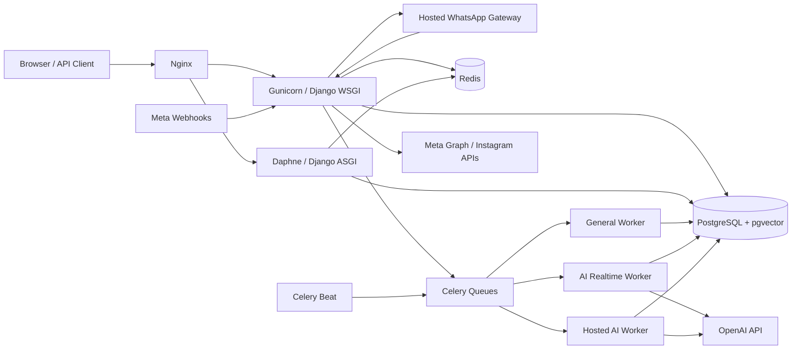

# SHVYA AI

[](https://github.com/Ashwani1611/shvya-ai/actions/workflows/ci.yml)


**SHVYA AI** is a multi-tenant AI sales engagement and CRM platform for managing leads, customer conversations, follow-ups, automations, and messaging channels from one workspace.

The CRM remains the system of record. AI, messaging, automation, and analytics operate on top of tenant-scoped CRM data rather than replacing it.

> Engineering rules and architectural constraints are defined in [`CLAUDE.md`](./CLAUDE.md). Changes to tenant isolation, business logic, async work, idempotency, model structure, or external integrations must follow those rules.

---

## Overview

SHVYA AI combines CRM operations, AI-driven engagement, Meta messaging integrations, automation, knowledge retrieval, and reporting in a single Django application.

Current platform capabilities include:

| Area | Capabilities |
| --- | --- |
| CRM | Leads, pipelines, stages, attributes, activities, teams, bulk operations, tenant-scoped data |
| AI engagement | AI replies, lead qualification, CRM actions, summaries, configurable models, AI credit tracking |
| Knowledge | Connected knowledge, document ingestion, embeddings, semantic retrieval with pgvector |
| WhatsApp Cloud API | Meta Embedded Signup, API inbox, message templates, campaigns, AI engagement |
| WhatsApp Coexistence | WhatsApp Business App onboarding, phone selection, history/state sync, shared Cloud API inbox |
| Hosted WhatsApp | Linked-device sessions through the internal `whatsapp-web.js` gateway, QR login, inbox, media, automation |
| Instagram | Instagram professional account OAuth, signed webhooks, inbox, messaging, token refresh |
| Meta Lead Ads | Signed lead webhook ingestion into the CRM |
| Automation | Cadences, workflows, triggers, scheduled/background execution |
| Analytics | CRM and engagement insights, operational reporting, account health |
| Administration | Organization management, roles, API keys, Superadmin console, global search |

---

## Architecture

SHVYA AI follows a **multi-tenant, service-layer, event-driven, queue-first** architecture.



### Architectural rules

- Every organization-owned query must be tenant scoped.
- Business logic belongs in `services/`, not in templates or large view functions.
- Expensive external work runs asynchronously through Celery.
- AI and automation follow a queue-first execution model.
- External actions must be idempotent and retry safe.
- Secrets are loaded from environment variables and must never be committed.
- Model changes require migrations and CI validation.
- The V1 product UI remains Django Templates + HTMX + JavaScript + Tailwind unless an architectural change is explicitly approved.

See [`CLAUDE.md`](./CLAUDE.md) for the authoritative engineering contract.

---

## Technology Stack

| Layer | Technology |
| --- | --- |
| Language | Python 3.13 |
| Web framework | Django 6.1 |
| API | Django REST Framework 3.18 |
| Authentication | SimpleJWT + organization-scoped API keys |
| Realtime | Django Channels + Daphne + channels-redis |
| Database | PostgreSQL 17 + pgvector |
| Cache / broker | Redis 8 |
| Background jobs | Celery 5.6 + Celery Beat |
| AI | OpenAI SDK + LangGraph |
| Frontend | Django Templates, HTMX, JavaScript, Tailwind CSS |
| Production HTTP | Gunicorn + Nginx |
| Hosted WhatsApp gateway | Node.js 18+ + Express + `whatsapp-web.js` |
| Containers | Docker + Docker Compose |
| CI/CD | GitHub Actions |
| TLS | Nginx + Certbot |
| Testing | pytest + pytest-cov + Ruff |

Runtime Python dependencies are pinned in [`requirements.txt`](./requirements.txt), and development/test dependencies are in [`requirements-dev.txt`](./requirements-dev.txt).

---

## Repository Structure

```text
shvya-ai/
├── api/                      # Versioned API routing and API modules
├── apps/                     # Django applications
│   ├── accounts/             # Authentication and user-facing account flows
│   ├── ai_engagement/        # AI engagement and qualification runtime
│   ├── analytics/            # Insights and reporting
│   ├── calls/                # Calling-related domain code
│   ├── channels/             # WhatsApp and Instagram channels
│   ├── copilot/              # Sales desk / copilot features
│   ├── crm/                  # Core CRM, leads, pipelines and dashboard
│   ├── followups/            # Cadence and follow-up execution
│   ├── hosted_automation/    # Hosted WhatsApp automation runtime
│   ├── integrations/         # External integrations and Connect Hub
│   ├── organizations/        # Tenant / organization models and API keys
│   ├── superadmin/           # Platform administration
│   ├── teams/                # Teams and assignment features
│   ├── telephony/            # Telephony domain code
│   └── triggers/             # Workflow / trigger engine
├── config/                   # Django settings, URLs, ASGI/WSGI and Celery config
├── core/                     # Shared utilities and common infrastructure
├── docs/                     # Operational and feature documentation
├── nginx/                    # Production and staging Nginx configuration
├── scripts/                  # Maintenance and operational scripts
├── services/                 # Business/service layer
├── static/                   # Static frontend assets
├── templates/                # Django templates
├── tests/                    # Test suite
├── whatsapp_web_gateway/     # Internal Hosted WhatsApp Node.js gateway
├── docker-compose.yml        # Production-style Compose stack
├── docker-compose.staging.yml# Isolated staging Compose stack
├── Dockerfile                # Django application image
├── requirements.txt          # Runtime Python dependencies
└── requirements-dev.txt      # Development and test dependencies
```

Always inspect the actual app/model before assuming a field or module exists. Parts of the project continue to evolve as features are refactored.

---

## Getting Started

### Prerequisites

For a native local setup:

- Python 3.13
- PostgreSQL 17 with the `vector` extension available
- Redis
- Git
- Node.js 18+ only if you need to run the Hosted WhatsApp gateway locally

Docker is required for production/staging parity and for validating the Compose stack.

### 1. Clone the repository

```bash
git clone https://github.com/Ashwani1611/shvya-ai.git
cd shvya-ai
```

Development work should normally branch from `staging`:

```bash
git checkout staging
git pull origin staging
git checkout -b feature/<short-description>
```

Use `fix/`, `feature/`, `chore/`, or `docs/` prefixes as appropriate.

### 2. Create a virtual environment

```bash
python -m venv .venv
source .venv/bin/activate
```

Windows PowerShell:

```powershell
.venv\Scripts\Activate.ps1
```

### 3. Install dependencies

```bash
python -m pip install --upgrade pip
pip install -r requirements-dev.txt
```

### 4. Configure environment variables

```bash
cp .env.example .env
```

At minimum, configure the local database, Redis, Django secret, and allowed hosts.

```dotenv
DEBUG=True
SECRET_KEY=replace-with-a-local-secret
ALLOWED_HOSTS=localhost,127.0.0.1

DB_NAME=shvya_ai
DB_USER=postgres
DB_PASSWORD=your-local-password
DB_HOST=127.0.0.1
DB_PORT=5432

REDIS_URL=redis://127.0.0.1:6379/0
JWT_SECRET=replace-with-a-local-jwt-secret
```

Do not commit `.env`, provider credentials, tokens, passwords, or API keys.

### 5. Prepare PostgreSQL

Create the database and ensure pgvector is available:

```sql
CREATE DATABASE shvya_ai;
```

Then run migrations:

```bash
python manage.py migrate
```

The project migrations create the required vector extension where applicable. The database user must have enough privileges to create extensions in the local development database.

### 6. Create an administrator

```bash
python manage.py createsuperuser
```

A platform superuser can access the Superadmin area and create/manage organizations and organization users.

### 7. Run the application

```bash
python manage.py runserver
```

Useful local endpoints:

| Endpoint | Purpose |
| --- | --- |
| `http://127.0.0.1:8000/` | Marketing/home page |
| `http://127.0.0.1:8000/dashboard/` | CRM dashboard |
| `http://127.0.0.1:8000/superadmin/` | Superadmin console |
| `http://127.0.0.1:8000/admin/` | Django admin |
| `http://127.0.0.1:8000/health/live/` | Liveness check |
| `http://127.0.0.1:8000/health/ready/` | Readiness check |

---

## Background Workers

SHVYA uses separate Celery lanes so customer-facing AI work is not blocked by unrelated background jobs.

Run the standard worker:

```bash
celery -A config worker -l info
```

Run the realtime AI queue:

```bash
celery -A config worker -l info -Q ai_realtime --concurrency=2 --prefetch-multiplier=1
```

Run the Hosted WhatsApp AI queue:

```bash
celery -A config worker -l info -Q hosted_ai --concurrency=1 --prefetch-multiplier=1
```

Run the scheduler:

```bash
celery -A config beat -l info
```

For an ASGI/WebSocket process outside `runserver`:

```bash
daphne -b 0.0.0.0 -p 8001 config.asgi:application
```

---

## Environment Variables

The canonical template is [`.env.example`](./.env.example).

| Category | Important variables |
| --- | --- |
| Django | `DEBUG`, `SECRET_KEY`, `ALLOWED_HOSTS`, `JWT_SECRET` |
| PostgreSQL | `DB_NAME`, `DB_USER`, `DB_PASSWORD`, `DB_HOST`, `DB_PORT`, `DB_CONN_MAX_AGE` |
| Redis | `REDIS_URL`, `CHANNEL_LAYER_REDIS_URL` where applicable |
| OpenAI | `OPENAI_API_KEY`, `OPENAI_AI_MODEL`, `OPENAI_ENGAGEMENT_MODEL`, `OPENAI_QUALIFICATION_MODEL`, `OPENAI_SUMMARY_MODEL`, `OPENAI_EMBEDDING_MODEL` |
| Meta | `META_VERIFY_TOKEN`, `META_APP_ID`, `META_APP_SECRET`, `META_WA_EMBEDDED_SIGNUP_CONFIG_ID` |
| Instagram | `META_INSTAGRAM_APP_ID`, `META_INSTAGRAM_APP_SECRET` |
| Hosted WhatsApp | `WHATSAPP_WEB_GATEWAY_URL`, `WHATSAPP_WEB_GATEWAY_TOKEN`, `WHATSAPP_WEB_CALLBACK_TOKEN`, `WHATSAPP_WEB_SESSION_PATH` |
| Mail | `SMTP_HOST`, `SMTP_PORT`, `SMTP_USERNAME`, `SMTP_PASSWORD` |

Production and staging values must be maintained outside Git.

---

## Messaging Integrations

### WhatsApp Cloud API

SHVYA supports Meta WhatsApp Cloud API onboarding and messaging, including:

- Embedded Signup
- connected WhatsApp Business accounts
- API inbox
- inbound/outbound messages
- template creation, synchronization and sending
- campaigns
- AI engagement
- lead/CRM updates from conversations

The public WhatsApp webhook endpoint is:

```text
/webhooks/whatsapp/
```

### WhatsApp Business App Coexistence

Coexistence has a dedicated onboarding/runtime flow rather than being treated as a Hosted WhatsApp session. The flow supports Meta Business App onboarding, explicit phone resolution when required, history/state synchronization, and the normal SHVYA AI engagement pipeline.

### Hosted WhatsApp

Hosted accounts use the internal Node.js gateway in [`whatsapp_web_gateway/`](./whatsapp_web_gateway/).

The gateway handles linked-device sessions and sends authenticated callbacks to Django. Session state is isolated from the application container and persisted in the configured WhatsApp session volume.

Hosted gateway tokens are mandatory outside throwaway local development.

### Instagram

SHVYA uses Meta's **Instagram API with Instagram Login** for professional Business/Creator accounts.

The public Instagram webhook endpoint is:

```text
/webhooks/instagram/
```

See:

- [`docs/instagram-setup.md`](./docs/instagram-setup.md)
- [`docs/instagram-oauth-checklist.md`](./docs/instagram-oauth-checklist.md)
- [`docs/instagram-oauth-meta-source.md`](./docs/instagram-oauth-meta-source.md)

### Meta Lead Ads

Meta lead delivery enters through a signed webhook boundary:

```text
/webhooks/meta-leads/
```

Webhook signatures and configured app secrets must be validated before lead import processing begins.

---

## AI and Knowledge Runtime

SHVYA separates customer-facing AI engagement from internal enrichment and knowledge processing.

Key runtime concepts:

- customer-facing engagement uses a dedicated realtime queue
- recent conversation context is bounded
- summaries carry older context forward
- lead qualification and CRM actions follow validated contracts
- connected knowledge is embedded and retrieved semantically through pgvector
- transient AI failures are retried by the background job layer rather than by multiple competing retry mechanisms
- usage is tracked through SHVYA's internal AI credit system

See [`docs/grounded-engagement.md`](./docs/grounded-engagement.md) for the grounded engagement design.

---

## Testing and Quality Checks

Install development dependencies first:

```bash
pip install -r requirements-dev.txt
```

Run Ruff:

```bash
ruff check .
```

Check for missing migrations:

```bash
python manage.py makemigrations --check --dry-run --settings=config.settings.testing
```

Run Django system checks:

```bash
python manage.py check --settings=config.settings.testing
```

Run the test suite with coverage:

```bash
pytest --cov
```

Install the pre-commit hooks:

```bash
pre-commit install
```

GitHub Actions CI validates both production and staging Compose configurations and builds both the Django and Hosted WhatsApp gateway images after lint/check/test steps pass.

---

## Branch and Deployment Strategy

SHVYA uses separate staging and production environments.

| Environment | Git branch | Compose file | Purpose |
| --- | --- | --- | --- |
| Development | `feature/*`, `fix/*`, `chore/*`, `docs/*` | local | Isolated development work |
| Staging | `staging` | `docker-compose.staging.yml` | Integration and pre-production verification |
| Production | `main` | `docker-compose.yml` | Live production environment |

Expected promotion path:

```text
feature/fix/docs branch
        ↓
      staging
        ↓
  CI + staging deploy
        ↓
 manual verification
        ↓
       main
        ↓
 CI + production deploy
```

Feature work should not go directly to `main`.

### Staging deployment

A successful CI run on `staging` triggers `.github/workflows/deploy-staging.yml`, which deploys the isolated staging Docker stack.

Staging uses:

- its own checkout under `/opt/shvya-ai-staging`
- separate Docker project/containers
- separate database and Redis volumes
- separate media/static paths
- staging-specific environment settings
- Basic Auth in front of the staging site

### Production deployment

A successful CI run on `main` triggers `.github/workflows/deploy.yml`.

The production workflow deploys the exact commit SHA validated by CI and refuses to deploy a SHA that is not part of `origin/main`.

See [`docs/deployment_environments.md`](./docs/deployment_environments.md) for additional environment details.

---

## Docker

The production-style stack is defined in [`docker-compose.yml`](./docker-compose.yml) and includes:

- PostgreSQL + pgvector
- Redis
- Gunicorn web service
- Daphne WebSocket/ASGI service
- general Celery worker
- realtime AI worker
- Hosted AI worker
- Celery Beat
- Hosted WhatsApp gateway
- Nginx
- Certbot

The staging stack is defined separately in [`docker-compose.staging.yml`](./docker-compose.staging.yml).

Validate the Compose files without starting containers:

```bash
docker compose --env-file .env.example -f docker-compose.yml config --quiet
docker compose --env-file .env.staging.example -f docker-compose.staging.yml config --quiet
```

The production Compose file uses server bind-mount paths for static/media data, so it should not be treated as a zero-configuration local-development Compose file.

---

## API

Core API routes are versioned under `/api/v1/`.

Examples include:

```text
POST /api/v1/auth/token/
POST /api/v1/auth/token/refresh/
/api/v1/leads/
/api/v1/teams/
/api/v1/copilot/
/api/v1/ai-engagement/
```

API writes and external side effects should preserve tenant isolation and idempotency guarantees.

---

## Security Notes

- Never commit `.env` files or provider secrets.
- API keys must be stored as prefixes + hashes, not as recoverable raw keys.
- Meta webhook requests must be signature validated before processing.
- Hosted gateway callbacks require authentication tokens.
- Tenant-owned data must always be filtered by organization.
- External actions should be idempotent to prevent duplicate work during retries.
- Production credentials must never be reused in staging or local environments.

---

## Documentation

Useful project documentation includes:

- [`CLAUDE.md`](./CLAUDE.md) - architecture and engineering rules
- [`docs/local_setup.md`](./docs/local_setup.md) - local development notes
- [`docs/deployment_environments.md`](./docs/deployment_environments.md) - staging and production separation
- [`docs/grounded-engagement.md`](./docs/grounded-engagement.md) - grounded AI engagement design
- [`docs/smart-triggers.md`](./docs/smart-triggers.md) - workflow/trigger behavior
- [`docs/crm-bulk-actions.md`](./docs/crm-bulk-actions.md) - CRM bulk actions
- [`docs/whatsapp_ai_troubleshooting.md`](./docs/whatsapp_ai_troubleshooting.md) - WhatsApp AI troubleshooting
- [`docs/instagram-setup.md`](./docs/instagram-setup.md) - Instagram integration setup

---

## Contribution Workflow

1. Update local `staging`.
2. Create a scoped feature/fix/docs branch.
3. Keep the change focused and tenant safe.
4. Add or update tests where behavior changes.
5. Run Ruff, Django checks, migration checks, and pytest locally.
6. Open a pull request into `staging`.
7. Verify the change on staging after CI/deployment succeeds.
8. Promote tested staging changes to `main` for production deployment.

Do not bypass the service layer, tenant isolation, migration requirements, or CI/CD promotion path for convenience.
