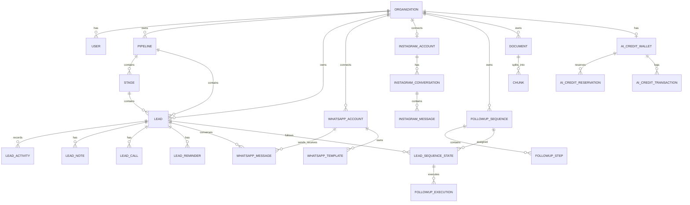
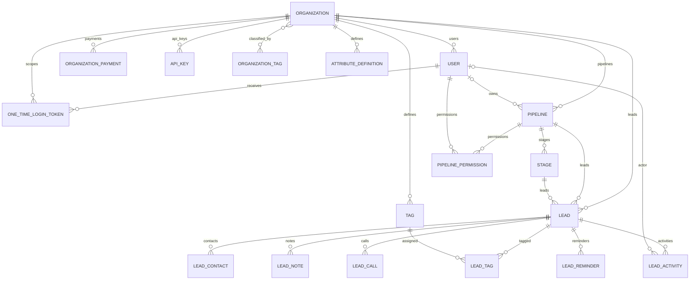
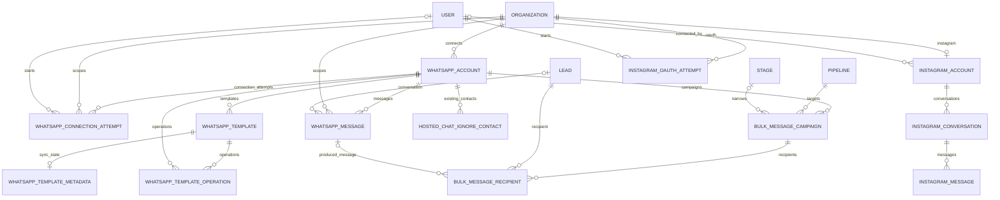
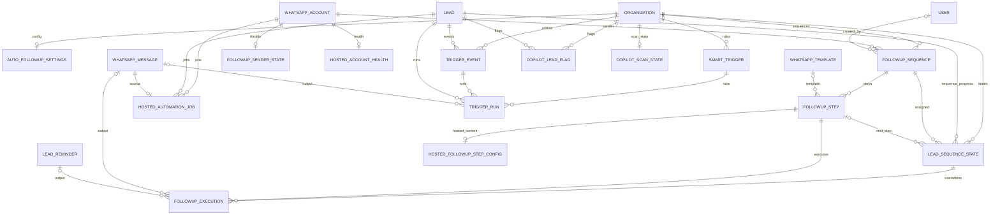
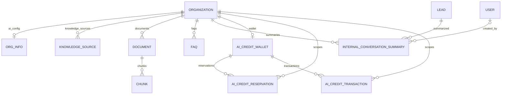
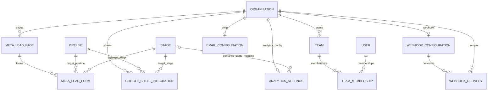

# SHVYA AI Database Schema

This document is the database architecture reference for **SHVYA AI**. It documents the current Django ORM schema, the important database constraints and indexes, the relationships between domains, and the reason each major group of tables exists.

> **Schema snapshot:** reviewed on 2026-09-16 against `main` at `26cad372932fe9f12635d658cf3a87f2ae2b3fd4` and `staging` at `70dec1a7a875629ee598b7878da3b45e1240fdce` before this documentation commit. At that point, the branch-exclusive changes did not include model files. The Django models and migrations remain the executable source of truth. A deployed database can differ if migrations have not been applied.

---

## 1. Database stack

- **Database:** PostgreSQL
- **ORM:** Django ORM
- **Primary-key default:** `BigAutoField`
- **Custom user model:** `accounts.User`
- **Tenant root:** `organizations.Organization`
- **Semi-structured data:** Django `JSONField`, stored as PostgreSQL `jsonb`
- **Vector search:** `pgvector`, with `vector(1536)` embeddings on AI knowledge chunks
- **Fuzzy/search indexes:** PostgreSQL `pg_trgm` + GIN indexes for lead search
- **Async/runtime state:** PostgreSQL for durable state, Redis for cache/Celery/channel-layer runtime state

### PostgreSQL extensions

The project migrations enable:

```text
vector   # pgvector, used by ai_engagement.Chunk.embedding
pg_trgm  # trigram search, used by CRM lead search indexes
```

---

## 2. Schema design principles and why they exist

1. **Organization is the tenant boundary.** Most business tables carry an explicit `organization_id` even when the organization can be reached through another foreign key. This makes tenant filtering direct, reduces accidental cross-tenant queries, and supports efficient organization-scoped indexes.

2. **Configuration is separated from transactional history.** Examples are `OrgInfo`, `AnalyticsSettings`, `AutoFollowupSettings`, and `EmailConfiguration`. One-to-one configuration tables keep `Organization` from becoming an unmaintainable mega-table.

3. **External-provider events are persisted.** WhatsApp messages, Instagram messages, connection attempts, webhook deliveries, template operations, trigger events, and follow-up executions are stored so retries, idempotency, failures, and support investigations have durable evidence.

4. **History is preserved independently of mutable configuration.** `LeadActivity` stores both foreign keys and snapshot names. If a pipeline, stage, or user changes later, the activity timeline still makes sense.

5. **Dynamic business data uses JSON only where the shape is intentionally flexible.** Lead custom values, provider payloads, trigger conditions/actions, template components, mappings, and metadata are JSON. Core identities and relationships remain relational.

6. **Destructive deletes are controlled.** `CASCADE` is used for data truly owned by a parent. `SET_NULL` preserves historical records when the referenced object disappears. `PROTECT` is used where deleting a resource that is still in use would corrupt automation behavior.

7. **AI billing uses wallet + reservation + ledger.** Reservations prevent concurrent AI requests from overspending the same balance, while immutable-ish transaction rows provide an audit trail.

8. **Knowledge retrieval separates documents from chunks.** A document can be versioned and processed once, then split into many searchable chunks with embeddings. This is substantially easier to scale than storing one embedding or one large text blob per organization.

---

## 3. High-level ER diagram

This diagram shows the main product data flow. Detailed domain diagrams follow.



---

## 4. Tenant, users, CRM and permissions ER diagram



### Why this shape

`Organization → Pipeline → Stage → Lead` is the central CRM hierarchy. A lead also stores `organization_id` directly instead of deriving it only through the pipeline. That deliberate duplication makes tenant checks and tenant-scoped queries simple and fast. Model validation prevents a lead from referencing a pipeline from another organization or a stage from another pipeline.

`AttributeDefinition` describes organization-specific custom fields, while the values remain in `Lead.attributes`. This gives the UI a typed definition without requiring a schema migration whenever a customer creates a custom lead field.

`PipelinePermission` is a separate join model rather than role flags directly on `User`, because the same user can have different permissions on different pipelines.

---

## 5. WhatsApp and Instagram ER diagram



### Why this shape

WhatsApp and Instagram persist local read models rather than depending on live provider calls for every page load. Provider IDs and idempotency keys are unique where duplicates would be dangerous. Sensitive WhatsApp/Instagram credentials are encrypted at rest and are not stored in connection-audit rows.

`BulkMessageRecipient` snapshots the audience of a campaign. Changing a lead's stage after the campaign is queued therefore does not silently change the audience mid-send.

Template operational metadata is one-to-one with the canonical `WhatsAppTemplate`, while operations are append-style history. This keeps the product-facing template model clean without losing provider sync diagnostics.

---

## 6. Follow-ups, hosted automation, triggers and Co-Pilot ER diagram



### Why this shape

Follow-up state is deliberately durable. `FollowupSequence` and `FollowupStep` describe what should happen; `LeadSequenceState` stores where a lead currently is; `FollowupExecution` stores each scheduled/attempted action. This separation makes retries, pauses, sequence switching, and support debugging deterministic.

`TriggerEvent` acts as a transactional outbox. CRM events are persisted before asynchronous processing, so a temporary broker outage does not have to lose the event. `TriggerRun` then records the execution of one rule against one event.

Co-Pilot flags are cached in the database rather than recalculated during every dashboard request. `CopilotScanState` records the freshness of that cache.

---

## 7. AI knowledge and credits ER diagram



### Why this shape

`Document` versions a concrete source. `Chunk` stores retrieval-sized text pieces and a nullable `vector(1536)` embedding. A document can therefore exist while processing is pending or while an embedding provider is temporarily unavailable.

`KnowledgeSource` is currently an organization-owned source registry and is not a foreign-key parent of `Document`. Do not assume a direct database relationship between them unless a future migration explicitly adds one.

AI credits are intentionally separate from the older `Organization.credits_total/credits_used` fields. `AICreditWallet` is the current AI balance, `AICreditReservation` handles concurrent in-flight usage, and `AICreditTransaction` is the settled audit ledger. UI coins are a presentation conversion over credits rather than a separate database currency.

---

## 8. Integrations, analytics and teams ER diagram



### Why this shape

Analytics stage meaning is configuration, not hard-coded CRM state. A stage is only a named ordered column, so `AnalyticsSettings` explicitly maps the organization's chosen stages to hot/won/lost semantics.

External integration secrets are stored encrypted where they must be reversible. Delivery tables keep payload/status/error history separate from the current configuration.

---

# 9. Complete application table catalog

Conventions used below:

- `UUID PK` means UUID primary key generated by the application.
- `BIGINT PK` means Django's implicit `BigAutoField` primary key.
- `FK → X` means a foreign key to model/table X.
- `O2O → X` means a one-to-one foreign key.
- `JSON` means PostgreSQL `jsonb` through Django `JSONField`.
- `ts` means timestamp/datetime.
- Standard Django-created indexes for PKs, unique constraints and foreign keys are not repeated unless there is an additional explicit index worth calling out.

## 9.1 `organizations`

### `organizations_organization`

**PK:** `id UUID`

**Columns:** `name varchar(255)`, `timezone varchar(64)`, `plan varchar(32)`, `assigned_poc_id FK → accounts_user NULL`, `credits_total int`, `credits_used int`, `credits_alert_enabled bool`, `renewal_payment_at date NULL`, `day_of_sale date NULL`, `onboarding_completion_date date NULL`, `disabled_at ts NULL`, `number_of_seats positive int`, `package varchar(20)`, `operational_notes text`, `total_sale_amount decimal(12,2) NULL`, `payment_mode varchar(20)`, `is_active bool`, `settings JSON`, `created_at ts`, `updated_at ts`.

**Why:** root tenant/workspace row. Almost every customer-owned record ultimately belongs to this table.

### `organizations_organizationtag`

**PK:** `id BIGINT`

**Columns:** `name varchar(50) UNIQUE`.

**Why:** internal platform/superadmin classification such as Trial, Discontinued, or operational labels. This is different from CRM lead tags.

### `organizations_organization_tags`

Implicit many-to-many join table between `Organization` and `OrganizationTag`.

**Why:** one organization can carry many internal tags and one tag can classify many organizations.

### `organizations_organizationpayment`

**PK:** `id BIGINT`

**Columns:** `organization_id FK → Organization`, `amount decimal(12,2)`, `payment_date date`, `payment_method`, `reference_number`, `notes`, `created_at`, `updated_at`.

**Why:** preserves individual payment history independently of the organization's contract amount.

### `organizations_apikey`

**PK:** `id UUID`

**Columns:** `organization_id FK`, `name`, `key_prefix UNIQUE`, `key_hash`, `can_upsert_leads`, `last_used_at NULL`, `expires_at NULL`, `is_active`, `created_at`.

**Security:** raw API keys are returned once and are never stored; only the prefix and password hash are persisted.

---

## 9.2 `accounts`

### `accounts_user`

**PK:** `id UUID`

**Columns:** `organization_id FK → Organization NULL`, `name`, `email UNIQUE`, `phone`, `role`, `is_active`, `is_staff`, `last_login_at NULL`, `created_at`, `updated_at`, plus authentication fields inherited from Django (`password`, `last_login`, `is_superuser`).

**Rules:** role is `superadmin`, `admin`, or `agent`. Superadmins must not belong to a client organization; non-superadmins must belong to one.

### `accounts_user_groups`

Implicit many-to-many join table from Django `PermissionsMixin` between `accounts_user` and `auth_group`.

### `accounts_user_user_permissions`

Implicit many-to-many join table from `accounts_user` to `auth_permission`.

### `accounts_onetimelogintoken`

**PK:** `id UUID`

**Columns:** `user_id FK → User`, `organization_id FK → Organization`, `token_hash UNIQUE`, `expires_at`, `used_at NULL`, `created_at`.

**Security:** the raw login token is not stored.

---

## 9.3 `crm`

### `crm_pipeline`

**PK:** `id UUID`

**Columns:** `organization_id FK`, `name`, `description`, `country_code`, `phone_number`, `owner_id FK → User NULL`, `is_active`, `ai_enabled`, `created_at`, `updated_at`.

**Constraint:** `UNIQUE (organization_id, name)`.

### `crm_stage`

**PK:** `id UUID`

**Columns:** `pipeline_id FK`, `name`, `description`, `display_order`, `color`, `is_active`, `ai_on`, `config JSON`, `created_at`, `updated_at`.

**Constraints:** active stage names are unique per pipeline; display order is unique per pipeline. System stage names such as New Lead/New Leads and Qualified are protected by model logic.

### `crm_lead`

**PK:** `id UUID`

**Columns:** `organization_id FK`, `pipeline_id FK`, `stage_id FK`, `stage_entered_at`, `name`, `phone`, `email`, `notes`, `attributes JSON`, `ai_enabled`, `lead_source`, `created_at`, `updated_at`.

**Constraint:** `UNIQUE (organization_id, phone)`.

**Explicit indexes:** organization, pipeline, stage, created time, `(organization,pipeline,stage)`, trigram GIN on name/phone/email/notes, GIN on attributes, and a trigram expression index over text-cast attributes.

**Rules:** phone is normalized with a leading country code; pipeline must belong to the organization; stage must belong to the pipeline.

### `crm_attributedefinition`

**PK:** `id UUID`

**Columns:** `organization_id FK`, `name`, `key`, `field_type`, `description`, `options JSON`, `display_order`, `created_at`, `updated_at`.

**Constraints:** unique `(organization,name)` and `(organization,key)`; index `(organization,display_order)`.

### `crm_leadactivity`

**PK:** `id UUID`

**Columns:** `lead_id FK`, `organization_id FK`, `topic`, `actor_id FK → User NULL`, `actor_name`, `old_pipeline_id NULL`, `old_pipeline_name`, `new_pipeline_id NULL`, `new_pipeline_name`, `old_stage_id NULL`, `old_stage_name`, `new_stage_id NULL`, `new_stage_name`, `details JSON`, `created_at`.

**Indexes:** `(organization,lead,-created_at)`, `(lead,-created_at)`, `(topic,-created_at)`.

**Why:** permanent lead timeline with snapshot names so history survives later renames/deletes.

### `crm_leadcontact`

**PK:** `id UUID`

**Columns:** `lead_id FK`, `channel`, `handle`, `verified`, `metadata JSON`, `created_at`.

### `crm_leadcall`

**PK:** `id UUID`

**Columns:** `lead_id FK`, `user_id FK → User NULL`, `status`, `call_name`, `duration_seconds`, `notes`, `called_at`, `created_at`.

### `crm_leadreminder`

**PK:** `id UUID`

**Columns:** `lead_id FK`, `assigned_to_id FK → User NULL`, `title`, `description`, `due_at`, `status`, `completed_at NULL`, `created_at`, `updated_at`.

### `crm_leadnote`

**PK:** `id UUID`

**Columns:** `lead_id FK`, `created_by_id FK → User NULL`, `note`, `note_type`, `created_at`, `updated_at`.

### `crm_pipelinepermission`

**PK:** `id UUID`

**Columns:** `pipeline_id FK`, `user_id FK`, boolean permissions for view/create/edit/move/delete leads and management of stages, pipeline, lead fields, users and API keys, plus timestamps.

**Constraint:** `UNIQUE (pipeline_id, user_id)`.

**Rule:** user and pipeline must belong to the same organization; platform superadmins do not need rows here.

### `crm_tag`

**PK:** `id UUID`

**Columns:** `organization_id FK`, `name`, `color`, `created_at`.

**Constraint:** `UNIQUE (organization_id, name)`.

### `crm_leadtag`

**PK:** `id BIGINT`

**Columns:** `lead_id FK`, `tag_id FK`, `created_at`.

**Constraint:** `UNIQUE (lead_id, tag_id)`.

---

## 9.4 `teams`

### `teams_team`

**PK:** `id UUID`

**Columns:** `organization_id FK`, `name`, `description`, `is_active`, `created_at`, `updated_at`.

**Constraint:** `UNIQUE (organization_id, name)`.

### `teams_teammembership`

**PK:** `id UUID`

**Columns:** `team_id FK`, `user_id FK`, `role` (`lead`/`member`), `joined_at`.

**Constraint:** `UNIQUE (team_id, user_id)`.

**Why:** explicit through model leaves room for membership-specific data such as role without adding team state directly to User.

---

## 9.5 `analytics`

### `analytics_analyticssettings`

**PK:** `id UUID`

**Columns:** `organization_id O2O`, `hot_lead_stage_id FK → Stage NULL`, `lead_won_stage_id FK → Stage NULL`, `lead_lost_stage_id FK → Stage NULL`, `stall_day_threshold`, `created_at`, `updated_at`.

**Why:** stage names are user-configurable, so analytical meaning is mapped explicitly rather than inferred from names.

---

## 9.6 `channels` - WhatsApp core

### `channels_whatsappaccount`

**PK:** `id UUID`

**Columns:** `organization_id FK`, `connection_type`, `business_name`, `phone_number_id`, `waba_id`, `display_phone_number`, encrypted `access_token`, `welcome_message`, `request_contact_info`, `status`, `is_active`, `connected_at`, `updated_at`.

**Why:** an organization can own multiple WhatsApp senders. API and hosted/coexistence connections share the canonical account model.

### `channels_whatsappmessage`

**PK:** `id UUID`

**Columns:** `organization_id FK`, `account_id FK`, `lead_id FK NULL`, `direction`, `external_id UNIQUE NULL`, `from_number`, `to_number`, `body`, `message_type`, `media_payload JSON`, `status`, `raw_payload JSON`, `error`, `is_read`, `created_at`, `updated_at`.

**Indexes:** `(organization,created_at)`, `(lead,created_at)`, `(lead,message_type,created_at)`.

**Why:** `external_id` is the Meta message id and acts as the primary provider-level idempotency key when present.

### `channels_bulkmessagecampaign`

**PK:** `id UUID`

**Columns:** `organization_id FK`, `account_id FK`, `name`, `pipeline_id FK`, `stage_id FK NULL`, `body`, `template_name`, `status`, `created_by_id FK → User NULL`, `created_at`, `started_at NULL`, `completed_at NULL`.

### `channels_bulkmessagerecipient`

**PK:** `id UUID`

**Columns:** `campaign_id FK`, `lead_id FK`, `message_id FK → WhatsAppMessage NULL`, `status`, `skip_reason`, `created_at`, `updated_at`.

**Constraint:** `UNIQUE (campaign_id, lead_id)`.

### `channels_whatsapptemplate`

**PK:** `id UUID`

**Columns:** `organization_id FK`, `account_id FK`, `name`, `category`, `template_format`, `status`, `body`, `footer`, `attachment_type`, `buttons JSON`, `meta_template_id`, `rejection_reason`, `created_by_id FK → User NULL`, `created_at`, `updated_at`.

**Constraint:** `UNIQUE (account_id, name)`.

---

## 9.7 `channels` - connection, template operations and hosted support

### `channels_whatsappconnectionattempt`

**PK:** `id UUID`

**Columns:** `organization_id FK`, `created_by_id FK → User NULL`, `account_id FK → WhatsAppAccount NULL`, `method`, `status`, `stage`, `waba_id`, `phone_number_id`, `display_phone_number`, `business_name`, `code_received`, `token_received`, `webhook_subscribed NULL`, `meta_error_code`, `error_message`, `warning_message`, `created_at`, `updated_at`, `completed_at NULL`.

**Indexes:** `(organization,created_at)`, `(organization,status)`.

**Security:** stores safe diagnostics only; OAuth codes and access-token values are not persisted here.

### `channels_hostedchatignorecontact`

**PK:** `id UUID`

**Columns:** `organization_id FK`, `account_id FK`, `phone_number`, `contact_name`, `chat_id`, `created_at`, `synced_at`.

**Constraint:** `UNIQUE (account_id, phone_number)`.

**Indexes:** `(organization,phone_number)`, `(account,phone_number)`, `(account,chat_id)`.

### `channels_whatsapptemplatemetadata`

**PK:** `id UUID`

**Columns:** `template_id O2O`, `local_status`, `language`, `placeholder_mapping JSON`, `components JSON`, `meta_response JSON`, Meta error fields, header sample metadata, `carousel_config JSON`, sync/submission/approval/rejection/deletion timestamps, `created_at`, `updated_at`.

**Index:** `(local_status,last_synced_at)`.

### `channels_whatsapptemplateoperation`

**PK:** `id UUID`

**Columns:** `organization_id FK`, `template_id FK NULL`, `account_id FK NULL`, `operation`, `success`, `http_status NULL`, Meta error fields, `response_payload JSON`, `created_at`.

**Indexes:** `(organization,created_at)`, `(template,operation)`.

---

## 9.8 `channels` - Instagram

### `channels_instagramaccount`

**PK:** `id UUID`

**Columns:** `organization_id O2O`, `ig_user_id UNIQUE`, `username`, `display_name`, `account_type`, `profile_picture_url`, encrypted `access_token`, token expiry/refresh timestamps, `status`, `webhook_subscribed`, `subscribed_fields JSON`, `connected_by_id FK → User NULL`, `connected_at`, `last_webhook_at`, `last_sync_at`, `last_error`, `created_at`, `updated_at`.

**Indexes:** `(organization,status)`, token expiry.

### `channels_instagramoauthattempt`

**PK:** `id UUID`

**Columns:** `organization_id FK`, `created_by_id FK → User`, encrypted `authorization_code`, `redirect_uri`, `status`, `error_message`, `expires_at`, `completed_at`, `created_at`, `updated_at`.

**Index:** `(organization,created_at)`.

### `channels_instagramconversation`

**PK:** `id UUID`

**Columns:** `organization_id FK`, `account_id FK`, `meta_conversation_id UNIQUE NULL`, participant identity/profile fields, last-message fields, `unread_count`, `last_synced_at`, `raw_payload JSON`, `created_at`, `updated_at`.

**Constraint:** `UNIQUE (account_id, participant_id)`.

**Index:** `(organization,last_message_at)`.

### `channels_instagrammessage`

**PK:** `id UUID`

**Columns:** `organization_id FK`, `account_id FK`, `conversation_id FK`, `external_id UNIQUE NULL`, `idempotency_key UUID UNIQUE`, `direction`, `status`, `message_type`, sender/recipient IDs, `body`, `attachments JSON`, `raw_payload JSON`, `error`, `is_read`, `sent_at`, `created_at`, `updated_at`.

**Indexes:** `(organization,created_at)`, `(conversation,created_at)`.

### `channels_instagramwebhookdelivery`

**PK:** `id UUID`

**Columns:** `payload_sha256 UNIQUE`, `raw_payload JSON`, `status`, `error_message`, `received_at`, `processed_at NULL`.

**Index:** `(status,received_at)`.

**Why no organization FK:** this is the raw durable webhook envelope. Organization/account resolution happens from the signed provider payload during processing.

---

## 9.9 `followups`

### `followups_autofollowupsettings`

**PK:** `id UUID`

**Columns:** `organization_id O2O`, `enabled`, business-hours start/end, conversation delay value/unit, timestamps.

### `followups_followupsequence`

**PK:** `id UUID`

**Columns:** `organization_id FK`, `name`, `description`, `whatsapp_account_id FK → WhatsAppAccount PROTECT`, `is_active`, `created_by_id FK → User NULL`, timestamps.

**Constraint:** `UNIQUE (organization_id, name)`.

**Index:** `(organization,is_active,updated_at)`.

### `followups_followupstep`

**PK:** `id UUID`

**Columns:** `sequence_id FK`, `position`, `step_type`, `title`, `whatsapp_template_id FK PROTECT NULL`, email/reminder content, schedule type and delay/specific/recurring settings, `recurring_weekdays JSON`, retry settings, `is_active`, timestamps.

**Constraints:** `UNIQUE (sequence_id, position)`; retry count must be between 0 and 5.

**Index:** `(sequence,position,is_active)`.

### `followups_leadsequencestate`

**PK:** `id UUID`

**Columns:** `organization_id FK`, `lead_id FK`, `sequence_id FK`, `assigned_by_id FK → User NULL`, `status`, `lead_auto_followup_enabled`, `next_step_id FK NULL`, progress/timing fields, assignment/activation/completion/clear timestamps, `updated_at`.

**Constraints:** `UNIQUE (lead_id, sequence_id)` and at most one row per lead whose status is `active` or `paused`.

**Indexes:** `(organization,status,upcoming_send_at)`, `(sequence,status)`.

### `followups_followupexecution`

**PK:** `id UUID`

**Columns:** `organization_id FK`, `state_id FK`, `lead_id FK`, `sequence_id FK`, `step_id FK PROTECT`, `scheduled_for`, `status`, attempt/retry timestamps, `whatsapp_message_id FK NULL`, `reminder_id FK NULL`, `email_message_id`, `error`, `payload JSON`, timestamps.

**Indexes:** `(state,step,status)`, `(organization,status,scheduled_for)`.

### `followups_followupsenderstate`

**PK:** `id UUID`

**Columns:** `account_id O2O → WhatsAppAccount`, `next_available_at`, `last_sent_at`, `last_lead_id FK → Lead NULL`, `updated_at`.

**Why:** per-sender throttle/state so due follow-ups drain sequentially instead of racing through one WhatsApp sender.

---

## 9.10 `hosted_automation`

### `hosted_automation_hostedaccounthealth`

**PK:** `id UUID`

**Columns:** `account_id O2O → WhatsAppAccount`, `enabled`, total/window message counts, window start, `paused_until`, last follow-up time/content hash, timestamps.

### `hosted_automation_hostedautomationjob`

**PK:** `id UUID`

**Columns:** `organization_id FK`, `account_id FK`, `lead_id FK`, `source_message_id O2O → WhatsAppMessage`, `kind`, `status`, `available_at`, processing timestamps, `result JSON`, `error`, timestamps.

**Indexes:** `(account,status,available_at)`, `(organization,status,available_at)`.

### `hosted_automation_hostedfollowupstepconfig`

**PK:** `id UUID`

**Columns:** `step_id O2O → FollowupStep`, hosted message body, optional attachment path/name/MIME/size, `authored_content_hash`, timestamps.

**Why:** hosted WhatsApp has free-form content rules different from API-template follow-ups, so provider-specific content is isolated from the generic follow-up step.

---

## 9.11 `triggers`

### `triggers_smarttrigger`

**PK:** `id UUID`

**Columns:** `organization_id FK`, `name`, `enabled`, `position`, `trigger_type`, `conditions JSON`, `action_type`, `action JSON`, `fingerprint`, `created_by_id FK → User NULL`, timestamps.

**Constraint:** `UNIQUE (organization_id, fingerprint)`.

**Index:** `(organization,enabled,trigger_type)`.

### `triggers_triggerevent`

**PK:** `id UUID`

**Columns:** `organization_id FK`, `lead_id FK`, `kind`, `key UNIQUE`, `payload JSON`, `created_at`, `processed_at NULL`.

**Indexes:** `(processed_at,created_at)`, `(lead,kind,created_at)`.

**Why:** transactional outbox for reliable async processing.

### `triggers_triggerrun`

**PK:** `id UUID`

**Columns:** `rule_id FK`, `event_id FK`, `lead_id FK`, `action_type`, `action JSON`, `status`, `detail`, `due_at`, `created_at`, `finished_at NULL`, `message_id FK → WhatsAppMessage NULL`.

**Constraint:** `UNIQUE (rule_id, event_id)`.

**Indexes:** `(status,due_at)`, `(rule,lead,created_at)`.

---

## 9.12 `copilot`

### `copilot_copilotleadflag`

**PK:** `id UUID`

**Columns:** `organization_id FK`, `lead_id FK`, `flag_code`, `severity`, `metadata JSON`, detection timestamps, `snoozed_until`, `resolved_at`, timestamps.

**Constraint:** `UNIQUE (organization_id, lead_id, flag_code)`.

**Indexes:** `(organization,severity)`, `(organization,flag_code)`, `(organization,snoozed_until)`.

### `copilot_copilotscanstate`

**PK/O2O:** `organization_id` is both primary key and one-to-one FK to Organization.

**Columns:** `last_refreshed_at NULL`, `last_error`, `updated_at`.

---

## 9.13 `ai_engagement`

### `ai_engagement_orginfo`

**PK:** `id BIGINT`

**Columns:** `organization_id O2O`, `about`, `bot_languages`, `qualification_requirements`, `engagement_instructions`, `ai_enabled`, `bump_up_enabled`, `bump_up_count`, timestamps.

### `ai_engagement_knowledgesource`

**PK:** `id BIGINT`

**Columns:** `organization_id FK`, `source_type`, `name`, `url`, `is_active`, timestamps.

### `ai_engagement_document`

**PK:** `id BIGINT`

**Columns:** `organization_id FK`, `name`, `source_key NULL`, `version`, optional file/source URL, `share_instruction`, `processing_status`, `processing_error`, `is_active`, timestamps.

**Constraint:** `UNIQUE (organization_id, source_key, version)`.

**Index:** `(organization,source_key,is_active)`.

### `ai_engagement_chunk`

**PK:** `id BIGINT`

**Columns:** `document_id FK`, `organization_id FK`, `content`, `chunk_index`, `embedding vector(1536) NULL`, `is_active`, timestamps.

**Constraint:** `UNIQUE (document_id, chunk_index)`.

### `ai_engagement_faq`

**PK:** `id BIGINT`

**Columns:** `organization_id FK`, `question`, `answer`, `is_active`, timestamps.

**Index:** `(organization,is_active)`.

### `ai_engagement_internalconversationsummary`

**PK:** `id UUID`

**Columns:** `organization_id FK`, `lead_id FK`, `summary`, source-message snapshot fields, `generated_by`, `model_name`, `is_active`, `created_by_id FK → User NULL`, `generated_at`, `updated_at`.

**Indexes:** `(organization,lead,is_active)`, `(lead,-generated_at)`.

### `ai_engagement_aicreditwallet`

**PK:** `id BIGINT`

**Columns:** `organization_id O2O`, `balance`, `reserved_credits`, lifetime added/used counters, `is_blocked`, `low_credit_threshold`, timestamps.

### `ai_engagement_aicreditreservation`

**PK:** `id UUID`

**Columns:** `organization_id FK`, `wallet_id FK`, feature/model/reference fields, reserved/actual credit usage, estimated/actual token counts, `status`, `created_at`, `settled_at NULL`.

**Index:** `(organization,status,created_at)`.

### `ai_engagement_aicredittransaction`

**PK:** `id BIGINT`

**Columns:** `organization_id FK`, `wallet_id FK`, `transaction_type`, signed `amount`, `balance_after`, feature/model/token counts, `reservation_id UUID NULL`, reference/description/actor snapshot fields, `metadata JSON`, `created_at`.

**Indexes:** `(organization,created_at)`, `(organization,transaction_type,created_at)`.

**Why `reservation_id` is not an FK:** the ledger is designed to remain audit-friendly and decoupled from reservation-row lifecycle.

---

## 9.14 `integrations`

### `integrations_webhookconfiguration`

**PK:** `id UUID`

**Columns:** `organization_id O2O`, `endpoint_url`, encrypted secret, `is_enabled`, timestamps.

### `integrations_webhookdelivery`

**PK:** `id UUID`

**Columns:** `webhook_id FK`, `organization_id FK`, `lead_id UUID` (scalar, not FK), `event_type`, `payload JSON`, `status`, attempt/response/error fields, `delivered_at NULL`, timestamps.

**Indexes:** `(organization,status,created_at)`, `(lead_id,created_at)`.

**Why scalar `lead_id`:** keeps the immutable outbound event record even if lead linkage changes or the lead is deleted later.

### `integrations_emailconfiguration`

**PK:** `id UUID`

**Columns:** `organization_id O2O`, provider, sender/reply-to identity, SMTP host/port/security/username, encrypted password, enabled/test status/error fields, timestamps.

### `integrations_googlesheetintegration`

**PK:** `id UUID`

**Columns:** `organization_id FK`, source identity fields, `pipeline_id FK`, `stage_id FK`, `mapping JSON`, `discovered_headers JSON`, `webhook_token UUID UNIQUE`, encrypted secret, enable/import flags, sync/error counters and timestamps.

**Index:** `(organization,is_enabled,created_at)`.

**Rules:** pipeline must belong to the organization and stage must belong to that pipeline.

### `integrations_metaleadpage`

**PK:** `id UUID`

**Columns:** `organization_id FK`, `page_id`, `page_name`, encrypted page access token, encrypted app secret, `is_active`, timestamps.

**Constraint:** `UNIQUE (organization_id, page_id)`.

### `integrations_metaleadform`

**PK:** `id UUID`

**Columns:** `page_id FK`, `form_id`, `form_name`, `pipeline_id FK PROTECT`, `stage_id FK PROTECT`, `field_mapping JSON`, `is_active`, timestamps.

**Constraint:** `UNIQUE (page_id, form_id)`.

**Rules:** stage must belong to pipeline; pipeline must belong to the page's organization.

---

## 9.15 `superadmin`

### `superadmin_auditlog`

**PK:** `id UUID`

**Columns:** `actor_id FK → User NULL`, `action`, `target_type`, `target_id`, `target_repr`, `ip_address NULL`, `metadata JSON`, `created_at`.

**Indexes:** `(action,created_at)`, `(actor,created_at)`.

**Why the target is not a generic FK:** target snapshots keep audit rows independent of the target app/model and allow history to survive target deletion. The model is intended to be append-only.

---

## 9.16 Apps with no current custom tables

- `apps.calls`: `models.py` currently defines no models.
- `apps.telephony`: current model modules define no models.
- `apps.core`: `models.py` is empty and the app is not part of the business model set in base settings.

Do not invent tables for these apps until a migration creates them.

---

# 10. Framework-managed tables

These tables are created by installed Django/third-party applications rather than SHVYA business model files. Exact columns are controlled by the installed package/migration version.

| Table | Purpose |
|---|---|
| `django_migrations` | Applied migration history |
| `django_session` | Django session storage |
| `django_content_type` | Model/content-type registry |
| `django_admin_log` | Django admin action log |
| `auth_permission` | Django permissions |
| `auth_group` | Django auth groups |
| `auth_group_permissions` | Group-to-permission join |
| `token_blacklist_outstandingtoken` | SimpleJWT outstanding refresh/sliding tokens |
| `token_blacklist_blacklistedtoken` | SimpleJWT blacklist entries |

There is **no Django `auth_user` table for application users** because `AUTH_USER_MODEL = "accounts.User"`.

---

# 11. Important uniqueness and idempotency guarantees

The following constraints are especially important because application correctness depends on them:

| Domain | Guarantee | Why |
|---|---|---|
| CRM lead | `(organization, phone)` unique | Same phone cannot silently create duplicate leads inside one tenant |
| Pipeline | `(organization, name)` unique | Stable per-tenant CRM configuration |
| Stage | `(pipeline, display_order)` unique | Deterministic board ordering |
| Pipeline permission | `(pipeline, user)` unique | One permission record per user/pipeline |
| Lead tag | `(lead, tag)` unique | No duplicate tagging |
| WhatsApp message | `external_id` unique when present | Meta webhook/send retry idempotency |
| Bulk recipient | `(campaign, lead)` unique | One recipient row per campaign audience member |
| WhatsApp template | `(account, name)` unique | Template names are sender/WABA scoped |
| Instagram message | `external_id` and `idempotency_key` unique | Inbound/outbound duplicate protection |
| Instagram conversation | `(account, participant_id)` unique | One local one-to-one thread per participant/account |
| Trigger event | `key` unique | Event replay/idempotency boundary |
| Trigger run | `(rule, event)` unique | A rule cannot execute twice for the same event row |
| Follow-up state | `(lead, sequence)` unique | Durable progress per lead/sequence |
| Active follow-up | one active/paused sequence per lead | Prevents competing sequences for one lead |
| Document version | `(organization, source_key, version)` unique | Deterministic knowledge versioning |
| Chunk | `(document, chunk_index)` unique | Stable chunk ordering |
| Co-Pilot flag | `(organization, lead, flag_code)` unique | Scanner refreshes one cached signal rather than duplicating it |
| Meta lead page | `(organization, page_id)` unique | No duplicate page connection per tenant |
| Meta lead form | `(page, form_id)` unique | Stable form routing |

---

# 12. Deletion behavior that matters

### `CASCADE`

Use when the child has no meaning without the parent. Examples: organization-owned leads, messages owned by an account, chunks owned by a document, execution history owned by a follow-up state.

### `SET_NULL`

Use when history should survive. Examples: activity actors, lead-call users, reminder assignees, generated-summary users, resulting WhatsApp messages on execution/trigger rows, optional historical pipeline/stage references.

### `PROTECT`

Use when deletion would break active configuration. Important examples:

- `FollowupSequence.whatsapp_account`
- `FollowupStep.whatsapp_template`
- `FollowupExecution.step`
- `MetaLeadForm.pipeline`
- `MetaLeadForm.stage`

Hosted account permanent deletion therefore performs explicit cleanup of protected follow-up sequences before deleting the account.

---

# 13. Security-sensitive database fields

Never log or expose these values in plaintext:

- `channels_whatsappaccount.access_token`
- `channels_instagramaccount.access_token`
- `channels_instagramoauthattempt.authorization_code`
- `integrations_webhookconfiguration.encrypted_secret`
- `integrations_emailconfiguration.encrypted_password`
- `integrations_googlesheetintegration.encrypted_secret`
- `integrations_metaleadpage.encrypted_page_access_token`
- `integrations_metaleadpage.encrypted_app_secret`

Important distinction:

- **Hash when the original secret is never needed again:** organization API keys, one-time login tokens.
- **Encrypt reversibly when the provider credential must later be sent to an external API:** Meta tokens, OAuth code while queued, SMTP password, webhook/integration secrets.

The current reversible encryption helpers derive Fernet keys from Django `SECRET_KEY`. Rotating `SECRET_KEY` without a credential-migration plan can make existing encrypted provider credentials unreadable.

---

# 14. Database performance notes

### Lead search

`crm_lead` is one of the hottest tables. It has dedicated tenant/pipeline/stage indexes plus trigram GIN indexes for name, phone, email and notes, and GIN support for dynamic attributes. Search code should use these indexed paths rather than loading all leads and filtering in Python.

### Message history

WhatsApp and Instagram message tables index organization/conversation or lead chronology. Inbox views should preserve those access patterns and paginate rather than fetching entire histories.

### Queue-like durable tables

The following tables behave like database-backed work queues or outboxes and have status/time indexes for workers:

- `triggers_triggerevent`
- `triggers_triggerrun`
- `followups_leadsequencestate`
- `followups_followupexecution`
- `hosted_automation_hostedautomationjob`
- `integrations_webhookdelivery`
- `channels_instagramwebhookdelivery`

Worker queries should keep using the indexed `status`, `due_at`, `available_at`, `scheduled_for`, or `processed_at` columns.

### Vector retrieval

`ai_engagement_chunk.embedding` is a 1536-dimensional pgvector value. If the chunk count becomes large, vector-index strategy should be reviewed against the actual retrieval query and pgvector version instead of adding an index blindly.

---

# 15. Multi-tenant invariants

When writing new queries or models, preserve these rules:

1. A non-superadmin user belongs to exactly one client organization.
2. A pipeline belongs to one organization.
3. A stage belongs to one pipeline.
4. A lead's organization must equal its pipeline's organization.
5. A lead's stage must belong to its pipeline.
6. A pipeline permission may only join a user and pipeline from the same organization.
7. Integration target pipeline/stage rows must remain inside the integration's organization.
8. Organization-scoped channel data must never be queried only by a provider ID if an organization/account scope is available.
9. Background workers must apply the same tenant boundaries as request/response code.

Do not rely only on UI filtering for these boundaries.

---

# 16. Schema change checklist

Whenever a model changes:

1. Update the Django model.
2. Create a migration with `python manage.py makemigrations`.
3. Review generated operations, constraints, indexes and destructive changes.
4. Run `python manage.py migrate` in the test/staging environment.
5. Run tests and database-sensitive smoke checks.
6. Update **this `database.md`** if a table, relationship, constraint, index, security-sensitive field, or architectural rule changed.
7. Merge through the normal flow: feature/fix branch → `staging` → verify → `main` → production deployment.

For production, treat the migration history as executable truth and this file as the human-readable architecture map.
