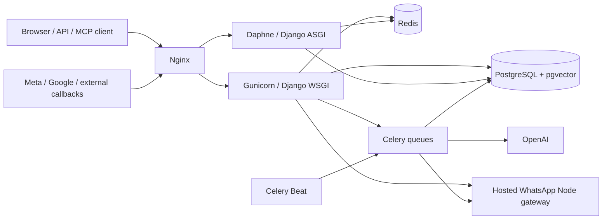

# SHVYA architecture

> **Implementation note:** updated for the current architecture on 2026-10-03. Source code, Django models/migrations, tests, runtime configuration and live connector discovery remain the executable source of truth.

For the detailed request, routing, AI, RAG, async and failure-model documents, start with [`system-architecture/README.md`](./system-architecture/README.md).

## Runtime topology

## Platform boundaries

- **CRM** is the system of record for leads, pipelines, stages, attributes and activity.
- **AI engagement** proposes bounded decisions; Python permission, qualification and execution contracts own authoritative CRM mutations.
- **Messaging** covers WhatsApp Cloud API, Coexistence, Hosted WhatsApp and Instagram with pipeline/tenant sender affinity.
- **Cadence and Workflows** execute through durable state/outbox-style scheduling and recheck current state at delivery time.
- **Knowledge/RAG** stores organization-approved sources in PostgreSQL/pgvector and keeps knowledge evidence separate from conversation memory.
- **SHVYA Sales** owns quotations, agreements, invoices, PDF/delivery tracking and payment lifecycle.
- **SHVYA Calendar** owns lead capture, availability, booking, Google Calendar/Meet and reminder delivery.
- **Call Intelligence** owns Android/cloud/manual call identity, device state, CRM call linkage and call-analysis data.
- **Support** owns organization tickets and the Shvya-Ops Client's Portal.
- **Operations MCP** is a separate actor-bound external-AI control plane; it does not bypass normal tenant/service validation. Its current maximum catalog is 101 Operations-native tools plus 10 diagnostic tools. A backend-owned library exposes 25 domain skills that route reasoning across CRM, AI, automation, channels, Calendar and operations without adding permissions.

## Operations MCP skill layer

The skill layer sits above the tool catalog and below the external AI client's task interpretation. `shvya-operator` selects the smallest relevant skill; broad account setup orchestrates domain skills rather than owning every schema decision. Read-only diagnostics remain separate from repair, and `shvya-acceptance-testing` is the final readiness gate after setup or repair.

Skill loading is not authorization. Actor role, selected organization, OAuth scopes, granted capabilities, live organization policy, exposed tools and canonical backend validation still determine what can run.

## Tenant architecture

Organization identity is a security boundary, not a UI filter. Tenant scope must survive:

- HTTP and WebSocket authentication;
- database queries and relationship validation;
- cache/lock/idempotency keys;
- Celery/background tasks;
- provider-account routing;
- MCP support context and capability evaluation;
- exports, analytics and diagnostics.

Superadmin cross-tenant access is allowed only through explicit platform-admin flows. Operations MCP further requires one explicit customer support context before Superadmin customer data is available.

## State and execution

PostgreSQL is durable state. Redis is used for cache, Celery transport and Channels delivery. External work is asynchronous where latency/retry behavior warrants it. A successful HTTP enqueue is not proof that an external provider side effect succeeded; durable rows, provider evidence and post-write verification carry that responsibility.

## Frontend architecture

The current product uses Django templates, HTMX/JavaScript and shared static assets. Backend rules remain authoritative; client-side controls may improve UX but do not replace server authorization or validation.

## Important documents

- [`../README.md`](../README.md) — repository overview.
- [`../CLAUDE.md`](../CLAUDE.md) — engineering contract.
- [`../database.md`](../database.md) — relational schema map.
- [`api.md`](./api.md) — route and integration boundary map.
- [`deployment.md`](./deployment.md) — deployment runbook.
- [`operations-mcp.md`](./operations-mcp.md) — external AI operations boundary.
- [`architecture-boundaries.md`](./architecture-boundaries.md) — service ownership, Operations facade rules, AI patch ceiling and the safe `apps.channels` rename plan.
- [`shvya-sales.md`](./shvya-sales.md), [`shvya-calendar-workspace.md`](./shvya-calendar-workspace.md), [`call-intelligence.md`](./call-intelligence.md) — current business workspaces.
