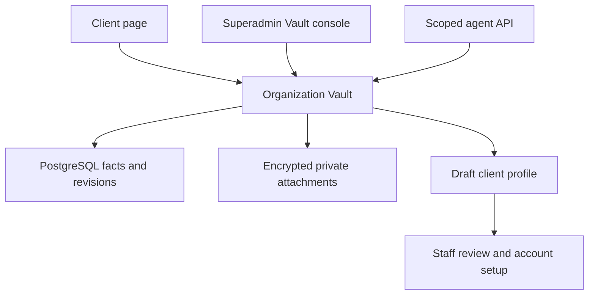

# SHVYA Vault

SHVYA Vault is a private content workspace for each organization, managed at
`/superadmin/vault/`. It collects the business information needed to prepare an
account: website links, brochures, prices, media, qualification questions,
language preferences and answers to outstanding questions.

The client receives a private `/vault/<slug>/` link and a six-digit access code.
The page works independently of a CRM login. A Vault grant never logs the client
into SHVYA or grants access to another organization's records.

The supplied Kraya document and screenshots informed the workflow. That document
describes Kraya's backend by inference from its agent API; it does not contain
the Kraya server source. This document describes the SHVYA implementation in
`apps/vault/`; it does not claim that Kraya's private source was inspected.

The live reference client page was also inspected in the browser. It currently
shows 16 sections, including a separate **Past chats** section. SHVYA implements
the supplied document and screenshots' 15-section schema, keeping sales scripts
and past chats together under `scripts`.

## Architecture and boundaries



A Vault is input for account setup. Saving an entry, answering a question,
submitting the Vault or creating a profile snapshot does **not** change live
AI Brain configuration, Playbooks, qualification rules, lead routing, bot
languages, knowledge indexing or outbound messaging. Staff can generate a
versioned draft profile and review it before a separate configuration change.

Models:

| Model | Purpose |
|---|---|
| `Vault` | One-to-one organization workspace, random slug, status, access controls, quota |
| `VaultSection` | Section identifier, content status (empty, filled or unavailable), completion flag |
| `VaultEntry` | Note, link, file or audio; provenance, client override, sharing instructions |
| `VaultEntryRevision` | Prior text and metadata when an entry changes |
| `VaultQuestion` | Scoped question, client answer and answer timestamp |
| `VaultCall` | Date, title, attendees, duration, summary and optional recording link |
| `VaultProfileSnapshot` | Versioned JSON setup input marked as a draft requiring review |
| `VaultEvent` | Creation, client update, submission and credential rotation activity |

## Superadmin and client interfaces

The superadmin list provides organization search, draft/submitted/paused filters,
progress and storage information, recent client activity, and creation for
organizations without a Vault. Staff can open the workspace, copy its client
link, pause/resume client access, set its storage allowance, generate a new client
code, generate/revoke its agent token, export Markdown, and create a draft profile.

Codes and agent tokens are displayed once on creation or regeneration. Existing
secrets cannot be retrieved from the list: the database stores hashes. Share a
new code with the intended client; keep the agent token within the authorized
setup workflow.

The client workspace has section navigation and completion progress. Each
section explains what to provide, with guidance and an example. Clients can add
notes, links and files, provide voice material, state that they do not have an
item, confirm or correct team/agent notes, answer questions, mark sections done,
and submit for review. Calls and their shared recording links are visible in the
workspace. A partial Vault can be submitted once it contains material or a
section marked unavailable; submission does not imply all 15 sections are filled.

An agent or staff note is client-visible. Keep operational billing, credits,
internal opinions and other clients' information outside the Vault.

## Fifteen sections

The keys are stable API identifiers. The first eleven are recommended; the last
four are optional material the client may provide.

| Key | Client title | What belongs here |
|---|---|---|
| `website` | Website pages | Individual product/service, pricing, About and Contact URLs; outdated-page warnings |
| `brochures` | Brochures, catalogues & price lists | Documents, policies, rate cards, description and customer-sharing permission |
| `media` | Photos & videos the AI can send | Images/video and a description of what each shows and when it should be sent |
| `offerings` | Products, services & pricing | Products, packages, prices/ranges, disclosure rules, minimum orders and conditions |
| `basics` | Business basics | Branches, service areas, hours/timezone, contacts, booking and payment links |
| `faqs` | Questions customers ask & objections | Real questions, objections and preferred answers |
| `team` | Who handles leads | Names, roles, numbers, routing, escalation order and response expectations |
| `qualification` | Qualification | A good lead, exact questions/options, deal-breakers and sales cycle |
| `handoff` | When the AI should hand over to a human | Trigger, handoff wording and responsible person/team |
| `blacklist` | Topics the AI must never answer | Restricted topics and escalation instructions |
| `rules` | Tone, language & promises | Persona, languages/scripts, tone, emoji preferences and prohibited promises |
| `proof` | Testimonials & proof | Approved attributed quotes, case studies, awards and evidence |
| `offers` | Current offers | Audience, terms, start/end dates and coupon code |
| `scripts` | Sales scripts & past chats | Redacted chat examples and call/email scripts for style reference |
| `other` | Anything else | Changes, launches, additional context and follow-up ideas |

Section states are `empty`, `filled` and `dont_have`. Completion is tracked
separately from whether a section has material. The submitted status and timestamp
record the client's submission; later updates remain visible through activity.

Files have a separate `allowed_for_ai_sharing` flag and `send_when` instructions.
The flag records permission for subsequent reviewed setup; it does not itself
publish the file or send it to a lead. A brochure used for internal understanding
can therefore remain unavailable for customer sharing.

## Source precedence and repeatable writes

The review workflow applies facts in this order:

1. The client's edit of a team/agent note.
2. Client-authored material and answers to questions.
3. Agent/team notes confirmed by the client.
4. Unconfirmed agent/team notes.
5. External operations checklists where they conflict with the Vault.

An entry's effective text uses the client override when present. The original is
retained with revision history. Updating an agent note must not erase the client
override. Updating a previously confirmed source note without a client override
clears its stale confirmation when its content changes. A changed question that already has a client answer is
rejected with a conflict; create a new question instead of changing its meaning.

Use an `external_id` for repeatable imports. Entry and question uniqueness is
scoped by Vault and author type; call uniqueness is scoped by Vault. Rerunning
the same source updates its existing item instead of adding duplicates.

| Item | Suggested external ID |
|---|---|
| Call | `ff_example` |
| Call-derived note | `ff_example:qualification` |
| Call-derived question | `ff_example:q:1` |
| WhatsApp-derived note | `wa:basics` |

Pull first, avoid repeating facts already provided by the client, write concise
facts in the relevant section, and ask one plain-language question for each gap.
Record source dates and origins (`fireflies`, `whatsapp`, `ops_chat`, `other`).
These origin labels are provenance, not automatic integrations.

## Permissions and access

| Access path | Authority |
|---|---|
| Superadmin console | Active authenticated superuser using SHVYA's superadmin area session |
| Client portal | Valid per-Vault access code followed by a scoped signed cookie |
| Agent API | Current `sv_` Bearer token resolving one Vault; no organization/workspace selector |
| File download | Authorized staff/client session or a valid scoped short-lived signed link |

Client access codes are password-hashed. Eight failed attempts cause a 15-minute
Vault lockout. Client grants expire after 12 hours by default. Code regeneration
invalidates existing client grants and signed links through an access version;
pausing also revokes existing client grants. Resuming requires clients to unlock
again. Agent reads and writes remain available while the client page is paused.

Agent tokens are SHA-256 hashed, last 90 days, and are shown once. Regeneration
immediately replaces the previous token; revocation disables it. Tokens have no
authority over live CRM or AI configuration. Never save tokens in source files,
exports, commits, logs or messages. A `401` means obtain a new token, not retry.

Browser mutations use CSRF protection. The Bearer-only API accepts JSON objects
up to 64 KiB and rejects protected fields such as organization IDs, author type,
client overrides and confirmation timestamps. File download links expire after
one hour; pulling again obtains fresh links. Private responses disable caching,
referrer transmission and indexing. Attachments are served as downloads rather
than executable inline content.

## Routes and agent API

| Method / route | Purpose |
|---|---|
| `GET, POST /superadmin/vault/` | Organization list, creation and access/storage management |
| `GET, POST /superadmin/vault/<uuid>/` | Staff workspace and content actions |
| `GET /superadmin/vault/<uuid>/export.md` | Staff Markdown export |
| `GET /superadmin/vault/<uuid>/profiles/<snapshot_uuid>/` | Draft profile JSON download |
| `GET, POST /vault/<slug>/` | Client unlock and workspace actions |
| `GET /vault/<slug>/export.md` | Authorized client Markdown export |
| `GET /vault/api/agent/workspace` | Structured workspace with protected file URLs |
| `GET /vault/api/agent/export.md` | Markdown with provenance, calls and questions |
| `POST /vault/api/agent/entries` | Upsert a sourced note or link |
| `POST /vault/api/agent/questions` | Upsert a client question |
| `POST /vault/api/agent/calls` | Upsert a call record |

Agent routes use `Authorization: Bearer <token>` and no trailing slash. Workspace
responses omit credentials and internal organization configuration. API uploads
are not supported: clients and staff upload through the protected interface.

Entry fields: `section`, `body`, `origin`, optional `source_date`, `external_id`,
`kind` (`note` or `link`), `url`, `send_when`, `allowed_for_ai_sharing`.
Question fields: `section`, `text`, optional `external_id`.
Call fields: `title`, `date`, optional `url`, `duration_min`, `attendees`, `summary`,
`external_id`, `share_recording`. Recording links are shared with the client by
default. A private recording is omitted from client-facing exports.

Writes return the item ID, `updated` boolean and item payload; new items use HTTP
201 and updates HTTP 200. Validation uses HTTP 400, conflicts 409, oversized
requests 413, wrong content type 415, and invalid/revoked tokens 401.

## Command-line workflow

`scripts/shvya_vault.py` uses Python's standard library only. Run `--help` without
credentials to view usage. Supply the current token to each invocation through
`VAULT_TOKEN`; `VAULT_URL` defaults to `https://shvya-ai.com` and must be a server
origin without a path. Local development may explicitly use an HTTP loopback
origin; remote origins require HTTPS.

The following commands use a placeholder, never a real credential. Avoid putting
actual tokens into shell history; an execution runner can supply a command-local
environment value without recording it.

```sh
VAULT_TOKEN='<current-vault-token>' python3 scripts/shvya_vault.py status
VAULT_TOKEN='<current-vault-token>' python3 scripts/shvya_vault.py pull --out ./client-vault

VAULT_TOKEN='<current-vault-token>' python3 scripts/shvya_vault.py call \
  --title 'Account setup call' --date 2026-10-07 --duration 30 \
  --attendee 'Client owner' --external-id ff_example \
  --summary 'Confirmed hours and qualification questions. The brochure is still needed.'

VAULT_TOKEN='<current-vault-token>' python3 scripts/shvya_vault.py note \
  --section basics --origin fireflies --date 2026-10-07 \
  --external-id ff_example:basics --body 'Open Monday to Saturday, 10 am to 7 pm.'

VAULT_TOKEN='<current-vault-token>' python3 scripts/shvya_vault.py ask \
  --section brochures --external-id ff_example:q:1 \
  --text 'Please upload your current customer brochure.'
```

Notes also accept `--file <utf8-file>` or standard input. Calls accept repeated
`--attendee`, `--summary-file`, a recording `--url`, and `--hide-recording`.
The CLI prints only concise status/results and never prints the token or raw
server error bodies. It does not automatically retry failed mutations.

`pull` creates:

- `export.md`: readable source material with provenance.
- `manifest.json`: structured metadata and a local-file mapping; temporary signed
  download URLs are removed before it is written.
- `files/<section>/<entry-uuid>-<kind>-<safe-filename>`: protected attachments.

UUID prefixes prevent same-name collisions. File names are sanitized and
symbolic links within the managed output directories are rejected. Files and
exports are written atomically with private file permissions. Immutable files
already present with the expected size are reused. Downloads are limited to the
configured origin's protected Vault file route and never carry the Bearer
header. Redirects are rejected for both API and download requests.

Treat the downloaded directory as client-confidential data. It contains decrypted
documents even though the server stores encrypted attachment bytes. It must not
be committed to source control. Refresh with `pull` when a download link expires.
The draft profile can be generated and downloaded from superadmin for staff
review; the CLI intentionally has no command to apply live AI configuration.

## Deployment, media and backups

The app is registered as `apps.vault.apps.VaultConfig`. Deploy its migration before
opening the feature:

```sh
python manage.py migrate vault
python manage.py check
```

Use the project's standard deployment process to reload application services and
collect static files. The URLs use the existing SHVYA origin, so this feature does
not require a new Vault subdomain or separate certificate.

Files use `VaultPrivateStorage`, backed by `VAULT_STORAGE_ROOT` or, by default,
`MEDIA_ROOT/.vault-encrypted`. The directory must be on persistent storage shared
by every application instance that serves Vault downloads. Do not place it on a
temporary container layer. It has no public storage URL; authenticated views
decrypt files for authorized downloads. Existing media mounts hold ciphertext
rather than readable customer files, but the Vault directory should still be
excluded from public web-server media serving and directory listings.

Attachments are authenticated-encrypted with Fernet using a purpose-specific
derived key from Django's `SECRET_KEY`. Back up **the database, the encrypted
Vault directory, `SECRET_KEY`, and retained `SECRET_KEY_FALLBACKS` together**.
Losing the key makes the attachment backup unreadable. Store secret backups
securely and separately from ordinary source-code exports. When rotating the
secret, retain the old key in `SECRET_KEY_FALLBACKS` until existing attachments
have been re-encrypted or migrated; no automatic re-encryption command is
provided by this feature. Test a restore before removing an old key.

The default per-file upload limit is 25 MiB (`VAULT_MAX_FILE_BYTES`) with a hard
storage cap of 50 MiB per file. Default organization allowance is 2 GiB; staff
can choose 512 MiB, 1 GiB, 2 GiB, 5 GiB or 10 GiB, provided it covers existing
usage. Align reverse-proxy upload limits with the application limit. Storage
quota tracks original bytes; encrypted files require additional disk space.

## Current limits

- No automatic Fireflies or WhatsApp ingestion is included. Staff or an authorized
  agent provides source facts and records their provenance.
- Audio uploads are stored privately. Browser dictation may be available where
  the browser supports it; server-side audio transcription is not implemented.
  An audio note without text must be listened to or supplemented by typed text.
- URLs are collected as source references; adding a URL does not crawl or index it.
- No automatic live AI setup, message sending, offer expiry enforcement in the
  live assistant, or synchronization with AI Brain occurs from Vault changes.
- File type and size checks are provided; this feature does not add a malware
  scanning service. Staff should review source material before production use.

## Development validation

The development validation run passed **61 tests with 26 additional subtest
cases** using Python 3.13.15 and Django 6.1.1. All migrations were applied against
PostgreSQL 18.3 running through PGlite's WebAssembly runtime. This verifies the
development test environment; it is not a native production PostgreSQL deployment
or a production acceptance result. The CLI help commands and Python compilation
also passed without contacting a live Vault.

The provided screenshots and live Kraya reference were reviewed. Browser-based
visual QA of the newly rendered SHVYA interface remains incomplete because the
available browser could not reach the local development server. Verify desktop
and mobile layouts on a reachable SHVYA preview before production rollout.
