# 01. Full Request / Response Cycle

> Snapshot: `staging` traced from `88a71f8a02c911c5c963c9f0d8235ff60684ab17`.

This document follows a request from the network edge through authentication, Django routing, services, PostgreSQL, Celery, external providers and realtime browser updates. It distinguishes the **HTTP response cycle** from the **business response cycle**. For a webhook, HTTP may finish in milliseconds while the final WhatsApp AI reply is produced asynchronously afterward.

---

## 1. Runtime components

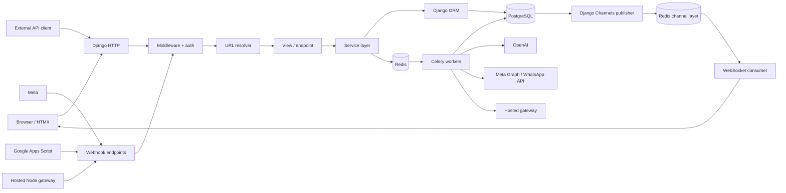

### Durable vs ephemeral state

| Concern | Primary owner |
| --- | --- |
| CRM records | PostgreSQL |
| WhatsApp/Instagram message rows | PostgreSQL |
| Hosted AI jobs | PostgreSQL |
| Trigger/follow-up execution state | PostgreSQL |
| Knowledge documents/chunks/vectors | PostgreSQL + pgvector |
| AI credit reservations/ledger | PostgreSQL |
| Celery transport | Redis |
| Django cache / short locks | Redis |
| WebSocket channel layer | separate Redis DB |
| External provider source of truth | Meta/OpenAI/Hosted gateway depending on operation |

Redis loss can interrupt or delay runtime work, but durable business state is designed to live in PostgreSQL.

---

## 2. HTTP request lifecycle

A normal dashboard or API request follows this shape:

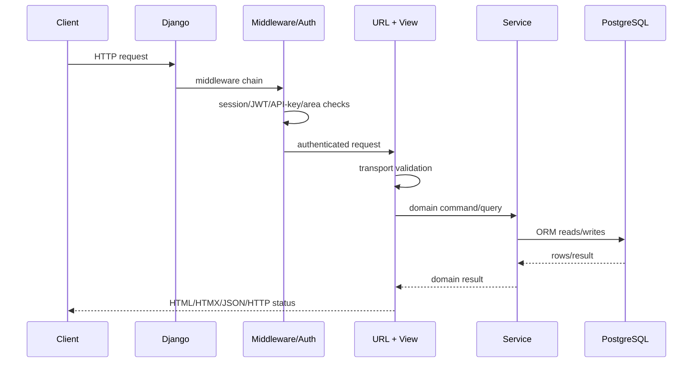

### Middleware boundary

`config/settings/base.py` installs Django's security/session/auth middleware and `apps.accounts.middleware.SHVYAAreaAuthenticationMiddleware` after Django authentication.

For SHVYA-specific areas:

- `/admin/` keeps Django's standard admin session behavior.
- `/superadmin/` uses the dedicated SHVYA Superadmin session.
- `/dashboard/` uses the dedicated CRM session.

The SHVYA middleware resets `request.user` to anonymous before resolving the dedicated area session. This prevents a default Django session from leaking identity into `/dashboard/` or `/superadmin/`.

In the current staging snapshot, dashboard authorization also rejects a user whose organization is inactive. The same organization-active rule is applied to API-key and CRM WebSocket authorization paths.

---

## 3. ASGI and WebSocket lifecycle

`config/asgi.py` uses `ProtocolTypeRouter`:

- `http` -> Django ASGI application;
- `websocket` -> `AllowedHostsOriginValidator` -> `CRMSessionAuthMiddleware` -> Channels URL router.

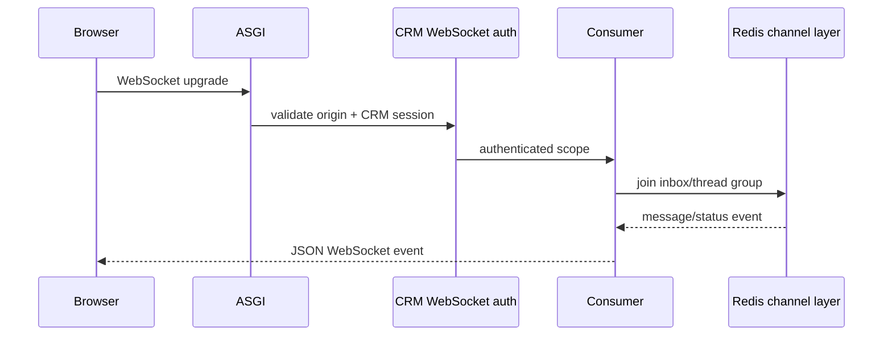

WebSockets are a projection mechanism. They do not replace database writes. `services/channels/realtime.py` publishes only after transaction commit.

---

## 4. Dashboard write request

Example: manually creating a lead.

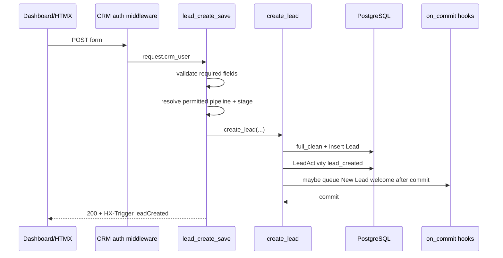

The UI receives the HTTP response after the durable lead operation completes. A welcome/automation task is separate background work.

---

## 5. API-key lead request

`apps/crm/views/api.py::LeadUpsertAPIView` authenticates with `SHVYAAPIKeyAuthentication` and requires `api_key.can_upsert_leads`.

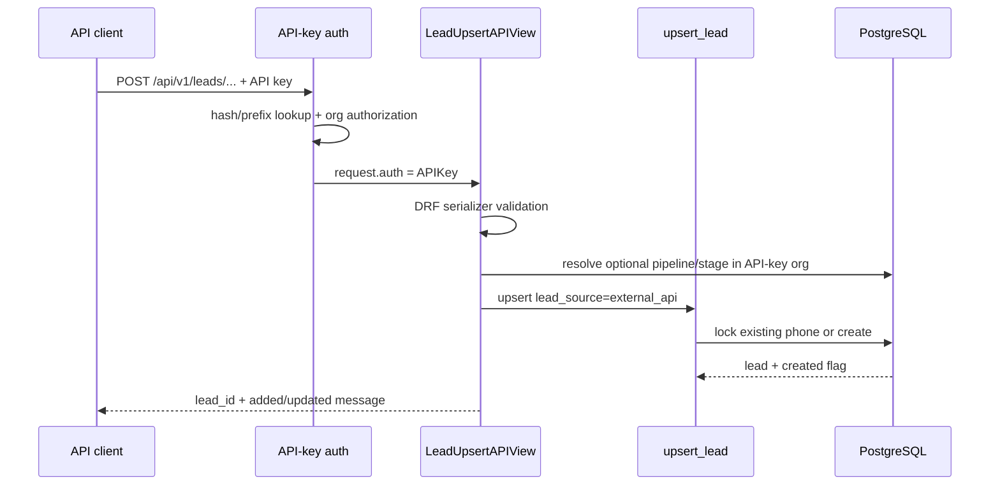

For a **new** lead, canonical `upsert_lead` requires pipeline and stage. For an **existing** phone, omitted pipeline/stage can leave its current CRM routing unchanged.

---

## 6. Public WhatsApp Cloud API webhook

The public route is `/webhooks/whatsapp/`.

### Security boundary

`apps/channels/webhook_security.py` wraps the legacy handler.

- GET verification compares `META_VERIFY_TOKEN` in constant time.
- POST requires `META_APP_SECRET`.
- POST validates `X-Hub-Signature-256` over the raw request body.
- Invalid/missing verification fails before business processing.

### Business lifecycle

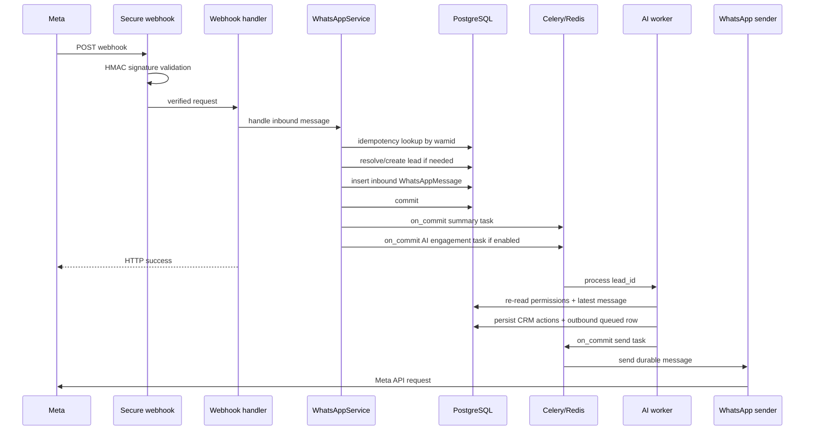

The important point is that **Meta's webhook HTTP response is not the AI response**. The webhook persists the event and schedules work. The customer-facing reply is generated and delivered asynchronously.

---

## 7. WhatsApp message commit and realtime UI

For a newly persisted WhatsApp message, `queue_message_publish()` defers Channels publication until commit.

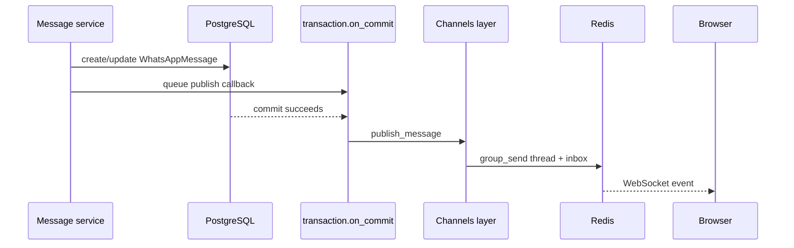

Groups include a lead thread group and an organization inbox group. Status updates use a separate event type.

---

## 8. Hosted WhatsApp request cycle

Hosted WhatsApp is architecturally different from Meta Cloud API. A separate Node gateway owns the linked-device/browser session; Django remains the CRM/control plane.

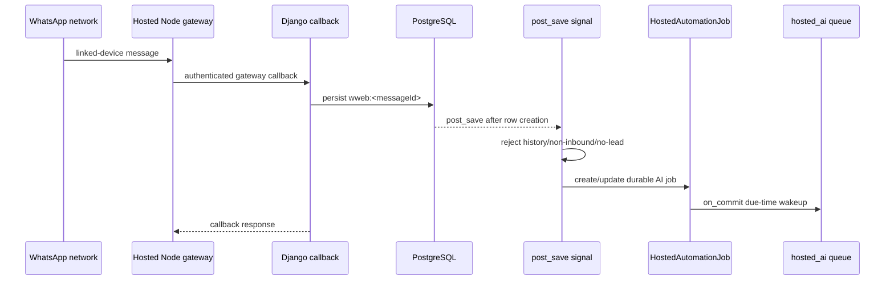

Hosted AI does not simply enqueue the canonical Meta AI task. The durable job binds:

- exact organization;
- exact Hosted account;
- exact lead;
- exact source inbound message;
- available/due time;
- result and completion status.

This prevents a second WhatsApp number for the same lead from stealing account context.

---

## 9. Coexistence request cycle

WhatsApp Business App Coexistence uses Meta Cloud API transport, not the Hosted Node gateway. Its onboarding is special, but after connection its message delivery belongs to the Meta/API family.

During onboarding:

1. browser completes Meta Coexistence Embedded Signup;
2. server exchanges authorization code for access token;
3. authorized WABA/phone assets are resolved;
4. phone metadata is fetched without re-registering the Business App number;
5. account is stored as API transport;
6. SHVYA subscribes the app to WABA webhooks;
7. state/history sync requests are initiated.

The imported Coexistence history uses a dedicated synchronization path. That path may create/attach leads while importing conversations. This differs from Hosted linked-device history, where historical sync is explicitly prevented from live auto-lead creation and AI enqueueing.

---

## 10. Google Sheets webhook cycle

The integration generates an Apps Script that posts rows to SHVYA with `X-Shvya-Sheets-Secret`.

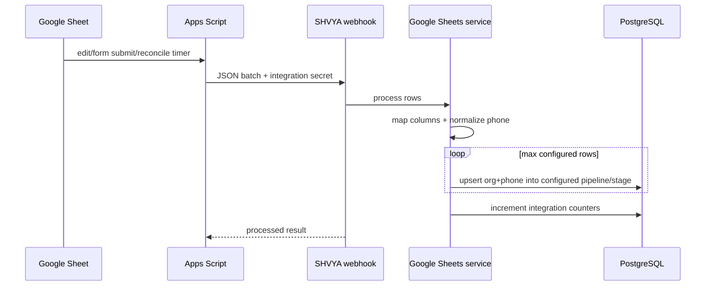

Apps Script also runs a periodic reconciliation function so missed appended rows can be resent. Upserts are phone-idempotent at the CRM layer.

---

## 11. Meta Lead Ads webhook cycle

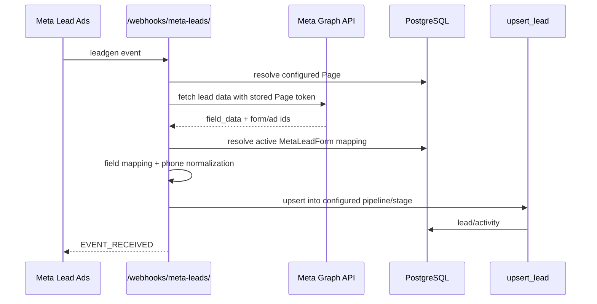

Implementation note: this endpoint currently logs a Meta signature mismatch rather than rejecting solely on that mismatch, then attempts to validate access by fetching the lead with the stored Page token. This behavior should be treated as an explicit current-runtime characteristic, not a generic webhook recommendation.

---

## 12. AI request cycle

The AI worker's input is intentionally small: for canonical Meta/API engagement, the Celery task receives only `lead_id`.

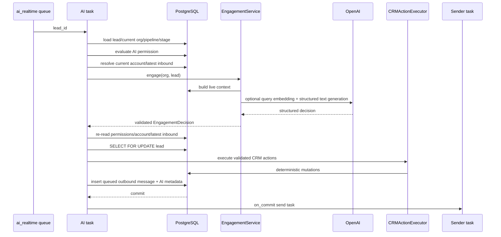

The worker may finish with `skipped` even after successful generation if the conversation changed, AI was disabled, the account disconnected, a duplicate response already exists, or the 24-hour free-form messaging window expired.

---

## 13. External provider request rules

### OpenAI

`OpenAIProvider` disables SDK automatic retries (`max_retries=0`). Celery is the retry owner. Calls have bounded timeouts and output limits. AI-credit reservation happens before the provider call and is settled from actual/fallback usage afterward.

### Meta WhatsApp

The AI task does not call Meta directly. It creates a durable `WhatsAppMessage` first and dispatches `send_whatsapp_message_task` after commit.

### Hosted WhatsApp

Hosted AI also creates the durable outbound row first, but final delivery is owned by the Hosted job/transport so Account Health pacing and cooldown behavior can be enforced.

---

## 14. Transaction pattern

Preferred pattern:

```text
request/webhook
  -> validate
  -> transaction.atomic
      -> lock rows when necessary
      -> mutate canonical database state
      -> attach idempotency/audit metadata
      -> transaction.on_commit(queue async work)
  -> return HTTP response
```

Do not enqueue work that expects a database row before the transaction that creates the row has committed.

---

## 15. Error semantics

Different failures belong at different layers:

| Failure | Typical behavior |
| --- | --- |
| malformed HTTP/API input | 4xx response |
| authentication/authorization failure | 401/403 or anonymous redirect behavior |
| tenant mismatch | reject/skip, never cross tenant |
| duplicate provider delivery | return existing/no-op |
| temporary OpenAI/network failure | Celery retry |
| permanent AI provider/config failure | fail task/record reason, no blind retry |
| stale AI result because a new message arrived | skip generated result |
| provider send failure | persist failure/retry according to sender semantics |
| WebSocket publish problem | durable DB state remains source of truth |

---

## 16. Review checklist for a new endpoint

When adding a new request path, verify:

- Which authentication boundary owns it?
- How is `organization` derived?
- Are all foreign IDs scoped to that organization?
- Does business logic live in a service instead of the view?
- Does a write need `transaction.atomic()`?
- Does concurrency need `select_for_update()` or an idempotency key?
- Is async work queued only after commit?
- Is the external provider call outside a fragile long-held database lock when possible?
- What durable row proves the operation happened?
- How does a retry avoid duplicate side effects?
- Does the browser need an after-commit WebSocket/HTMX update?
- Does the flow need documentation updates in this folder?