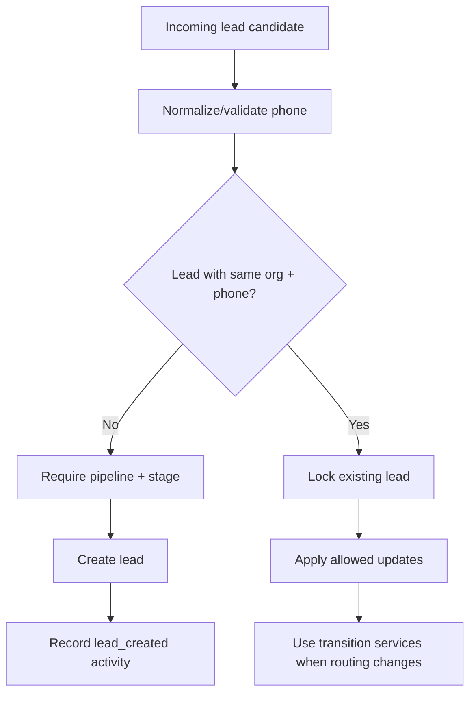
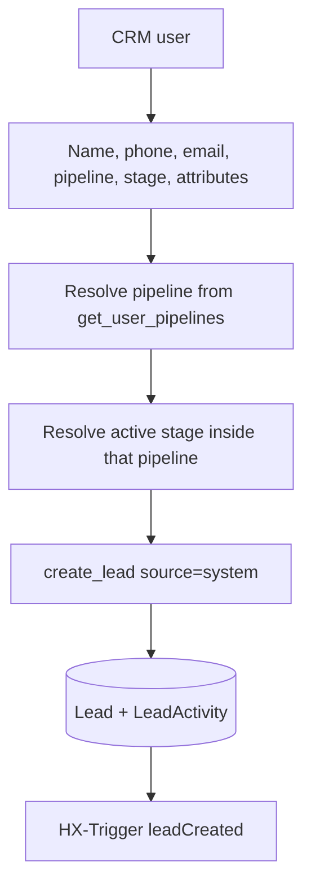
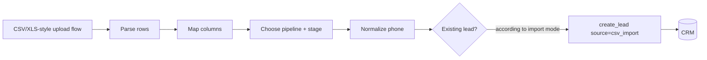
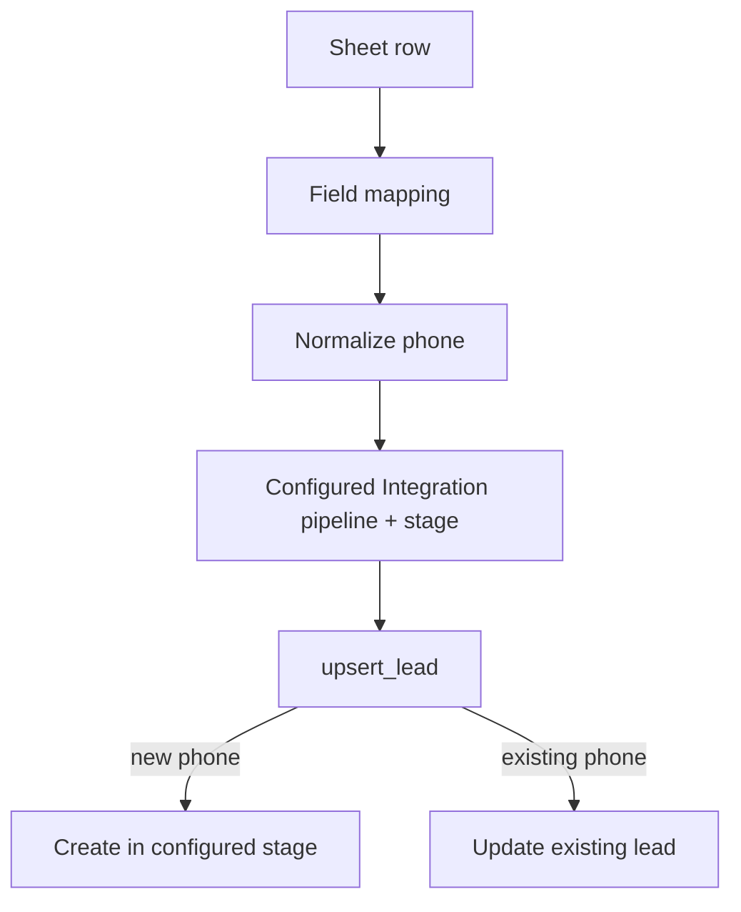
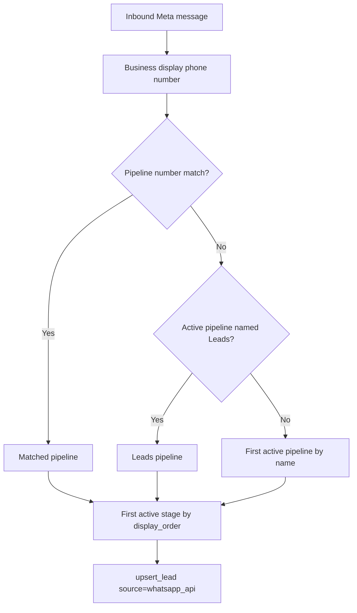
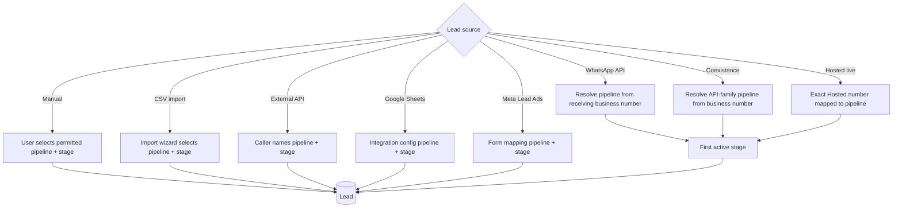

# 02. Lead Creation, Pipeline and Stage Routing

> Snapshot: `staging` traced from `88a71f8a02c911c5c963c9f0d8235ff60684ab17`.

This document answers four questions precisely:

1. **From where can a lead enter SHVYA?**
2. **What `lead_source` is stored?**
3. **How is the pipeline chosen?**
4. **How is the stage chosen and what happens if the lead already exists?**

The canonical CRM write boundary is `services/crm/lead_service.py`.

---

## 1. Lead creation source matrix

| Entry path | Main implementation | Stored source | Pipeline selection | Stage selection | Create vs update |
| --- | --- | --- | --- | --- | --- |
| Dashboard manual lead | `apps/crm/views/dashboard.py` | `system` | user-selected permitted pipeline | user-selected active stage inside pipeline | create only through `create_lead` |
| CSV/file import | `apps/crm/views/dashboard.py` import flow | `csv_import` | import wizard selection | import wizard selection | import mode controls duplicate behavior; new rows use `create_lead` |
| External Lead API | `apps/crm/views/api.py` | `external_api` | caller-supplied active pipeline name | caller-supplied active stage name | phone-based `upsert_lead` |
| Google Sheets | `apps/integrations/services/google_sheets.py` | `google_sheets` | configured on `GoogleSheetIntegration` | configured on `GoogleSheetIntegration` | phone-based `upsert_lead` |
| Meta Lead Ads | `apps/integrations/views/meta_leads.py` | `meta_ads` | configured on `MetaLeadForm` | configured on `MetaLeadForm` | phone-based `upsert_lead` |
| WhatsApp Cloud API inbound | `services/channels/whatsapp_service.py` | `whatsapp_api` | business-number mapping, then fallbacks | first active stage by `display_order` | phone-based `upsert_lead`; existing CRM assignment is protected |
| WhatsApp Business App Coexistence | `services/channels/whatsapp_coexistence_service.py` | `whatsapp_api` | same API-family pipeline resolver | first active stage by `display_order` | phone-based upsert/attach during sync and message handling |
| Hosted WhatsApp live inbound | `services/channels/hosted_whatsapp_service.py` | `whatsapp` | exact Hosted number must map to active pipeline | first active stage by `display_order` | only if auto-lead creation enabled and no existing phone |
| Hosted history synchronization | same Hosted service | no automatic live lead creation | n/a | n/a | history rows are persisted but live auto-create rule is disabled for historical rows |

There is also a transport-normalization signal in `apps/channels/lead_source_signals.py` that can relabel a just-created legacy `whatsapp_api` lead to `whatsapp` when the first inbound message proves it was created by a Hosted account. The current Hosted service already creates new live Hosted leads as `whatsapp`; the signal remains a defensive compatibility layer.

---

## 2. Canonical lead identity

A lead is unique by:

```text
(organization, phone)
```

This means the same phone can exist in different organizations, but not twice inside one organization.

`upsert_lead()` uses a transaction and row locking for existing records. The design treats phone as the external identity for integrations and messaging channels.



---

## 3. `create_lead` vs `upsert_lead`

### `create_lead`

Used when the calling flow expects a genuinely new CRM row.

It:

- constructs `Lead`;
- calls `full_clean()`;
- saves;
- records `lead_created` activity;
- evaluates whether a New Lead welcome should be queued.

Typical callers:

- dashboard manual create;
- CSV import new rows.

### `upsert_lead`

Used by integrations and channels where the same external identity can be delivered again.

It:

- enters `transaction.atomic()`;
- looks up and locks existing `(organization, phone)`;
- updates safe fields if found;
- creates only if no existing row is found;
- requires pipeline + stage for a new row;
- uses shared transition services when an existing non-WhatsApp lead is intentionally rerouted;
- converts a concurrent unique conflict into `DuplicateLeadError` rather than silently producing two leads.

---

## 4. Manual dashboard lead creation

Flow: `lead_create_save()` in `apps/crm/views/dashboard.py`.



Rules:

- name, phone, pipeline and stage are required;
- pipeline must be one the current user can access;
- stage must belong to that exact pipeline and be active;
- only currently defined organization attributes are accepted;
- source is `system`;
- frontend receives `lead_id`, `pipeline_id`, and `stage_id` through `HX-Trigger` so it can place the card without a full reload.

### Dashboard default pipeline is not the create rule

The dashboard screen itself prefers a pipeline named `Leads` for admins, then falls back to the first available pipeline. That display default does **not** override manual creation. The create form posts explicit pipeline/stage IDs and validates them.

---

## 5. CSV/file import

The CRM import wizard stores temporary import state and asks the user to choose the target pipeline/stage before final creation.

New imported rows use:

```text
lead_source = "csv_import"
```

Phone values are normalized using the import normalization helper. The import flow supports duplicate-handling/import modes rather than blindly creating all rows.

Conceptual path:



Do not confuse this with the Google Sheets integration. CSV import is a user-driven batch import; Google Sheets is a connected webhook/reconciliation integration.

---

## 6. External Lead API

`LeadUpsertAPIView` uses an organization API key.

### Request routing

- pipeline is supplied by **name**;
- stage is supplied by **name**;
- if stage is supplied, pipeline is required;
- pipeline lookup is constrained to the API key's organization and active pipelines;
- stage lookup is constrained to that pipeline and active stages.

The service call uses:

```text
lead_source = "external_api"
```

### Existing lead behavior

Because this is a general upsert path, an existing lead can be updated and, when a new pipeline/stage is intentionally supplied, routed through shared transition logic.

### New lead behavior

If the phone does not already exist, `upsert_lead` requires enough routing information to create a valid lead. A new lead cannot be created into “no pipeline/no stage”.

---

## 7. Google Sheets lead creation

A `GoogleSheetIntegration` stores a configured target `pipeline` and `stage` plus field mapping.

Apps Script sends batches to SHVYA. `process_google_sheet_rows()`:

1. loads integration + organization + pipeline + stage;
2. rejects/returns early if missing or disabled;
3. maps sheet headers to core fields/custom attributes;
4. requires a Phone mapping;
5. normalizes phone to `+digits`;
6. defaults missing name to `Google Sheets Lead`;
7. calls `upsert_lead(... lead_source="google_sheets")`;
8. retries the upsert once after `DuplicateLeadError` to handle concurrent batches;
9. increments created/updated/skipped/error counters.



For an existing non-WhatsApp lead, configured routing can move it through canonical transition services.

---

## 8. Meta Lead Ads lead creation

Each active `MetaLeadForm` is mapped to one pipeline and stage.

The webhook receives only a lead-generation event identifier, then fetches full field data from Meta Graph API using the stored Page access token.

### Mapping steps

1. resolve configured `MetaLeadPage`;
2. fetch `leadgen_id` data;
3. resolve active form mapping;
4. map name/phone/email/custom fields;
5. normalize phone;
6. add Meta trace attributes such as form/ad/lead identifiers;
7. call `upsert_lead` with the form's configured pipeline/stage and `lead_source="meta_ads"`.

### Phone recovery

The current implementation tries multiple strategies because phone is required by the CRM identity model:

- mapped/common phone field;
- another field whose name looks phone/mobile/contact/WhatsApp-like;
- a traceable fallback derived from Meta `leadgen_id` when no CRM-compatible phone is supplied.

Warnings can be stored in lead attributes when fallback logic was required.

---

## 9. WhatsApp Cloud API pipeline routing

`services/channels/whatsapp_service.py::resolve_pipeline()` is the key API-family resolver.

Priority:

```text
1. Active pipeline whose normalized configured WhatsApp number matches the inbound business number
2. Active pipeline named "Leads"
3. First active organization pipeline ordered by name
```

Then `_first_stage(pipeline)` selects:

```text
first active stage ordered by display_order
```



### Why the display phone number matters

Meta's `phone_number_id` is an opaque resource ID, not the actual phone number. The inbound service intentionally prefers `account.display_phone_number` when resolving the pipeline so an opaque Meta ID cannot misroute a new lead.

---

## 10. Existing lead protection for WhatsApp API

For an inbound `whatsapp_api` upsert, the service deliberately does **not** fight a human-managed CRM assignment.

If the phone already exists under another pipeline/stage, inbound processing can attach the message to that existing lead instead of moving the lead back to the pipeline associated with the receiving number.

This protects workflows such as:

```text
Lead originally created from WhatsApp
-> agent/AI moves lead to Qualified or another pipeline
-> customer sends another message
-> message attaches to same lead
-> inbound transport does not reset CRM routing
```

The current AI permission layer separately checks whether the current conversation transport is valid for the lead/pipeline, with support for an already-established conversation remaining bound to its original organization account after a legitimate CRM move.

---

## 11. WhatsApp first-turn behavior

After an API inbound message transaction commits, SHVYA can queue:

- internal conversation summary generation;
- canonical AI engagement when account/pipeline AI auto-reply is enabled.

The generic New Lead welcome scheduler intentionally skips `lead_source="whatsapp_api"`. Otherwise a first inbound WhatsApp message could trigger both a template-style welcome path and the canonical AI response path.

For non-WhatsApp sources created directly into a stage named `New Lead` or `New Leads`, the lead service can queue the new-lead welcome task after commit.

---

## 12. Hosted WhatsApp pipeline routing

Hosted sessions are stricter at connection time.

`create_hosted_account()` calls `require_pipeline_number()`:

- normalize country code + phone;
- find an active pipeline whose configured WhatsApp number equals that number;
- reject session creation if no pipeline is mapped.

This means a Hosted account is expected to be bound to a pipeline by number before QR/session creation.

### Live inbound auto-lead creation

A new live Hosted inbound creates a lead only when all are true:

```text
not group message
AND inbound
AND not historical sync
AND no existing lead for peer phone
AND valid peer phone
AND session auto_lead_creation == true
AND mapped pipeline exists
AND pipeline has an active first stage
```

Then:

```text
lead_source = "whatsapp"
pipeline = pipeline mapped to Hosted account number
stage = first active stage by display_order
```

### History sync behavior

Hosted `history_sync` persists old messages with `historical=True`. The auto-lead condition contains `not historical`, so importing the linked-device history does not create a flood of CRM leads from every old chat.

A previously ignored/existing contact can later re-engage in realtime. A genuine new inbound is treated as live and becomes eligible for normal lead creation/AI rules.

---

## 13. Coexistence lead routing

Coexistence uses Meta Cloud API transport but can import WhatsApp Business App contact/history data during onboarding.

`_ensure_lead_for_phone()`:

1. normalizes customer phone;
2. returns existing organization lead if present;
3. resolves pipeline through the same API-family business-number resolver;
4. chooses first active stage by `display_order`;
5. calls `upsert_lead(... lead_source="whatsapp_api")`.

Unlike Hosted history sync, the Coexistence synchronization path can ensure/create a lead while importing a conversation. That difference is intentional in the current implementation and should be considered before changing onboarding/import semantics.

---

## 14. Pipeline number mapping

Both API and Hosted behavior ultimately depend on normalized business phone mapping.

Hosted helper `pipeline_whatsapp_number()` combines:

```text
Pipeline.country_code + Pipeline.phone_number
```

into an E.164-like `+digits` value.

A pipeline number is therefore not merely display metadata. It participates in:

- inbound routing;
- Hosted account creation;
- account selection for outbound conversation;
- AI permission transport validation.

Changing a pipeline's WhatsApp number can change runtime routing and permission results.

---

## 15. First-stage rule

Automatic channel creation uses:

```python
Stage.objects.filter(
    pipeline=pipeline,
    is_active=True,
).order_by("display_order").first()
```

Consequences:

- the first stage is configuration-driven;
- inactive stages are skipped;
- changing `display_order` can change where new WhatsApp leads land;
- if a resolved pipeline has no active stage, channel auto-creation cannot create the lead.

For Google Sheets, Meta Lead Ads, external API and manual UI, the stage can be explicitly selected/configured instead.

---

## 16. Stage transitions after creation

Lead creation is only the first routing decision. Later stage/pipeline changes should go through `services/crm/lead_transition.py` rather than direct field assignment.

Sources of later transitions include:

- human dashboard actions;
- external API bulk/single movement;
- positive WhatsApp reply intent logic;
- AI `pipeline_transition` CRM action;
- smart triggers/other deterministic automation where implemented.

The transition services keep activity history and invariants aligned.

---

## 17. Positive WhatsApp reply movement

`services/channels/whatsapp_service.py` classifies simple reply intent. A positive reply can call the stage service to move the lead to the next stage. Negative replies are not automatically deleted or moved backward.

This path is separate from the full AI engagement decision. It is deterministic message-intent business logic.

---

## 18. AI pipeline/stage movement

AI cannot invent arbitrary pipeline names or write `lead.stage_id` directly.

The model may request:

```json
{
  "type": "pipeline_transition",
  "stage_shift": {
    "stage_id": "<stage UUID from runtime context>"
  }
}
```

`CRMActionExecutor` then:

1. resolves the stage inside the current organization;
2. requires both stage and owning pipeline to be active;
3. determines same-pipeline vs cross-pipeline move;
4. calls canonical transition service;
5. records resulting state/activity;
6. when target stage name is `Qualified`, can append the backend qualification completion summary.

The LLM requests; deterministic code authorizes and executes.

---

## 19. New Lead and Qualified semantic stages

Certain names currently carry additional application meaning.

### `New Lead` / `New Leads`

- triggers the generic welcome scheduler for eligible non-WhatsApp creation paths;
- participates in qualification-mode behavior in the AI runtime.

### `Qualified`

- qualification completion can cause/authorize the controlled transition;
- backend can append a completion summary after transition.

Because semantic behavior partly depends on names, renaming system stages should be treated as an architecture change, not only a UI change.

---

## 20. Lead source vs transport

`lead_source` answers **how the CRM lead originated**, not necessarily which channel it uses forever.

Example:

```text
lead_source = google_sheets
later customer chats on WhatsApp API
later AI moves lead to Qualified
```

The origin remains Google Sheets unless explicit logic changes it. WhatsApp messages carry their own account/transport linkage separately.

---

## 21. Routing decision summary



---

## 22. Routing invariants to preserve

When modifying lead creation, keep these invariants unless intentionally redesigning the system:

1. Organization is always explicit.
2. Stage belongs to pipeline.
3. Pipeline belongs to organization.
4. New lead has a valid pipeline and stage.
5. Phone identity is normalized before integration/channel upsert.
6. Existing WhatsApp leads are not casually reset to the receiving number's initial stage.
7. Hosted history does not behave like a live inbound.
8. Automatic WhatsApp creation uses active stages only.
9. Human/AI transitions use the shared transition services.
10. Async welcome/AI work starts only after the lead/message transaction commits.
11. `lead_source` describes origin and should not be confused with current messaging transport.
12. Number-to-pipeline mapping changes are operational routing changes and must be tested end to end.