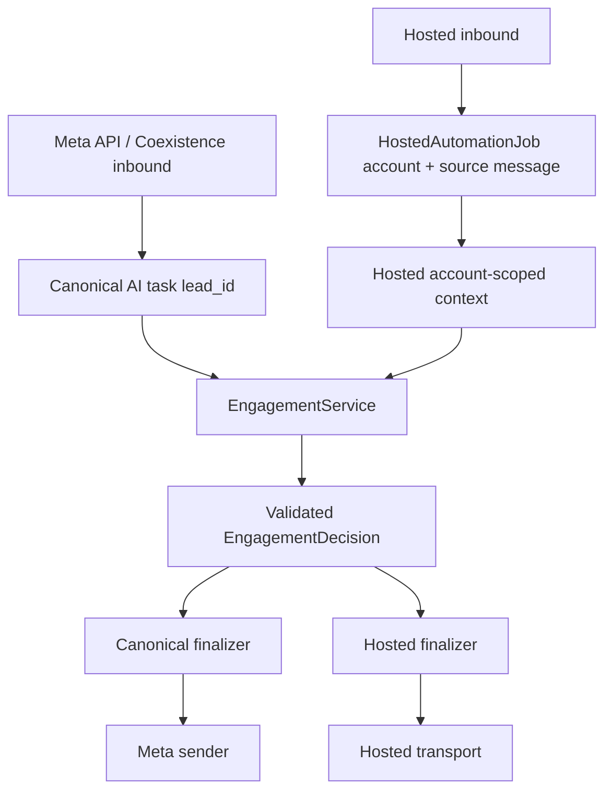
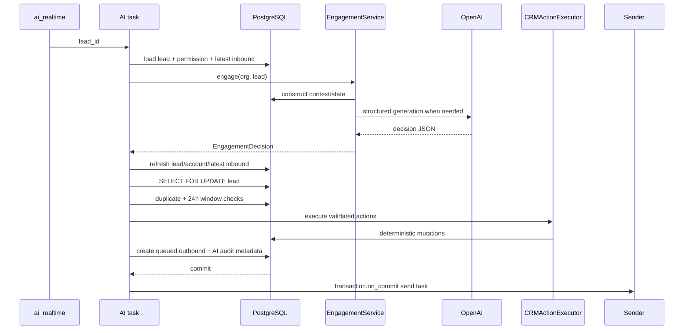
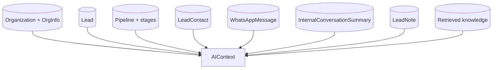
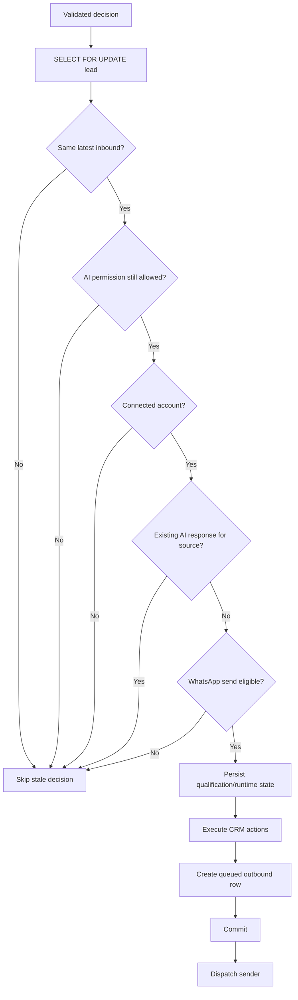
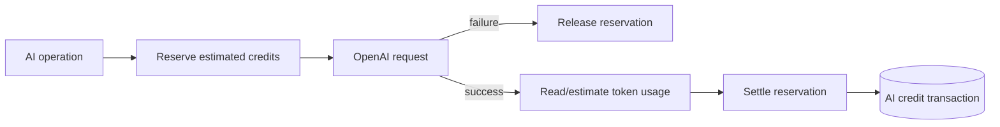

# 03. AI Engagement Runtime Design

> Snapshot: `staging` traced from `88a71f8a02c911c5c963c9f0d8235ff60684ab17`.

This document describes the production AI engagement architecture from inbound message to validated CRM actions and outbound WhatsApp reply.

The key design rule is:

> **The model understands/generates language. Python owns authorization, state, qualification order, CRM mutations, idempotency and delivery.**

The main implementation is `apps/ai_engagement/services/engagement.py`, with task finalization in `apps/ai_engagement/tasks.py` and deterministic side effects in `apps/ai_engagement/services/crm_executor.py`.

---

## 1. Two transport runtimes, one guarded engagement engine

SHVYA has two customer-facing WhatsApp AI execution families.

### Meta API / Coexistence

- inbound message is persisted by the Meta API path;
- after commit, `ai.generate_ai_engagement_response` is queued;
- task receives only `lead_id`;
- worker resolves current lead/account/latest inbound;
- final outbound uses the Meta/API sender task.

### Hosted linked-device WhatsApp

- inbound message is persisted from Hosted gateway callback;
- a committed-message signal creates a durable `HostedAutomationJob` bound to exact account + source message;
- the `hosted_ai` queue processes the job after configured debounce/health rules;
- Hosted execution injects an account-scoped context builder but reuses `EngagementService`;
- Hosted job owns final transport delivery.



---

## 2. AI permission hierarchy

`AIPermissionService` is the central technical gate.

Customer-facing AI requires all configured controls to permit it:

```text
Organization AI
  AND Pipeline AI
  AND Stage AI
  AND Lead AI
  AND valid WhatsApp conversation/account mapping
```

### Organization

`OrgInfo.ai_enabled` must be true.

### Pipeline

`Pipeline.ai_enabled` must permit automation.

### Stage

If the lead has a stage, `Stage.ai_on` must be true.

### Lead

`Lead.ai_enabled` must be true.

### Transport mapping

The latest inbound account must:

- belong to the same organization;
- be active;
- be connected;
- use a supported automation connection type (`api` or Hosted transport value);
- expose a usable display number;
- match the lead pipeline's configured WhatsApp number **or** be an already-established conversation transport for that lead.

The established-conversation exception is important. A lead may be legitimately moved to another pipeline after a conversation begins; existing authenticated conversation history can preserve the original transport binding instead of suddenly blocking replies.

---

## 3. Canonical Meta/API task lifecycle

`generate_ai_engagement_response` delegates to a shared executor. The effective order is:

```text
Lead
-> initial AI permission
-> current WhatsApp account
-> latest inbound message
-> EngagementService generation
-> permission re-check
-> account re-check
-> conversation freshness re-check
-> final SELECT FOR UPDATE
-> permission/account/freshness check again
-> duplicate response check
-> 24-hour send eligibility
-> persist qualification/runtime state
-> execute CRM actions
-> queue outbound message
-> commit
-> dispatch sender
```



---

## 4. Why the task receives only `lead_id`

The webhook deliberately does not serialize a large, stale snapshot into Celery.

By resolving state in the worker:

- pipeline/stage moves made after webhook receipt are visible;
- organization/pipeline/stage/lead AI toggles are current;
- account disconnects are visible;
- latest conversation state is current;
- tenant relationships are revalidated;
- a stale webhook-time object cannot authorize a later send.

Hosted differs only where exact account/source binding is required for a multi-account linked-device environment; that information is stored durably in `HostedAutomationJob`.

---

## 5. AI context construction

`AIContextBuilder` builds an immutable runtime context. It does not itself mutate CRM state or send messages.

It loads:

- organization identity/config;
- `OrgInfo` AI configuration;
- lead identity and `lead_source`;
- current pipeline and stage;
- active stages available to runtime policy;
- lead contacts;
- organization-defined attributes and lead attribute values;
- recent WhatsApp conversation;
- current internal conversation summary;
- qualification/system notes;
- optional knowledge chunks.



Every message/knowledge query is organization-scoped. A lead from another tenant is rejected rather than silently contextualized.

### Hosted context

`HostedAIContextBuilder` overrides conversation loading so messages are filtered by one exact `account_id`. This prevents conversations on multiple connected numbers from being merged into a single Hosted AI turn.

---

## 6. Qualification is backend-owned state

The engagement engine compiles organization-authored qualification requirements and tracks which requirements are already answered.

The backend owns:

- requirement IDs;
- ordering;
- what is answered;
- what requirement comes next;
- validation of proposed answer updates;
- state revision/version;
- final persistence.

The model does **not** get authority to arbitrarily choose a different qualification path.

### Deterministic zero-LLM path

For obvious direct answers to the exact currently asked qualification requirement, SHVYA can process the answer and produce the next qualification question without invoking the text model. The resulting decision can identify its model/source as deterministic.

This reduces latency and cost for simple flows such as:

```text
AI: How many sales agents do you have?
Lead: 12
```

The backend can bind `12` to the expected requirement instead of asking a general LLM to rediscover the state machine.

---

## 7. Conditional RAG decision

RAG is not executed for every inbound message.

The engagement service avoids a query embedding for messages that look like:

- short acknowledgements;
- short numeric answers;
- simple option/qualification replies.

It tends to retrieve knowledge for organization/product questions containing concepts such as:

- price/pricing/cost/fee;
- plan/package;
- product/service/feature;
- policy/refund;
- availability/location;
- recommendation/difference;
- brochure/website/offer;
- or a sufficiently substantive direct question.

When knowledge is needed, the query is built from a short window of recent conversation rather than only the last token/string.

More detail is in `04-rag-knowledge-data-flow.md`.

---

## 8. Engagement input contract

The model receives compact structured input rather than unrestricted database objects.

Conceptually the input includes:

```json
{
  "backend_state": {},
  "organization": {},
  "lead": {},
  "pipeline": {},
  "stage": {},
  "contacts": [],
  "attributes": {},
  "conversation_summary": {},
  "recent_conversation": [],
  "qualification": {},
  "next_requirement": {},
  "knowledge": []
}
```

The conversation/context payload is bounded by a configurable character budget so a long chat cannot grow the prompt without limit.

---

## 9. Model response contract

`EngagementDecision` is the normalized backend object. Important fields include:

```text
should_engage
silence_rule
message
file_document_id
crm_actions
qualification_updates
next_requirement_id
reason_code
reason/model metadata
backend_revision
flow_version
```

Allowed reason-code families include:

- `ANSWER_ORG_QUESTION`
- `QUALIFICATION_NEXT`
- `QUALIFICATION_CLARIFY`
- `NORMAL_CONVERSATION`
- `HUMAN_HANDOFF`
- `OPT_OUT`
- `UNKNOWN_INFORMATION`
- `NO_ACTION`
- `ORG_INSTRUCTION`

The provider adapter can send a strict JSON Schema through the OpenAI Responses API. Engagement schema is hardened so CRM and qualification action shapes are explicit.

---

## 10. Structured model call

`OpenAIProvider` is the centralized direct provider adapter.

Current default model configuration is based on:

```text
OPENAI_AI_MODEL -> default gpt-4.1-nano
OPENAI_EMBEDDING_MODEL -> default text-embedding-3-small
```

Task-specific model environment variables can override the base model for engagement, qualification, summary, lead briefing and bump-ups.

Provider rules:

- SDK automatic retries are disabled;
- timeout is bounded;
- output tokens are bounded per feature;
- engagement uses structured output schema;
- organization AI credits are reserved before the provider call;
- reservation is released on provider failure;
- reservation is settled after success using provider usage when available.

Transient provider failures are surfaced distinctly so Celery can retry. Authentication, bad request, permission and other permanent failures are not treated as endlessly retryable.

---

## 11. Decision validation and repair

A model response is not trusted because it parsed as JSON.

The engagement service normalizes and validates:

- response schema;
- reason code;
- `should_engage`/message consistency;
- qualification updates against current requirement state;
- backend revision/flow version;
- CRM action schema;
- silence policy;
- file selection shape;
- organization/runtime policy.

If output is malformed or violates the expected contract in a repairable way, the service can make one schema-repair generation call. The repaired result is validated again.

---

## 12. Silence rules

`should_engage=false` is not a free-form model choice.

Current policy requires intentional silence to be grounded in organization-authored instructions/qualification configuration, with an organization-instruction reason. Normal qualification completion, uncertainty, greetings or a negative answer are not automatically valid reasons to stay silent.

This prevents the model from silently abandoning a lead simply because it is unsure.

---

## 13. Decision idempotency during generation

Generation can be expensive, so `EngagementService` uses a generation lock/cache keyed by current state.

The result key conceptually includes:

```text
organization
lead
source inbound message
backend/runtime revision
organization profile hash / flow state
```

A short-lived cached validated decision can be reused when duplicate workers contend for the same exact state. A generation lock prevents multiple workers from issuing the same provider request simultaneously.

This generation-level protection is separate from the final outbound-message duplicate check.

---

## 14. Revalidation after the model returns

AI generation happens outside the final locked write. That is deliberate to avoid holding a database row lock while waiting on an external model provider.

After generation, the task checks again:

1. lead still exists/current state is refreshable;
2. AI permission still allows engagement;
3. connected WhatsApp account still exists;
4. latest message is still the same source inbound;
5. latest message is still inbound.

If a newer customer message arrived during generation, the old response is discarded as stale.

---

## 15. Final transaction

The finalizer obtains a row lock on the lead and repeats critical checks before side effects.



---

## 16. Source-message processing marker

The finalizer locks the source inbound message and stores a `shvya_ai_processing` marker in its raw payload after successful finalization.

This marker records that the exact inbound has already been processed and includes a response hash. Repeated workers therefore cannot persist qualification state twice for the same inbound turn.

It also validates `backend_revision` and `flow_version` before accepting model-produced qualification updates. If state changed during generation, the worker retries/abandons rather than writing updates against the wrong state machine version.

---

## 17. CRM actions the model may request

Current validated action families include:

### Attribute updates

```json
{
  "type": "attribute_updates",
  "updates": [{"key": "budget", "value": "50000"}]
}
```

Backend verifies every key against the organization's `AttributeDefinition` rows.

### Pipeline/stage transition

```json
{
  "type": "pipeline_transition",
  "stage_shift": {"stage_id": "..."}
}
```

Backend resolves the stage inside the current organization and active pipeline, then calls canonical transition services.

### Add note

Creates a system `LeadNote` and corresponding activity.

### Create reminder

Parses deterministic `due_at`, assigns pipeline owner where applicable, persists `LeadReminder`, records activity.

### Contact updates

Updates only contacts that belong to the same lead/organization.

---

## 18. What the model cannot do directly

The model cannot directly:

- execute SQL;
- choose arbitrary tenant IDs;
- persist a lead;
- directly set `pipeline_id`/`stage_id` without backend validation;
- call Meta APIs;
- call the Hosted gateway;
- mark an arbitrary file as shareable;
- bypass AI toggles;
- bypass the 24-hour free-form WhatsApp window;
- bypass duplicate-response checks;
- spend AI credits without the provider boundary reserving them.

---

## 19. File sharing through AI

An engagement decision can include `file_document_id`.

Before queueing the outbound document, backend requires the selected document to:

- belong to the organization;
- be active;
- have completed processing;
- contain an uploaded file;
- satisfy current AI-guided sharing configuration (`share_instruction` behavior when configured).

The sender validates the source again at delivery time. A stale model decision cannot turn an unavailable/foreign document into a valid send.

---

## 20. WhatsApp send eligibility

The canonical helper checks deterministic transport conditions before a free-form AI response is queued:

- lead has phone;
- account exists;
- account belongs to lead organization;
- account is active;
- account status is connected;
- source is inbound;
- source has timestamp;
- current time is still inside the 24-hour customer-service window.

AI does not decide whether Meta transport rules are technically satisfied.

---

## 21. Outbound idempotency

Before queueing a new AI response, the task checks for an existing outbound whose metadata contains:

```text
raw_payload.shvya_ai.source_inbound_message_id == source inbound UUID
```

There is also a defensive fallback check for same body created at/after the inbound timestamp, covering older rows without the explicit metadata contract.

New outbound AI rows store metadata including source inbound ID, model, reason and next requirement.

---

## 22. No-engagement decisions can still mutate CRM

If a valid decision says `should_engage=false`, the finalizer can still persist qualification answers and execute validated CRM actions. It simply does not create a customer-facing outbound message.

This is useful for flows such as an explicit human handoff or organization-authored silence condition where CRM state still needs to remain accurate.

---

## 23. Internal conversation summary

A separate Celery task maintains `InternalConversationSummary`.

It:

- resolves current lead by ID;
- acquires a per-lead Redis lock;
- finds latest WhatsApp message;
- skips if there are no messages;
- skips if current summary already covers the latest message;
- calls summary provider only when stale;
- publishes new summary state;
- retries transient provider failures.

The summary is context for later AI work, not the authoritative conversation record. Raw `WhatsAppMessage` rows remain the source conversation history.

---

## 24. Bump-up messages

Celery Beat dispatches `ai.dispatch_bump_ups` periodically.

A bump is eligible only after deterministic checks such as:

- lead/organization/pipeline AI enabled;
- AI permission allowed;
- organization bump-ups enabled;
- account found and account settings allow AI/bump-ups;
- most recent message is outbound;
- enough silence has elapsed;
- latest inbound is recent enough;
- configured bump limit has not been reached.

The generated bump is persisted as a normal outbound message with `shvya_ai.origin="bump_up"` before sender dispatch.

---

## 25. Hosted AI differences

Hosted runtime adds protections around the shared engagement engine.

### Exact account scope

Context loads messages only for `job.account`.

### Exact source scope

Job has one-to-one source inbound. If a newer inbound appears on that account before generation/delivery, the job is skipped as superseded.

### Historical guard

If source raw payload says `isHistory=true`, Hosted AI skips.

### Account Health

Before generation/delivery, Hosted health is reconciled. A pause can requeue the job for `paused_until`.

### Resume exact generated message

If AI already generated a queued outbound and Account Health pauses at delivery, the job stores that `message_id`. After cooldown it resumes the same row rather than generating a second AI response.

### Fail-soft

For certain permanent Hosted generation failures, Hosted execution can build a deterministic fallback decision rather than dropping the conversation. Transient failures remain retryable.

---

## 26. AI credits

Both text generation and query/document embeddings can be metered against the organization's AI credit wallet.

Provider boundary pattern:



This prevents concurrent requests from all seeing the same unreserved balance and overspending it.

---

## 27. Retry ownership

The provider adapter sets OpenAI `max_retries=0`. Celery tasks own retries.

Typical behavior:

- rate limit/network/5xx -> transient -> Celery retry;
- configuration/authentication/bad request -> permanent -> fail/skip according to flow;
- unexpected exceptions -> task-level retry up to configured limit;
- stale conversation -> skip, not retry;
- permission disabled -> skip, not retry.

This avoids multiplied retries from provider SDK × application worker.

---

## 28. Execution recovery

Canonical Meta/API engagement records execution status around the source inbound. A recurring recovery task (`ai.recover_api_engagement`) runs on the realtime queue and can recover work left incomplete around process/broker interruptions.

Hosted durability is represented explicitly by `HostedAutomationJob` and a recurring Hosted recovery dispatcher.

---

## 29. Why this design is safe under concurrency

Example race:

```text
T0 inbound A arrives
T1 worker starts generating reply to A
T2 inbound B arrives while OpenAI is working
T3 model returns reply for A
```

The worker rechecks latest message at T3. Because B is now latest, response A is skipped rather than being sent out of order.

Another race:

```text
worker 1 and worker 2 both start for same inbound
```

Generation lock/cache reduces duplicate model calls; final database duplicate protection and source-message processing metadata prevent duplicate final side effects.

---

## 30. AI architecture invariants

Preserve these unless intentionally redesigning the contract:

1. AI permission is checked before generation and before finalization.
2. Model never directly mutates CRM.
3. Current source inbound must still be current before send.
4. Qualification requirement ordering/state is backend-owned.
5. RAG is organization-scoped.
6. Provider calls are credit-reserved where organization scoped.
7. Output is schema/policy validated.
8. CRM actions are allow-listed and tenant-resolved.
9. Outbound row is durable before provider delivery.
10. Meta send is dispatched after commit.
11. Hosted job owns exact account/source and health pacing.
12. One inbound message must not produce multiple accepted AI finalizations.
13. Conversation summary is derived context, not source of truth.
14. A later inbound makes an older generated response stale.
15. Permanent and transient provider failures must stay distinguishable.