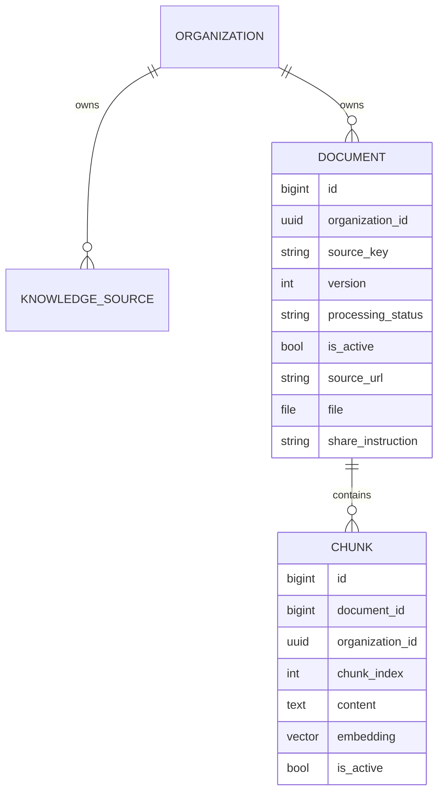
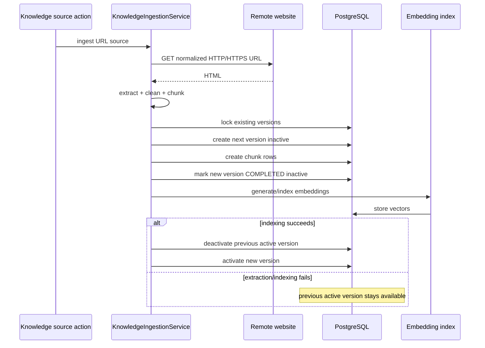
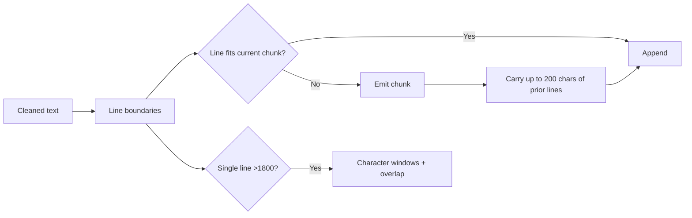
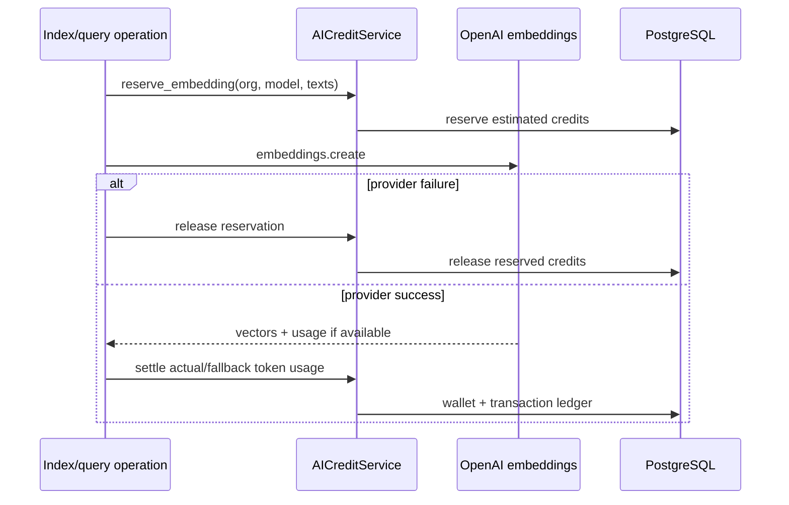
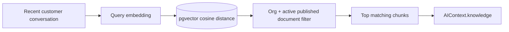
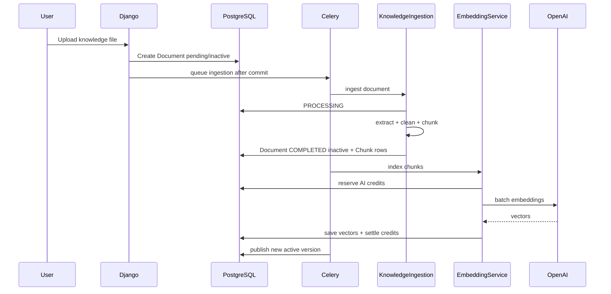
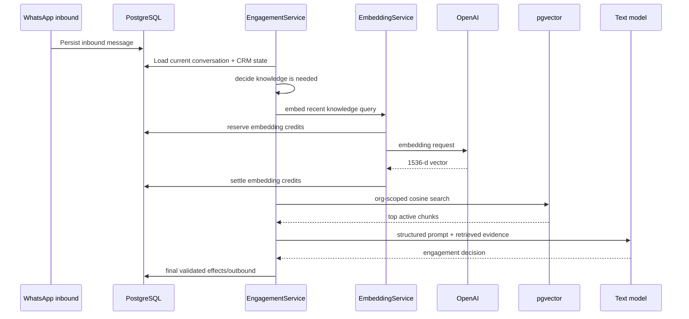

# 04. RAG, Knowledge Ingestion and Data Flow

> Snapshot: `staging` traced from `88a71f8a02c911c5c963c9f0d8235ff60684ab17`.

This document explains how organization knowledge moves from a file or URL into PostgreSQL/pgvector, how a customer question becomes a query embedding, how relevant chunks are selected, and how those chunks become grounded AI context.

The important architectural distinction is:

> **Ingestion prepares and publishes knowledge. Retrieval reads only eligible published knowledge. Engagement decides when retrieval is needed.**

---

## 1. RAG components

| Concern | Main implementation | Durable state |
| --- | --- | --- |
| Source registration | AI engagement knowledge UI/services | `KnowledgeSource` |
| File/URL text extraction | `apps/ai_engagement/services/knowledge.py` | `Document` processing state |
| Text cleaning/chunking | `KnowledgeIngestionService` | `Chunk.content` |
| Embedding generation | `apps/ai_engagement/services/embeddings.py` | provider call + AI credit records |
| Embedding persistence | `apps/ai_engagement/services/embedding_index.py` | `Chunk.embedding` |
| Orchestration/publication | `apps/ai_engagement/services/knowledge_pipeline.py` and Celery tasks | `Document.is_active` + version |
| Vector retrieval | `apps/ai_engagement/services/retrieval.py` | pgvector query |
| Engagement-time RAG decision | `apps/ai_engagement/services/engagement.py` | no direct new durable knowledge state |
| Context assembly | `apps/ai_engagement/services/context.py` | immutable runtime context |

---

## 2. Knowledge data model

The relevant data hierarchy is:



`KnowledgeSource` is an organization-owned registry/config object. It is **not currently a foreign-key parent of `Document`**. A `Document` uses `source_key` and versioning to represent concrete processed versions of logical sources.

### Important constraints

- `Document` versions are unique by `(organization, source_key, version)`.
- `Chunk` position is unique by `(document, chunk_index)`.
- `Chunk.embedding` uses 1536 dimensions.
- retrieval is constrained to the organization and active/published document state.

---

## 3. Full ingestion pipeline

```mermaid
flowchart TD
    SOURCE{Knowledge input}
    SOURCE -->|Uploaded file| FILE[Document row]
    SOURCE -->|URL| URL[KnowledgeSource]

    FILE --> PROCESS[Mark/process source]
    URL --> FETCH[Fetch URL]
    FETCH --> EXTRACT[Extract readable text]
    PROCESS --> EXTRACT

    EXTRACT --> CLEAN[Normalize text]
    CLEAN --> CHUNK[Split into overlapping chunks]
    CHUNK --> VERSION[Create/assign inactive Document version]
    VERSION --> CHUNKROWS[(Persist Chunk rows without vectors)]
    CHUNKROWS --> EMBED[Generate embeddings]
    EMBED --> VECTORS[(Persist vector(1536))]
    VECTORS --> PUBLISH{All required indexing succeeded?}
    PUBLISH -- Yes --> ACTIVE[Atomically publish new version]
    PUBLISH -- No --> KEEP[Keep prior active version]
```

The publication step is critical. A new source refresh should not make the old working knowledge disappear merely because extraction or embedding failed halfway through.

---

## 4. Supported input types

`KnowledgeIngestionService` supports these uploaded file types:

```text
.txt
.csv
.xlsx
.pdf
.docx
```

It also supports HTTP/HTTPS URL sources whose response is HTML/XHTML.

The ingestion service deliberately does not generate LLM responses, perform vector search, mutate leads or send messages. It only extracts, cleans, versions, chunks and persists source content.

---

## 5. Uploaded document lifecycle

Conceptual lifecycle:

```text
Document created
-> PROCESSING
-> validate uploaded file
-> extract text
-> clean text
-> chunk text
-> determine next source version
-> persist chunks with embedding = NULL
-> COMPLETED but inactive
-> embedding/indexing
-> publish active version
```

### Failure behavior

If extraction/chunking fails:

```text
processing_status = FAILED
processing_error = error text
is_active = false
```

A failed document is not eligible for normal retrieval.

### Why completed and active are separate

`processing_status=COMPLETED` means text processing completed. `is_active=true` means that concrete version is the currently published version for retrieval. The split allows SHVYA to prepare a new version completely before switching readers to it.

---

## 6. URL ingestion lifecycle

URL refresh uses an especially conservative publication sequence.



### URL normalization

Only HTTP and HTTPS schemes are accepted. A URL without a scheme is normalized with HTTPS. The normalized URL is used as the logical `source_key` for URL versioning.

### HTML extraction

The parser removes non-content elements such as:

- `script`
- `style`
- `noscript`
- `svg`
- `canvas`
- `template`

Then visible text is converted into line-oriented clean text.

---

## 7. Text cleaning

The cleaner:

1. splits source text into lines;
2. collapses repeated whitespace within each line;
3. removes empty lines;
4. removes immediately repeated identical lines;
5. rejoins useful lines with newline boundaries.

Why preserve line boundaries? The chunker prefers coherent line groups before falling back to arbitrary character slicing.

---

## 8. Chunking design

Default configuration:

```text
max chunk size: 1800 characters
overlap: 200 characters
```

The chunker is character-budget based rather than token-budget based.

### Normal lines

Lines are accumulated until the next line would exceed `max_chars`. The current chunk is emitted, then a small tail of previous lines is retained up to the overlap budget.

### Oversized single line

If one line itself exceeds the maximum, it is split directly into character windows with overlap.



Overlap reduces the chance that a useful fact is split exactly at a chunk boundary.

---

## 9. Document versioning

A logical knowledge source can have multiple `Document` versions.

For each new version:

1. existing versions for the same organization/source are locked while determining the next version;
2. version increments from the latest known version;
3. new chunks belong only to the new document version;
4. new version remains inactive through indexing;
5. publication deactivates any previously active version and activates the new one atomically.

This gives retrieval a simple rule: use the currently active completed document version.

---

## 10. Embedding generation

`EmbeddingService` is the centralized embedding provider boundary.

Current defaults:

```text
provider: OpenAI
model: text-embedding-3-small
dimensions: 1536
```

Every embedding vector is validated to have exactly 1536 dimensions before being accepted.

### Single embedding

Used for cases such as a customer knowledge query.

### Batch embedding

Used for multiple document chunks. The provider can embed a list in one call. Returned vectors are reordered by provider response index before persistence.

### Empty data behavior

Empty input is rejected. The indexer also rejects inactive or empty chunks before requesting embeddings.

---

## 11. AI-credit movement for embeddings

Organization-scoped embedding operations participate in the same AI wallet/reservation architecture as text generation.



Features distinguish different embedding consumers, such as `knowledge_embedding` for indexing and `knowledge_query` for engagement-time semantic search.

This means an organization without sufficient AI credits should not consume an embedding call and only discover the shortage later at text generation.

---

## 12. Embedding indexing

`EmbeddingIndexService` coordinates chunk -> provider -> vector persistence.

### Single chunk

Checks:

- chunk active;
- content non-empty;
- provider returns expected vector length.

Then saves `Chunk.embedding`.

### Batch

Before one batch call, all chunks must belong to exactly one organization. Cross-tenant embedding batches are explicitly rejected.

After the provider returns valid vectors, vectors are bulk-updated into chunk rows.

### Document indexing

`index_document(document, only_missing=True)` targets active chunks belonging to that document and can skip chunks whose vectors already exist.

### Organization indexing

`index_organization()` targets active, unembedded chunks for a single organization.

---

## 13. Ingestion orchestration and publication

The knowledge pipeline combines separate layers in this order:

```text
extract/chunk
-> embedding/index
-> publish version
```

For an uploaded document, the Celery task `ai.ingest_and_index_document` resolves the document, ingests its chunks, indexes embeddings, and then allows publication behavior according to the pipeline.

For URL ingestion, a new inactive version is produced first, then indexing happens, then publication replaces the old active version only on success.

A reindex operation can fill missing embeddings without creating another source version.

---

## 14. Retrieval eligibility filter

`KnowledgeRetrievalService` starts from an organization-scoped base queryset.

A normal retrievable chunk must satisfy the current publication rules, conceptually:

```text
Chunk.organization == current organization
Chunk.is_active == true
Chunk.document.organization == current organization
Chunk.document.is_active == true
Chunk.document.processing_status == COMPLETED
```

This prevents:

- retrieving another organization's chunks;
- retrieving an unpublished new version;
- retrieving a failed/incomplete version;
- retrieving explicitly inactive chunks.

Tenant filtering happens before ranking.

---

## 15. Semantic vector retrieval

At engagement time, if knowledge is needed:

1. SHVYA builds a knowledge query from recent conversation;
2. query is embedded into a 1536-dimensional vector;
3. pgvector computes cosine distance to eligible chunk embeddings;
4. rows are ordered by smallest cosine distance;
5. similarity is derived from distance and clamped to a valid range;
6. top matches become `KnowledgeMatch` context items.



### Why filter before ranking

Similarity alone must never authorize data access. Organization and publication state determine what the search is allowed to see. Ranking only decides relevance inside that allowed set.

---

## 16. Keyword and hybrid retrieval capabilities

The retrieval service also implements deterministic keyword retrieval and hybrid scoring.

Keyword matching can consider text from fields such as:

- chunk content;
- document name;
- `source_key`;
- source URL.

Hybrid scoring currently combines evidence approximately as:

```text
semantic + keyword match:
  semantic * 0.68 + keyword * 0.32 + 0.06

semantic only:
  semantic score

keyword only:
  keyword * 0.96
```

These capabilities exist in the retrieval layer.

### Important current-runtime distinction

The production `AIContextBuilder` engagement path currently does:

```text
query text
-> query embedding
-> vector retrieval
```

If query embedding fails, the context builder returns no retrieved knowledge for that call. It does **not currently automatically switch to keyword/hybrid fallback** in that engagement path merely because those retrieval methods exist elsewhere in the service.

That distinction should be preserved in documentation and tests until the live context builder is explicitly changed.

---

## 17. When engagement invokes RAG

`EngagementService` does not blindly query the vector database on every message.

It tends to skip RAG for obvious qualification/acknowledgement input such as:

- yes/no-like acknowledgements;
- short numeric answers;
- option letters/numbers;
- very small simple answers.

It tends to request knowledge for organization/product questions involving ideas such as:

```text
price, pricing, cost, fee
plan, package
product, service, feature
policy, refund
location, availability
recommendation, difference
brochure, website, offer
```

Substantive question-shaped messages can also qualify.

The purpose is to avoid spending an embedding call when the answer should come from the deterministic qualification state machine rather than the organization's knowledge base.

---

## 18. Knowledge query construction

When RAG is needed, the query can include a small recent conversation window rather than only the latest message.

Current design uses a bounded recent slice, conceptually:

```text
last few messages (up to roughly four)
-> concatenate useful conversation context
-> cap total query text around 1800 characters
-> embed once
```

This helps resolve questions like:

```text
Lead: What plans do you have?
AI: We have several options...
Lead: What is the price of the second one?
```

Embedding only “What is the price of the second one?” would lose useful local context.

---

## 19. RAG data entering the model

Retrieved matches are serialized into the AI context alongside CRM and conversation state. The model sees snippets as **knowledge evidence**, not as executable instructions or database authority.

Conceptually:

```json
{
  "knowledge": [
    {
      "content": "...relevant source excerpt...",
      "source": "...document identity...",
      "score": 0.87
    }
  ]
}
```

The exact serialized shape is owned by the context/engagement layer and may evolve. The architectural contract is that retrieved material remains organization-scoped and bounded.

---

## 20. RAG and qualification interaction

Qualification and RAG solve different problems.

### Qualification state

Answers questions SHVYA needs from the lead:

```text
“What is your budget?”
“How many agents do you have?”
“When do you want to start?”
```

Backend qualification requirements own this sequence.

### RAG

Answers questions the lead asks about the organization/product:

```text
“What does the Pro plan include?”
“What is your refund policy?”
“Do you provide integration with X?”
```

When a message is clearly the direct answer to the current qualification requirement, the deterministic qualification path may avoid RAG and avoid a text-model call altogether.

---

## 21. RAG and conversation summaries

Internal conversation summaries and knowledge chunks are separate context sources.

- Summary compresses **what this lead and SHVYA have discussed**.
- RAG retrieves **organization knowledge from configured sources**.

A summary should not become an accidental organization knowledge base. Likewise, a knowledge document should not be treated as the record of what a particular lead previously said.

---

## 22. RAG and document sharing

A `Document` can also represent a file that AI may be allowed to send to the customer.

That is separate from using its chunks as retrieval evidence.

For AI-guided file sending:

- document must belong to the organization;
- document must be active;
- processing must be completed;
- a physical uploaded file must exist;
- `share_instruction` can constrain/describe when sharing is appropriate.

The model may return only a `file_document_id`. Backend verifies eligibility again before creating the outbound WhatsApp document message, and the sender revalidates at send time.

---

## 23. Data movement for a file upload



---

## 24. Data movement for a customer knowledge question



---

## 25. Failure modes and what data remains usable

### Remote URL unavailable

New version fails before publication. Previous active version remains retrievable.

### Extraction produces no readable text

New document/version is failed/inactive. No empty knowledge is published.

### Chunking produces nothing

Same: failed/inactive.

### Embedding provider fails during indexing

New version is not supposed to replace the previous active version. Existing published knowledge remains usable.

### Query embedding fails during engagement

Current live context builder continues without retrieved knowledge rather than crossing tenants or fabricating a vector. Whether the final engagement should answer, clarify or fail-soft is decided by the engagement policy.

### AI credit unavailable

Embedding provider call is blocked at reservation time.

### Vector dimensions wrong

Indexer rejects the vector instead of storing incompatible data.

---

## 26. Security and isolation rules

1. Every document belongs to an organization.
2. Every chunk redundantly stores organization scope.
3. Retrieval applies organization filters before ranking.
4. Batch embedding refuses chunks from multiple organizations.
5. AI-guided file sharing rechecks organization ownership.
6. Failed/unpublished document versions are not normal retrieval candidates.
7. Provider credentials live in server configuration, never in chunk metadata.
8. RAG evidence is content context, not permission to execute actions.

---

## 27. Performance considerations

Current retrieval uses pgvector cosine distance over eligible chunks. As knowledge volume grows, measure:

- chunks per organization;
- query latency by tenant size;
- vector scan cost;
- embedding API latency/cost;
- top-k quality;
- duplicate/near-duplicate source content;
- average chunk size and useful overlap;
- active version count per logical source.

Do not add an approximate vector index blindly. Choose an index strategy based on observed scale, pgvector version and recall/latency targets.

---

## 28. RAG observability questions

For a production debugging session, be able to answer:

```text
Which organization issued the query?
Which inbound message caused the RAG attempt?
Did EngagementService decide RAG was needed?
Was a query embedding requested?
Was the credit reservation successful?
Which embedding model produced it?
Did vector retrieval run?
Which active document versions were eligible?
Which chunks were returned and with what scores?
Did the final model use a grounded reason code?
Was the response later discarded as stale?
```

Avoid logging sensitive full document bodies unless operationally required; identifiers and bounded diagnostics are usually safer.

---

## 29. Change checklist for RAG

When changing RAG, verify all of these:

- extraction still leaves old published version intact on failure;
- new version is not activated before indexing succeeds;
- chunks remain organization-scoped;
- embedding dimension matches `Chunk.EMBEDDING_DIMENSIONS`;
- query embedding consumes organization credits intentionally;
- batch indexing cannot mix organizations;
- retrieval base queryset cannot see inactive/foreign documents;
- engagement's “should retrieve?” policy remains tested separately from retrieval quality;
- simple qualification answers do not trigger unnecessary RAG calls;
- model output remains schema/policy validated after RAG context is added;
- AI-selected document sharing still revalidates file ownership/activity at finalization and send time;
- docs in this folder are updated if live engagement begins using hybrid/keyword fallback.