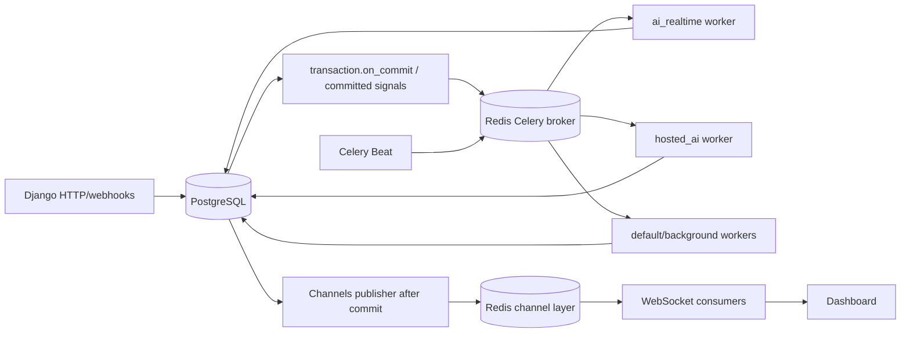
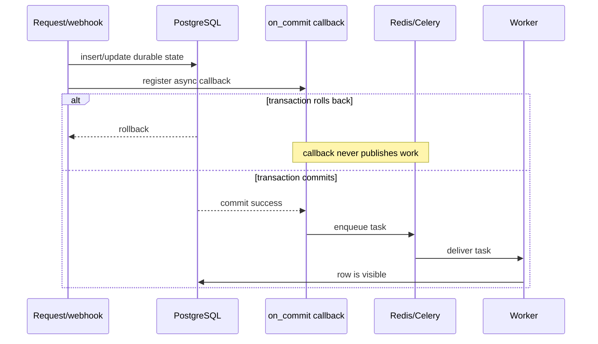
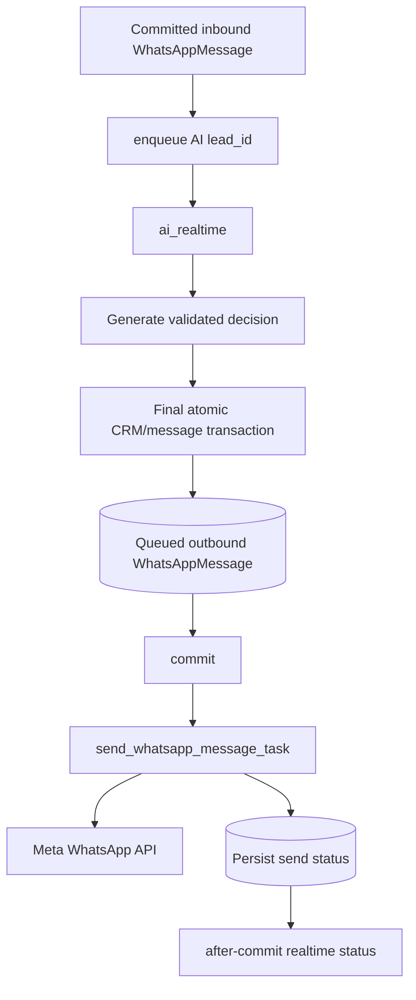
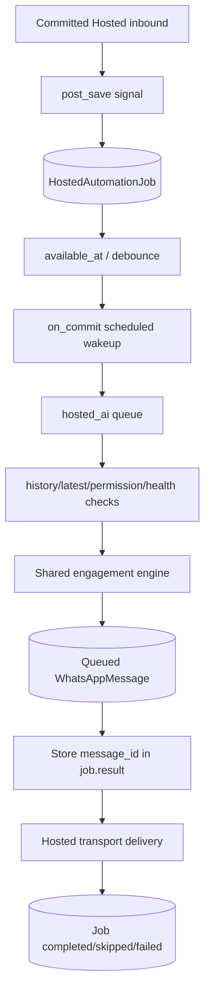
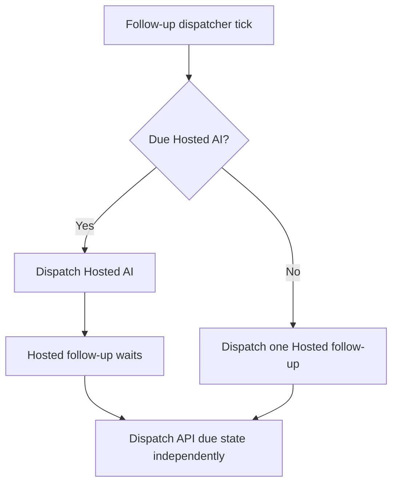
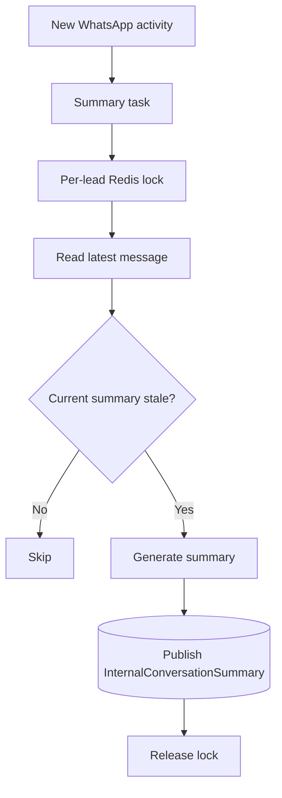
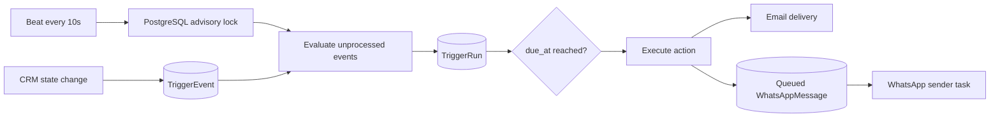
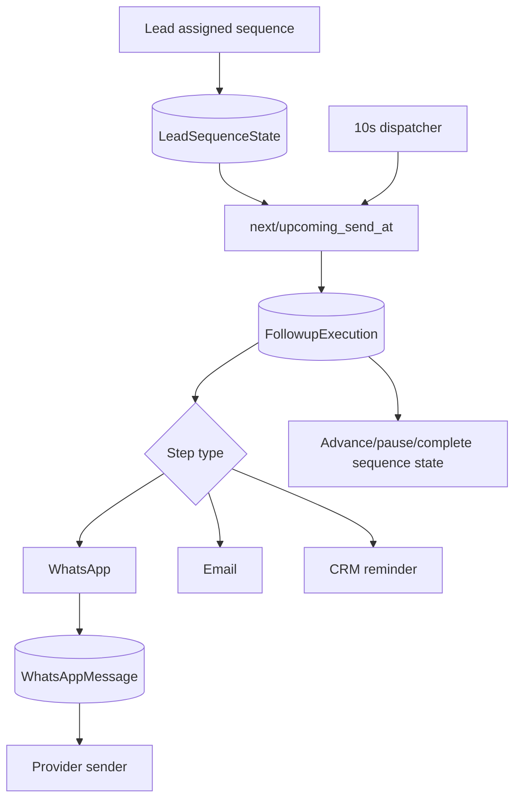

# 05. Async Events, Queues, Realtime Updates and Data Movement

> Snapshot: `staging` traced from `88a71f8a02c911c5c963c9f0d8235ff60684ab17`.

This document explains where SHVYA moves work asynchronously, which state is durable, how Celery queues are separated, how Beat recovers or schedules recurring work, and how database commits become WebSocket updates.

The core rule is:

> **PostgreSQL records the business fact. Redis/Celery move work. WebSockets project committed state to the browser.**

---

## 1. Runtime topology



Redis is used for multiple purposes, but they should not be mentally conflated:

- Celery broker/result/runtime queueing;
- Django cache and short-lived locks/state;
- Channels layer, configured on a separate Redis database.

---

## 2. Why async work starts after commit

A common failure pattern would be:

```text
create DB row
-> enqueue Celery task immediately
-> worker runs before transaction commits
-> worker cannot find row
```

SHVYA avoids that in important paths by using `transaction.on_commit()`.



This pattern is also used for realtime publication so UI consumers do not receive a message that later rolls back.

---

## 3. Celery queue separation

`config/celery.py` explicitly routes latency-sensitive customer-facing work.

### `ai_realtime`

Current routed tasks:

```text
ai.recover_api_engagement
ai.generate_ai_engagement_response
apps.channels.tasks.send_whatsapp_message_task
```

Why: a customer waiting for an AI WhatsApp reply should not sit behind document ingestion, summaries, scheduled follow-ups or other slower background jobs.

### `hosted_ai`

Current routed tasks:

```text
hosted.dispatch_due_ai
apps.hosted_automation.tasks.process_hosted_ai_engagement_job_task
```

Why: Hosted linked-device automation has different debounce, account-health and delivery ownership. Keeping it isolated prevents Hosted transport work from blocking Meta API engagement and vice versa.

### Default/background queue

Tasks without explicit routing, including many ingestion/summary/integration operations, use the general worker routing configured by Celery deployment.

---

## 4. Beat schedule

Current central schedule from `config/celery.py`:

| Job | Configured interval | Purpose |
| --- | ---: | --- |
| Recover API AI engagement | 10 seconds | Finds/requeues incomplete canonical Meta/API engagement work. |
| Dispatch Smart Triggers | 10 seconds | Evaluates trigger outbox events and due trigger runs. |
| Refresh Co-Pilot flags | 30 minutes | Recomputes cached lead flags. |
| Dispatch Auto Follow-ups | 10 seconds | Advances due Hosted/API follow-up state. |
| Hosted AI recovery dispatcher | 5 seconds | Catches due/missed Hosted AI jobs. |
| AI bump-ups | 60 seconds | Evaluates silent conversations for configured bump-ups. |
| Refresh Instagram tokens | 6 hours | Refreshes eligible Instagram credentials. |

A task's docstring can become stale; the Beat configuration is the runtime schedule to verify when timing matters.

---

## 5. Canonical Meta/API AI movement



The durable outbound `WhatsAppMessage` row exists before Meta delivery. This gives retries/recovery a stable message identity.

---

## 6. Hosted durable AI movement

Hosted AI uses an explicit durable job instead of only a broker message.



The database job allows recovery even if Redis loses an individual wakeup around deploy/broker interruption.

### Job identity

`HostedAutomationJob.source_message` is one-to-one. Repeated signal delivery for the same inbound cannot create multiple accepted jobs for that same source message.

### Due-time wakeup

When a queued job is created or its `available_at` changes, a post-save signal registers an `apply_async(countdown=...)` callback after commit.

Beat also scans frequently as recovery. Exact self-scheduling provides responsiveness; periodic recovery provides resilience.

---

## 7. Hosted AI priority over Hosted follow-up

`apps/followups/tasks.py` enforces a priority rule during the periodic dispatcher:

```text
1. Try one due Hosted AI engagement job.
2. If Hosted AI was dispatched, do not dispatch a Hosted auto-follow-up in that cycle.
3. Independently process the Meta WhatsApp API follow-up lane.
```

Why: a direct customer inbound should be answered before the system sends an automated follow-up from an older schedule.



---

## 8. Account Health deferral

Hosted account health can pause outbound automation.

Before Hosted AI generates/delivers, the job checks current account health. If paused:

```text
status -> QUEUED
available_at -> paused_until
started_at -> cleared
```

If AI already generated an outbound row before the pause becomes active, the exact `message_id` is retained in `job.result`. After cooldown the job resumes that same message instead of asking the model to generate another reply.

This protects both correctness and AI cost.

---

## 9. Internal summary movement

Conversation summaries are derived background state.



The lock prevents concurrent summary generation for the same lead. The task also checks whether the current summary already covers the latest message, making it state-idempotent.

Raw messages remain the source of truth; summary is a derived acceleration/context layer.

---

## 10. Smart Trigger transactional outbox

Smart Triggers use durable database events and runs.



### Scheduler overlap protection

`dispatch_smart_triggers` obtains a PostgreSQL session advisory lock using a fixed lock key before dispatching. If another Beat delivery already owns the lock, the overlapping invocation exits.

This prevents two scheduler instances from walking the same ordered workload concurrently.

### Work limits

The dispatcher processes bounded batches, including up to hundreds of pending event/run records per pass. Bounded scans protect one Beat tick from becoming unbounded work.

---

## 11. Trigger data states

Key durable concepts:

- `TriggerEvent`: fact/outbox row describing something that happened to a lead;
- `SmartTrigger`: configured rule;
- `TriggerRun`: execution of one rule for one event, with status and optional due time/message.

`TriggerRun` uniqueness on `(rule,event)` makes re-evaluation idempotent at the rule-event level.

WhatsApp trigger sends ultimately reuse the normal durable message/sender path rather than inventing a second provider-delivery mechanism.

---

## 12. Auto-follow-up movement

Follow-up configuration and execution are separated:

```text
FollowupSequence / FollowupStep
        -> what should happen
LeadSequenceState
        -> where this lead currently is
FollowupExecution
        -> one scheduled/attempted action
FollowupSenderState
        -> sender pacing state
```



The durable state lets a sequence survive worker restarts and makes retry/pause/progress inspectable.

---

## 13. Manual inbound resets/delays automation

A live customer reply can affect scheduled automation. Hosted inbound processing registers lead reply timing so old follow-ups do not behave as if the lead remained silent.

This is one reason inbound-message persistence must occur before follow-up/AI scheduling decisions.

---

## 14. Bump-up data movement

Beat periodically scans AI-eligible leads. It does not create a separate message type in the transport layer. Once generated, a bump-up is stored as a regular durable outbound `WhatsAppMessage` with AI metadata identifying `origin="bump_up"` and its sequence number/model.

```text
Beat scan
-> deterministic eligibility
-> build AI context
-> model generates bump
-> final freshness lock/check
-> queue normal outbound row
-> on_commit normal sender
```

This means standard message status/realtime/history mechanisms continue to work.

---

## 15. Knowledge ingestion async movement

Knowledge ingestion can be expensive because it performs extraction, chunk creation and provider embedding calls.

Typical path:

```text
HTTP upload/config action
-> create durable source/document record
-> commit
-> Celery ingestion task
-> extraction/chunk DB writes
-> embedding API
-> vector persistence
-> publish active version
```

The task can retry situations where an old caller queued too early and the document row is temporarily not visible, but the preferred pattern remains enqueue after commit.

---

## 16. Realtime message publication

`services/channels/realtime.py` publishes two projections after a WhatsApp message commits.

### Thread event

Group:

```text
whatsapp_thread_<lead_id>
```

Payload includes:

- message ID;
- lead ID;
- direction;
- body;
- message type;
- status;
- created timestamp.

### Inbox event

Group:

```text
whatsapp_inbox_<organization_id>
```

Payload includes lead identity, unread indicator/count semantics, last-message timestamp and preview.

### Status event

Status changes can publish a dedicated `whatsapp.status` event to the thread group.

---

## 17. Why realtime is after commit

Bad pattern:

```text
publish WebSocket “message delivered”
-> database transaction fails
-> browser displays state that never existed
```

Current pattern:

```text
write database
-> commit
-> publish WebSocket event
```

If the WebSocket publication itself fails, the durable row still exists and a page refresh can reconstruct correct state from PostgreSQL.

---

## 18. Redis lock use cases

Redis is also used for short coordination locks where durable PostgreSQL rows are not the only concern.

Examples include:

- internal conversation summary per-lead lock;
- AI generation lock/cache for same lead/source/runtime state;
- other short runtime coordination/caching paths.

Locks should have bounded TTLs and should never be the only record that a business transaction occurred.

---

## 19. PostgreSQL row locks

Critical mutations use `select_for_update()` where concurrent workers/users could otherwise overwrite each other.

Important examples:

- lead upsert of existing `(organization,phone)`;
- final AI engagement transaction;
- AI credit reservation/settlement internals;
- version publication/next-version calculation;
- Hosted job final-state updates;
- follow-up/trigger state where their services require serialization.

A row lock protects a specific durable invariant. It is not a substitute for idempotency keys when the same external event can be delivered twice.

---

## 20. Database uniqueness as concurrency control

Several invariants are enforced below the Python layer:

```text
Lead: organization + phone
WhatsAppMessage.external_id: unique when present
InstagramMessage.external_id / idempotency_key
HostedAutomationJob.source_message: one-to-one
TriggerEvent.key: unique
TriggerRun: rule + event unique
BulkMessageRecipient: campaign + lead unique
Follow-up active-state constraints
Document: organization + source_key + version
Chunk: document + chunk_index
```

Database uniqueness is the final defense when two processes pass the same application-level pre-check concurrently.

---

## 21. Retry model

Retries must be owned by the layer that understands whether the operation is safe to repeat.

### OpenAI

SDK automatic retries are disabled. Celery handles transient rate-limit/network/server failures.

### WhatsApp delivery

A durable `WhatsAppMessage` identity exists before delivery. Sender logic updates that row rather than creating a new message for every attempt.

### Hosted AI

Durable job retains status/result and exact generated `message_id`, enabling resume without regeneration.

### Integrations

Google Sheets uses phone-based CRM upsert and reconciliation. Meta/provider webhooks use external IDs/payload keys where available.

---

## 22. Recovery vs normal scheduling

Recovery jobs should not be confused with primary scheduling.

Example Hosted AI:

```text
primary: job post_save -> exact countdown wakeup after commit
backup: Beat every 5 seconds -> scan due job
```

Example Meta/API AI:

```text
primary: inbound commit -> queue engagement task
backup: Beat every 10 seconds -> recovery scan
```

This dual design provides low latency during normal operation and eventual recovery after a missed broker publish or worker interruption.

---

## 23. Eventual consistency boundaries

Some user-visible state is intentionally eventually consistent.

Examples:

- inbound webhook HTTP response may complete before AI reply exists;
- AI outbound row may be `queued` before provider marks it `sent`;
- WebSocket update arrives after DB commit;
- conversation summary can lag latest message briefly;
- Co-Pilot flags refresh periodically;
- trigger/follow-up actions run on scheduler intervals;
- Instagram token refresh is periodic.

These are not necessarily bugs. Each should have a durable source of truth and a bounded/recoverable delay.

---

## 24. Data ownership by subsystem

| Data | Owner | Consumers |
| --- | --- | --- |
| Lead CRM state | CRM/PostgreSQL | dashboard, AI, triggers, follow-ups, analytics |
| WhatsApp messages | Channels/PostgreSQL | inbox, AI, summaries, follow-ups, realtime |
| AI decision cache | Redis | duplicate-generation avoidance |
| AI final response | durable WhatsApp row | sender, UI, audit |
| Hosted AI execution | `HostedAutomationJob` | Hosted worker/recovery/diagnostics |
| Trigger outbox | `TriggerEvent` | trigger evaluator |
| Trigger execution | `TriggerRun` | action executors/provider sender |
| Follow-up progress | `LeadSequenceState` | follow-up dispatcher |
| Knowledge vectors | `Chunk.embedding` | RAG retrieval |
| Internal summary | `InternalConversationSummary` | AI context/CRM UI |
| Realtime event | Redis channel layer | connected browsers only |

---

## 25. Failure examples

### Worker crashes after DB commit but before Meta send

The durable outbound row exists. Sender/recovery logic can inspect/retry that row without regenerating the business message.

### Broker misses Hosted due wakeup

`HostedAutomationJob` remains queued in PostgreSQL. The 5-second recovery dispatcher can discover it.

### Browser disconnects before WebSocket event

No business state is lost. Browser can reload from PostgreSQL-backed HTTP views.

### Two Beat processes run Smart Triggers simultaneously

PostgreSQL advisory lock allows only one dispatcher to own the scheduler section.

### AI worker gets duplicate delivery

Generation locks reduce duplicate provider calls, source-message processing metadata and outbound source IDs prevent multiple accepted finalizations.

---

## 26. Observability model

When debugging an asynchronous incident, trace durable identifiers rather than only timestamps.

Useful chain:

```text
organization_id
-> lead_id
-> inbound WhatsAppMessage.id / external_id
-> Celery task or HostedAutomationJob.id
-> AI source message marker
-> outbound WhatsAppMessage.id / external_id
-> provider status/error
-> realtime/UI projection
```

For triggers:

```text
TriggerEvent.id/key
-> SmartTrigger.id
-> TriggerRun.id
-> message/delivery id
```

For follow-ups:

```text
LeadSequenceState.id
-> FollowupStep.id
-> FollowupExecution.id
-> outbound message/reminder/email id
```

---

## 27. Rules for adding new async work

Before adding a task or queue, decide:

1. What durable row represents the intent/work?
2. What unique key makes repeated enqueue safe?
3. Must enqueue wait for transaction commit?
4. Which queue owns the latency/SLA?
5. Is a periodic recovery scanner needed?
6. Who owns retries?
7. Can the worker safely re-read current state instead of trusting serialized stale state?
8. Does the final side effect need a row lock?
9. What happens if the worker crashes after provider success but before local status update?
10. What data lets support identify the exact attempt?
11. Does UI publication happen only after durable commit?
12. Can one transport starve another?

A new Celery task without answers to these questions is not yet a complete production design.