# 06. End-to-End Production Scenarios

> Snapshot: `staging` traced from `88a71f8a02c911c5c963c9f0d8235ff60684ab17`.

This document connects the individual architecture layers into real production scenarios. Use it when debugging a user-visible behavior because each sequence shows the expected handoff between transport, CRM, AI, queues and providers.

---

# Scenario 1: Manual CRM lead creation

## Goal

An authenticated CRM user creates a lead from the dashboard and places it into a selected pipeline/stage.

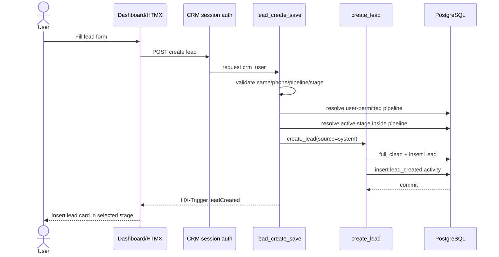

### Routing

```text
pipeline = explicit user-selected permitted pipeline
stage = explicit user-selected active stage
lead_source = system
```

### Possible background effect

If the newly created lead is in a system New Lead/New Leads stage and the source is eligible, the lead service may queue the configured welcome behavior after commit.

---

# Scenario 2: New customer sends first WhatsApp Cloud API message

## Goal

An unknown phone messages a connected Meta WhatsApp number. SHVYA creates the CRM lead, stores the message and queues AI.

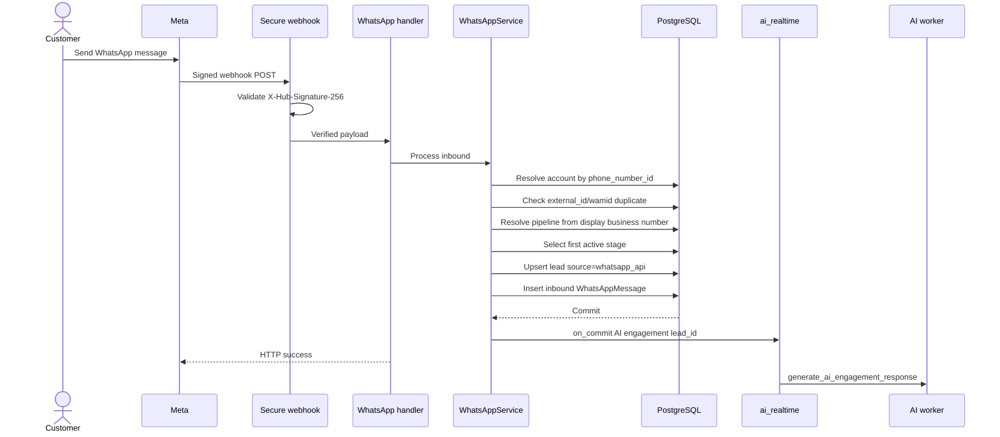

### Pipeline resolution

Priority:

```text
1. active pipeline matching receiving business phone
2. active pipeline named Leads
3. first active organization pipeline ordered by name
```

Stage is the first active stage ordered by `display_order`.

---

# Scenario 3: WhatsApp AI replies to that first message

Continuation of Scenario 2.

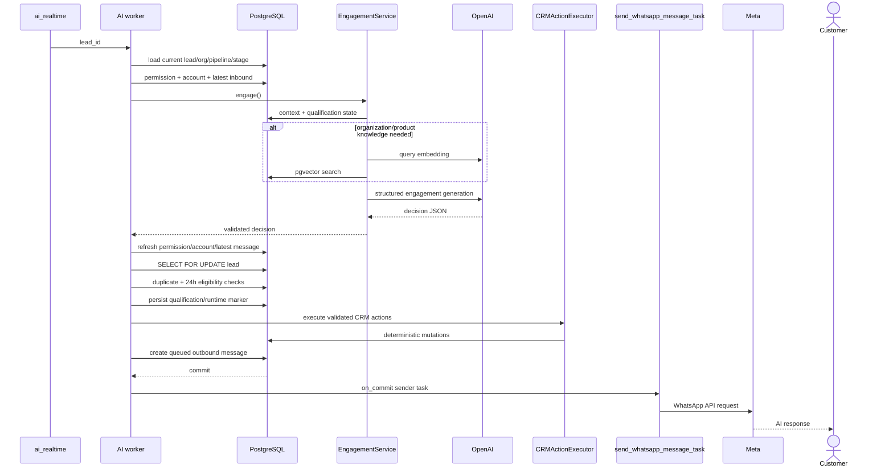

### Important stale-response rule

If another inbound message arrives while OpenAI is generating, the worker detects that the original source is no longer the latest inbound and skips the older generated reply.

---

# Scenario 4: Existing WhatsApp lead has been moved to another stage

## Goal

A lead started in the WhatsApp number's initial pipeline/stage, then an agent or AI moved it. The customer messages again.

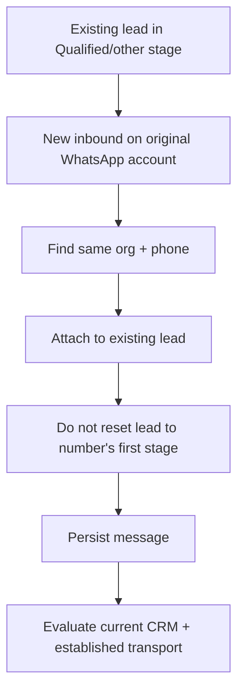

This prevents every new inbound message from destroying human/AI CRM progression.

The AI permission service can allow the established conversation account even when the lead has legitimately moved to a pipeline whose configured number differs, provided the conversation history proves the binding.

---

# Scenario 5: Hosted WhatsApp live inbound creates a lead

## Preconditions

- Hosted session is connected.
- Its phone number maps to an active pipeline.
- `auto_lead_creation=true` in session settings.
- Message is live, inbound, non-group and not history.
- No existing lead has the peer phone.

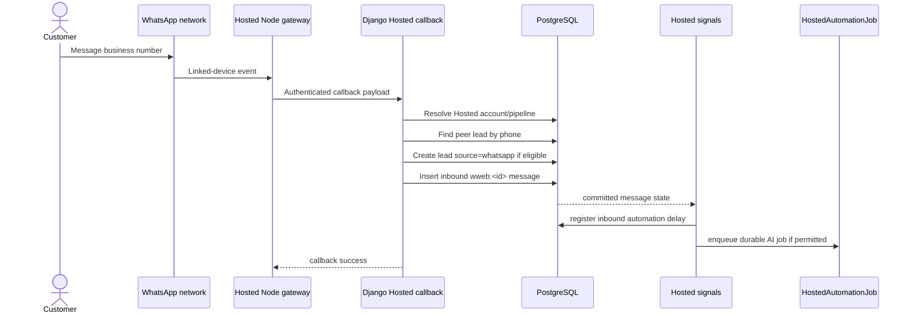

### Routing

```text
pipeline = exact pipeline mapped to Hosted business number
stage = first active stage by display_order
lead_source = whatsapp
```

Hosted account creation itself is rejected when its business number cannot be mapped to an active pipeline.

---

# Scenario 6: Hosted AI debounce, health pause and delivery

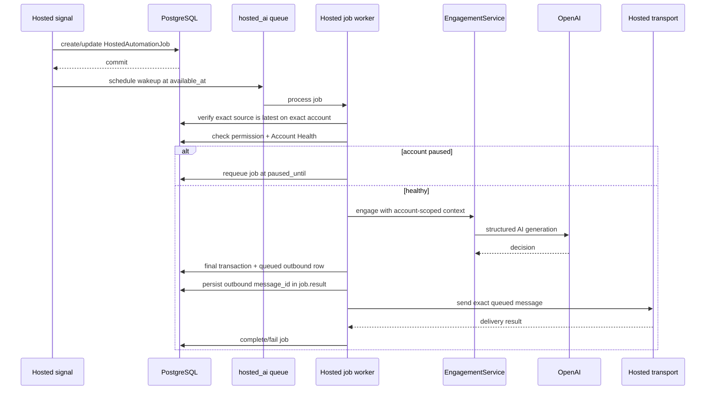

If health becomes paused after generation, the generated message ID remains durable. The job later resumes the same queued message instead of generating new text.

---

# Scenario 7: Hosted history synchronization

## Goal

Import older linked-device messages without treating them as new live sales leads.

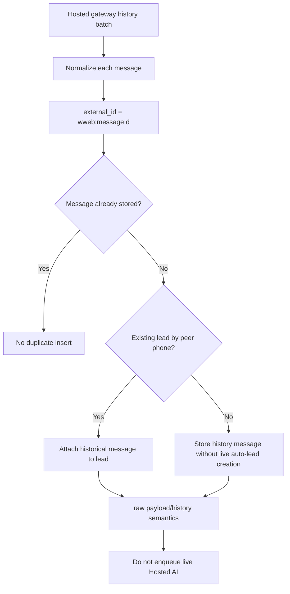

Historical sync is intentionally different from a live inbound. The `not historical` guard prevents old chats from creating a large number of CRM leads or triggering automated replies.

---

# Scenario 8: Coexistence onboarding and history

## Goal

Connect a WhatsApp Business App number to SHVYA through Meta Coexistence and make its conversation state available.

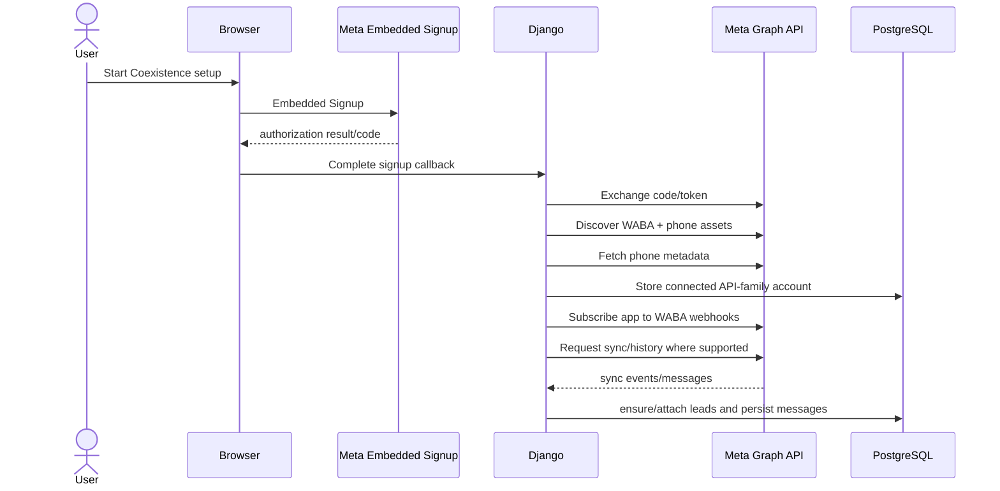

Coexistence transport ultimately belongs to the Meta Cloud API family. It does not use the Hosted Node linked-device sender.

During Coexistence history import, SHVYA can ensure/create leads for synchronized conversations using API-family pipeline routing. This differs from Hosted history synchronization.

---

# Scenario 9: Google Sheets creates or updates a lead

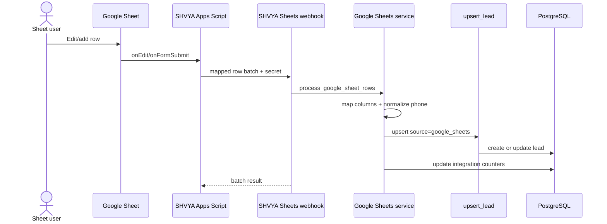

A 5-minute Apps Script reconciliation trigger scans appended rows missed by live events and resends them. Phone-based upsert makes resending safe at the CRM identity level.

---

# Scenario 10: Meta Lead Ad becomes CRM lead

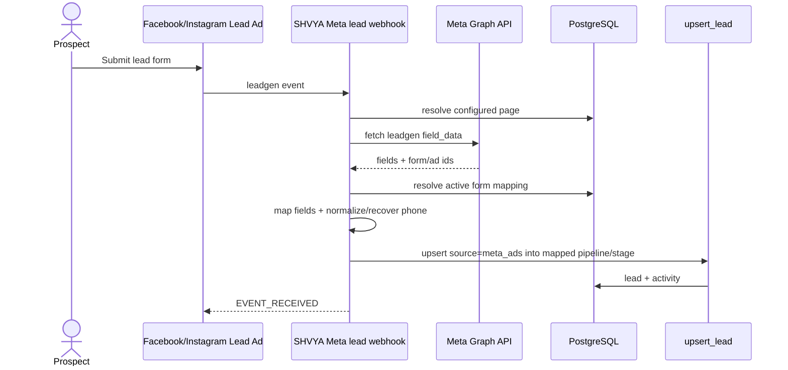

The Meta form mapping determines the exact pipeline and stage. It is not routed from a WhatsApp business number.

---

# Scenario 11: External API creates/updates a lead

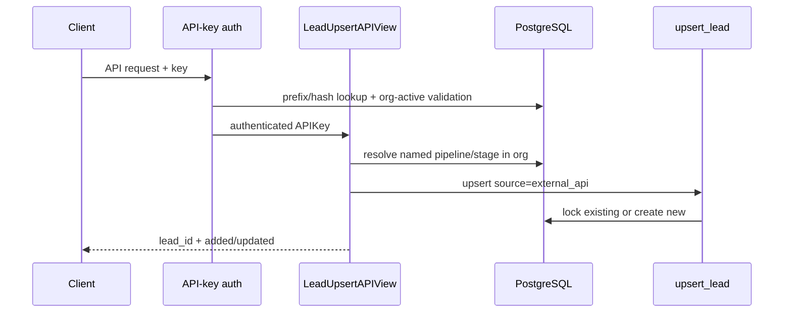

For new leads, sufficient valid routing must be supplied. Existing leads can be updated without recreating their identity.

---

# Scenario 12: CSV import

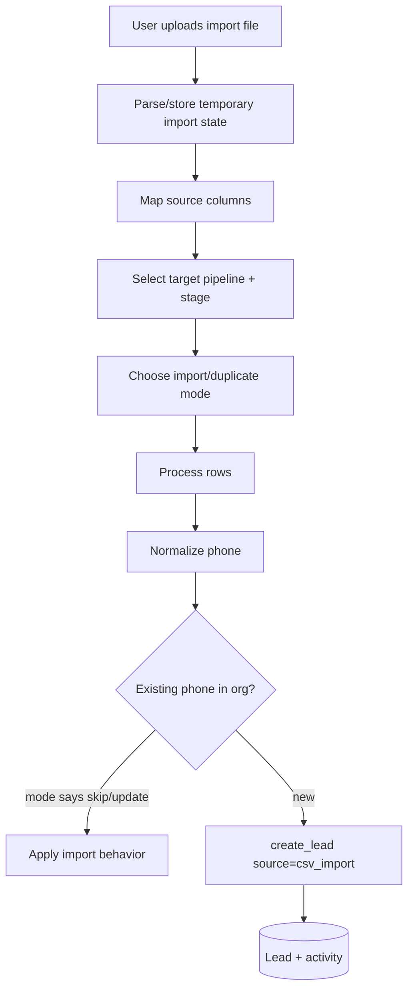

CSV import is a guided CRM workflow, not a live webhook integration.

---

# Scenario 13: Customer asks a pricing/product question and RAG is used

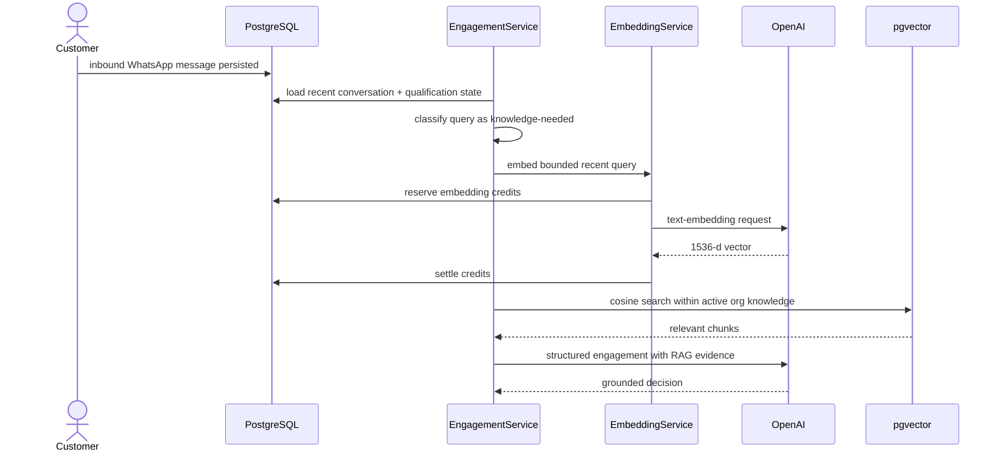

If query embedding fails, the current live context builder does not automatically swap to keyword/hybrid fallback. It proceeds without retrieved knowledge for that build.

---

# Scenario 14: Simple qualification answer avoids unnecessary RAG/model work

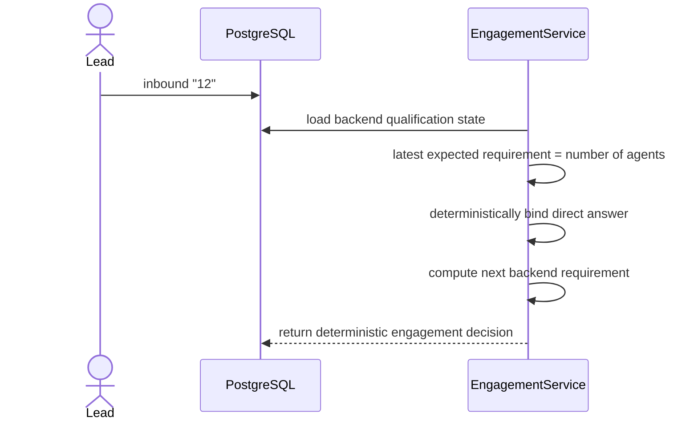

The backend can save the answer and ask the next configured qualification question without first embedding “12” or asking a general model what it means.

---

# Scenario 15: AI completes qualification and moves lead to Qualified

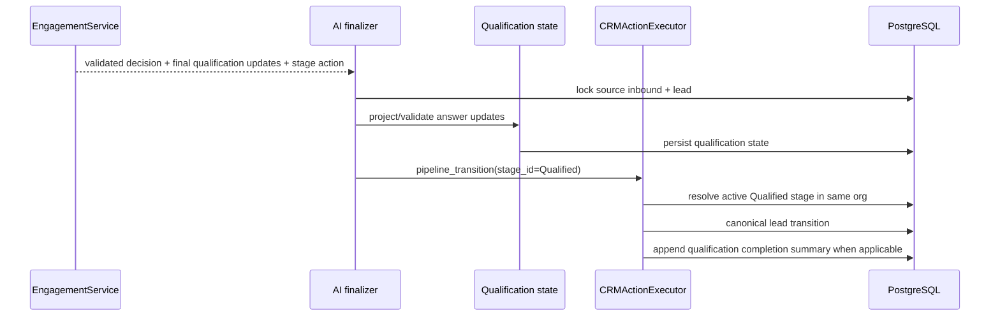

The model supplies only an allowed stage identifier from runtime context. Python resolves the owning pipeline and performs the actual transition.

---

# Scenario 16: Newer inbound arrives during AI generation

This is one of the most important concurrency scenarios.

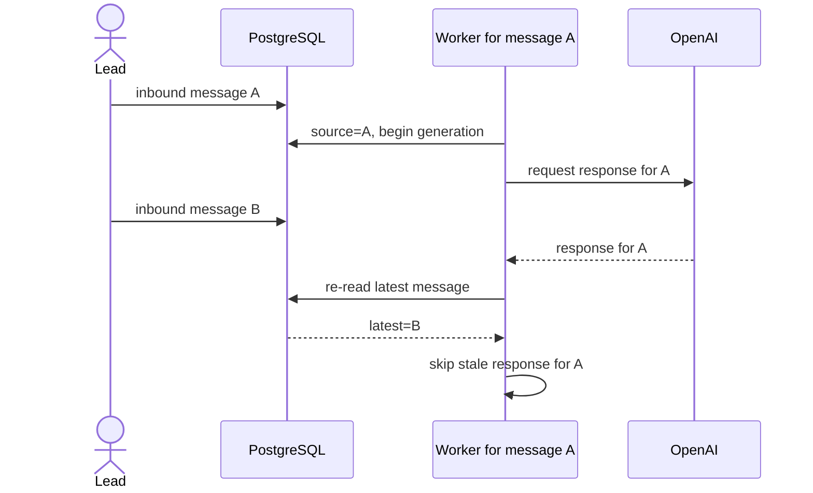

SHVYA prefers no reply over an out-of-order reply that ignores the customer's newer message.

---

# Scenario 17: Duplicate webhook delivery

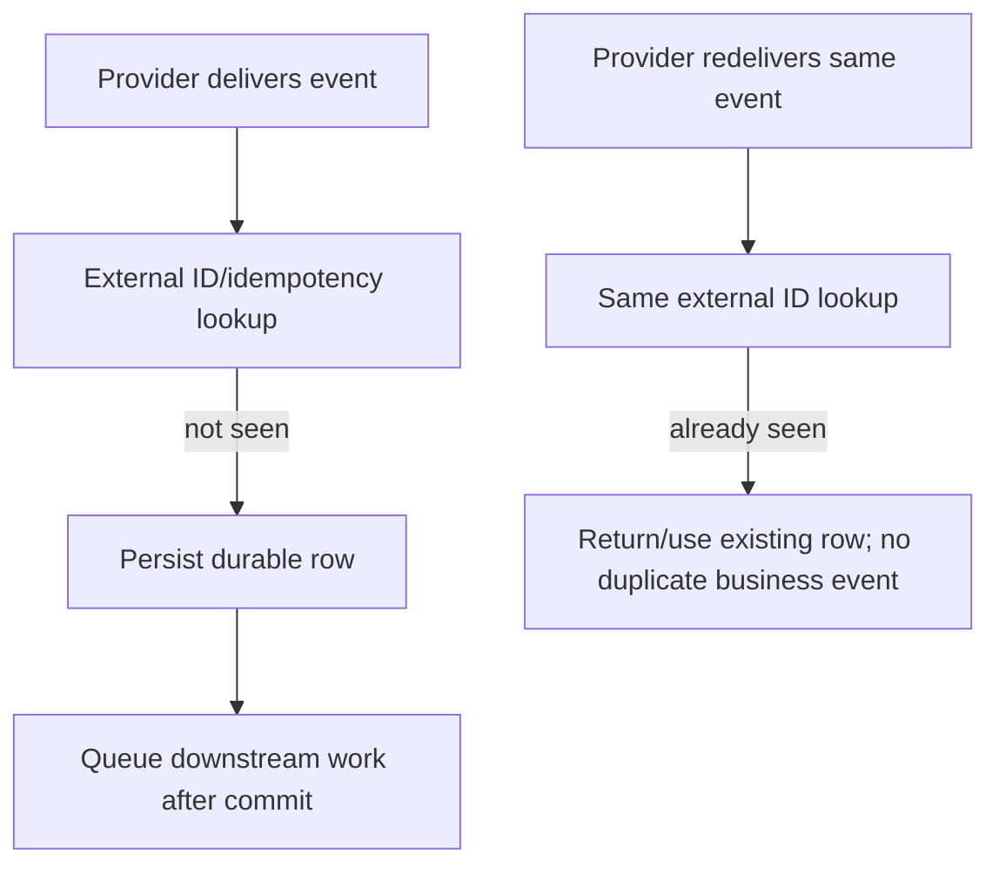

The exact key depends on subsystem, such as Meta `wamid`, Hosted `wweb:<messageId>`, webhook payload hash or integration-specific identifier.

---

# Scenario 18: Smart Trigger after CRM change

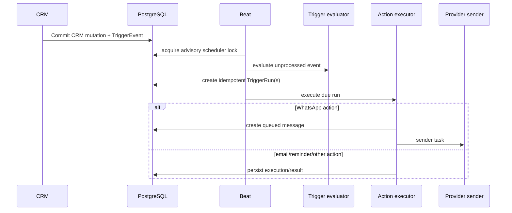

The trigger event/run tables make the automation inspectable and retryable instead of hiding all state in Redis.

---

# Scenario 19: Auto-follow-up collides with live Hosted AI

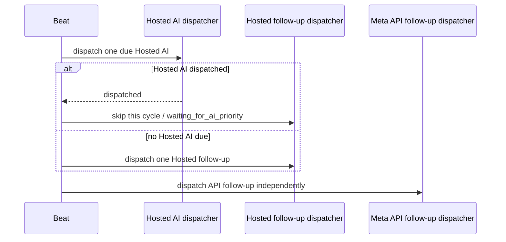

This keeps a fresh customer reply ahead of an older scheduled Hosted follow-up.

---

# Scenario 20: Knowledge source refresh fails

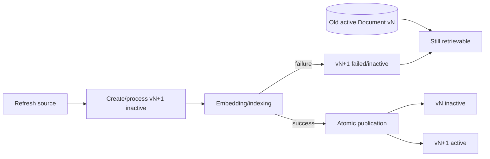

A failed refresh should not replace working knowledge with an incomplete version.

---

# Scenario 21: WebSocket client misses an event

```mermaid
flowchart TD
    WRITE[Message/status committed] --> PUB[after-commit Channels publish]
    PUB --> DROP{Browser connected?}
    DROP -- Yes --> LIVE[Realtime UI update]
    DROP -- No --> MISSED[Event not seen live]
    MISSED --> RELOAD[Later HTTP/page reload]
    RELOAD --> DB[(Read canonical PostgreSQL state)]
```

Realtime delivery is not the source of truth, so a disconnected browser does not cause business data loss.

---

# Scenario 22: Organization is disabled

In the current staging snapshot, an inactive organization is intended to be blocked at multiple access boundaries.

```mermaid
flowchart TD
    REQ{Access type}
    REQ -->|Dashboard HTTP| SESSION[CRM session authorization]
    REQ -->|API key| APIAUTH[API key organization authorization]
    REQ -->|WebSocket| WSAUTH[CRM WebSocket session authorization]
    SESSION --> ACTIVE{Organization active?}
    APIAUTH --> ACTIVE
    WSAUTH --> ACTIVE
    ACTIVE -- No --> DENY[Deny / invalidate session as appropriate]
    ACTIVE -- Yes --> ALLOW[Continue]
```

The system should not rely on the UI hiding controls for disabled tenants.

---

# Scenario 23: Complete “customer message to dashboard update” chain

```mermaid
flowchart LR
    C[Customer] --> PROVIDER[WhatsApp provider]
    PROVIDER --> HOOK[SHVYA inbound callback]
    HOOK --> CRM[Lead resolve/create]
    CRM --> IM[(Inbound Message)]
    IM --> WS1[Realtime inbound publish]
    IM --> AITASK[AI job]
    AITASK --> CONTEXT[CRM + qualification + optional RAG]
    CONTEXT --> DECISION[Validated decision]
    DECISION --> ACTIONS[CRM actions]
    DECISION --> OM[(Outbound Message)]
    OM --> SEND[Provider delivery]
    OM --> WS2[Realtime outbound/status publish]
    WS1 --> DASH[Dashboard]
    WS2 --> DASH
```

This is the overall request/response cycle in one view: inbound provider event becomes durable CRM/message state; AI works from that state; validated effects become durable outbound/action state; provider and browser are updated from durable state.