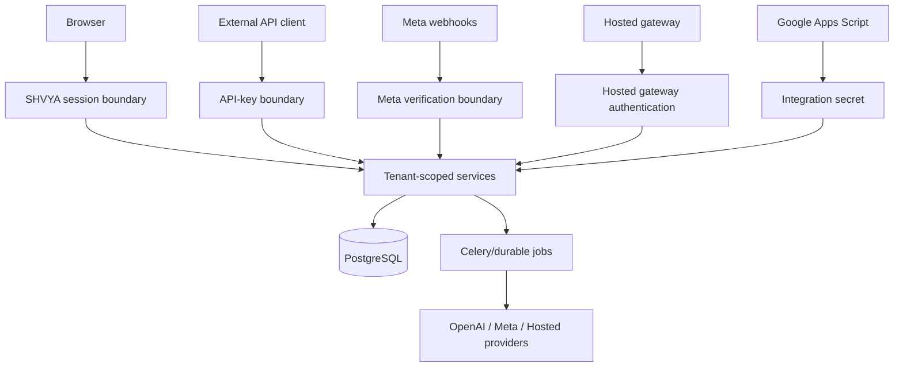
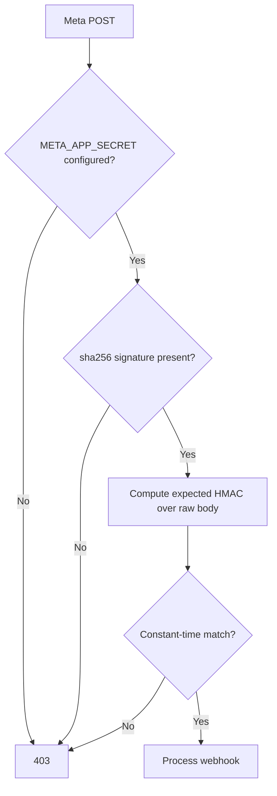
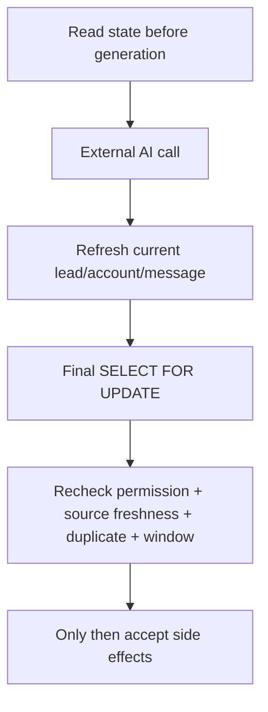
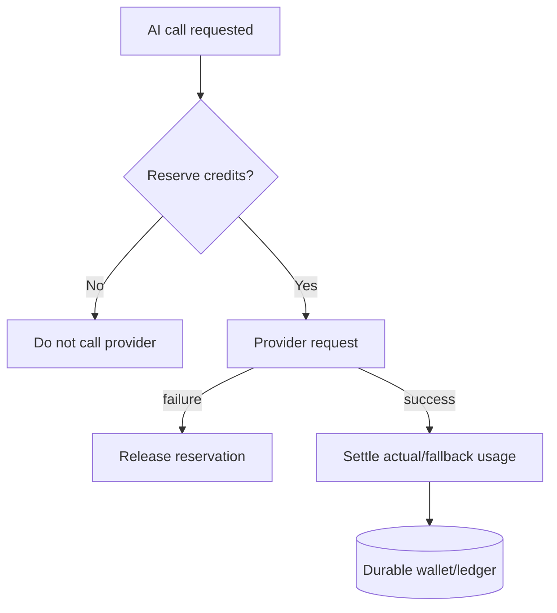

# 08. Security, Idempotency and Failure Model

> Snapshot: `staging` traced from `88a71f8a02c911c5c963c9f0d8235ff60684ab17`.

This document explains the defensive architecture around tenant isolation, authentication, secret storage, provider verification, retries, duplicate events, concurrency and partial failures.

The central reliability rule is:

> **External events can be duplicated, delayed or delivered out of order. Workers can crash. Provider calls can time out ambiguously. Security checks and idempotency therefore belong in durable application boundaries, not only in the UI.**

---

## 1. Trust boundaries



Every entry point must establish identity and tenant scope before accepting resource IDs supplied by a caller/provider payload.

---

## 2. Organization is the security boundary

`Organization` is the root tenant object. Important business rows either reference it directly or can be traced to it through validated relationships.

Critical checks include:

```text
User.organization
APIKey.organization
Lead.organization
Pipeline.organization
Stage.pipeline.organization
WhatsAppAccount.organization
WhatsAppMessage.organization
Document.organization
Chunk.organization
Integration.organization
HostedAutomationJob.organization
```

A UUID is not authorization. A request that supplies a valid row ID from another tenant must still be rejected.

---

## 3. Disabled organization enforcement

The current staging snapshot includes hardened access checks for inactive organizations across primary interactive boundaries.

### Dashboard HTTP

Dedicated CRM session authorization calls the centralized CRM user/organization authorization policy. A user belonging to a disabled organization is not allowed to continue simply because the user row itself remains active.

### API keys

An API key cannot be treated as sufficient if the owning organization is inactive.

### WebSockets

CRM WebSocket session resolution also applies active-organization authorization. Otherwise a disabled tenant could lose HTTP access but retain an already authenticated realtime path.

### Design rule

When adding a new authentication mechanism, check both:

```text
credential/user is active
AND
organization is active/authorized
```

---

## 4. Session separation

SHVYA separates authentication areas:

```text
/admin/       -> Django admin session
/superadmin/  -> SHVYA Superadmin session
/dashboard/   -> SHVYA CRM session
```

`SHVYAAreaAuthenticationMiddleware` resets `request.user` to `AnonymousUser` before loading a dashboard/superadmin-specific session. This avoids accidentally inheriting identity from Django's default session cookie.

The middleware validates the stored Django session authentication hash. Missing or mismatched hashes invalidate the dedicated session rather than being accepted.

---

## 5. WebSocket authentication

WebSockets do not reuse a frontend assumption such as “the user already loaded the dashboard”. The ASGI stack passes WebSocket connections through:

```text
AllowedHostsOriginValidator
-> CRMSessionAuthMiddleware
-> URLRouter/consumer
```

Tenant authorization is performed at the connection boundary. A realtime socket is therefore an authenticated application entry point, not merely a browser optimization.

---

## 6. API-key storage

Organization API keys are stored using:

```text
key_prefix
key_hash
```

The raw API key is not intended to be persistently recoverable after creation.

This is appropriate because SHVYA only needs to verify a presented API key, not send the original key to another provider later.

### Capability checks

Authentication alone does not imply every API operation is allowed. For example, lead upsert checks the API key's `can_upsert_leads` capability.

---

## 7. One-time token storage

One-time login tokens store a token hash rather than raw reusable token material. This follows the same principle as API keys: if the server only needs verification, prefer irreversible storage.

---

## 8. Reversible secret encryption

Provider credentials that must be used later require reversible encryption rather than hashing.

Examples include:

- WhatsApp access tokens;
- Instagram access tokens;
- temporary Instagram authorization code storage;
- SMTP password;
- webhook/integration secrets where server-side recovery is required;
- Google Sheet secrets;
- Meta lead Page token/app-secret material.

The project uses Fernet-based encrypted fields/helpers tied to server secret material.

### Operational consequence of `SECRET_KEY` rotation

Because encryption key derivation depends on Django secret material in current implementation, rotating `SECRET_KEY` without a migration/re-encryption plan can make stored encrypted provider credentials unreadable.

Treat key rotation as a credential migration project, not only an environment variable change.

---

## 9. WhatsApp Meta webhook verification

The public WhatsApp route is wrapped by `apps/channels/webhook_security.py`.

### GET subscription verification

- requires `hub.mode=subscribe`;
- compares supplied verify token to configured `META_VERIFY_TOKEN` using constant-time comparison;
- returns challenge only on success.

### POST delivery verification

- fails closed when `META_APP_SECRET` is missing;
- requires `X-Hub-Signature-256`;
- calculates HMAC-SHA256 over the raw request body;
- compares using constant-time comparison;
- delegates to message processing only after verification.



---

## 10. Meta Lead Ads webhook caveat

The current Meta Lead Ads implementation has different behavior from the hardened WhatsApp webhook.

A signature mismatch can be logged while processing continues to the next verification layer, where SHVYA attempts to fetch the referenced lead using the stored Page access token and configured Page/Form mappings.

This should be understood as a **current implementation characteristic**, not a general recommendation that webhook signatures are optional.

If this endpoint is hardened later, tests and documentation should explicitly define whether invalid signature becomes immediate rejection and how compatibility with Meta delivery/retries is handled.

---

## 11. Google Sheets integration authentication

Generated Apps Script sends the configured integration secret in a dedicated header, currently:

```text
X-Shvya-Sheets-Secret
```

The webhook should resolve the target integration and verify its secret before processing rows. The resulting lead writes are then scoped to the pipeline/stage saved on that organization-owned integration.

A spreadsheet row must never be allowed to choose an arbitrary organization by supplying a tenant ID.

---

## 12. Hosted gateway trust boundary

Hosted linked-device traffic originates from a separate gateway process. Django owns CRM/business state; the gateway owns the actual linked WhatsApp session.

Security implications:

- gateway callbacks must be authenticated by the configured Hosted integration mechanism;
- account/session IDs must still be resolved to organization-owned rows;
- inbound peer/contact data is untrusted input and must be normalized;
- gateway transport must not bypass Account Health or durable message status rules;
- historical payloads must remain distinguishable from live events.

---

## 13. Lead identity idempotency

The database uniqueness contract:

```text
UNIQUE (organization, phone)
```

prevents two durable leads for one normalized phone inside the same organization.

`upsert_lead()` adds transaction/locking behavior above this constraint. If two processes race to create the same phone, the database unique constraint remains the final authority and the service surfaces a controlled duplicate condition.

---

## 14. WhatsApp message idempotency

Provider webhook delivery is at-least-once in practice, so duplicate delivery must be expected.

### Meta API

Inbound messages use provider message identity such as Meta `wamid` in `WhatsAppMessage.external_id`. When the same external ID already exists, inbound processing returns/uses the existing row rather than creating a second business message.

### Hosted

Hosted messages derive an external identity such as:

```text
wweb:<gateway message id>
```

History and live callbacks therefore converge on one durable message identity.

---

## 15. Instagram idempotency

Instagram message persistence includes provider external identity and a local `idempotency_key`. Webhook delivery also has a durable payload hash record. These exist because provider callbacks and outbound retries can repeat.

---

## 16. AI generation idempotency

There are multiple layers because no single mechanism covers every race.

### Generation lock/cache

`EngagementService` uses a state-bound decision cache/lock so duplicate workers for the same lead/source/runtime state do not all issue an expensive model request.

### Source inbound processing marker

Before accepting qualification/runtime updates, finalization locks the source inbound row. It stores a `shvya_ai_processing` marker after successful processing.

### Outbound source metadata

AI-generated outbound rows store:

```text
raw_payload.shvya_ai.source_inbound_message_id
```

A finalizer checks for an existing outbound referencing the same inbound before creating another.

### Fallback duplicate check

For legacy rows without explicit AI metadata, the task can defensively check for the same outbound body created at/after the source inbound timestamp.

---

## 17. Why generation cache alone is insufficient

A Redis lock can expire or Redis can restart. Therefore it cannot be the final proof that a customer-facing response was already accepted.

Durable database markers and outbound message rows remain the final idempotency evidence.

General rule:

```text
Redis lock = coordination optimization
PostgreSQL identity/constraint = durable correctness
```

---

## 18. Hosted AI job idempotency

`HostedAutomationJob.source_message` is one-to-one.

This means repeated `post_save` callbacks or callback replay for the exact inbound cannot create multiple independent durable AI jobs for that message.

Hosted execution also binds to exact:

```text
organization
account
lead
source inbound message
```

This avoids cross-number ambiguity in organizations with multiple connected accounts.

---

## 19. Trigger idempotency

Smart Trigger durability uses two important keys:

```text
TriggerEvent.key -> unique
TriggerRun(rule,event) -> unique
```

An event replay should not create a second execution of the same configured rule against the same event.

The periodic dispatcher also obtains a PostgreSQL advisory lock so overlapping Beat processes do not concurrently scan/execute the same ordered batch.

---

## 20. Follow-up idempotency/state constraints

Follow-up state is durable rather than represented only by scheduled Celery messages.

Important protection includes:

- unique lead/sequence state;
- conditional constraint limiting active/paused sequence assignment per lead;
- durable `FollowupExecution` rows for concrete scheduled actions;
- sender state for pacing.

The dispatcher can reconstruct what is due from PostgreSQL after restart.

---

## 21. Bulk messaging idempotency

Bulk campaigns snapshot recipients through `BulkMessageRecipient`, unique by campaign + lead.

A recipient can reference the durable `WhatsAppMessage` created for its send. Retry logic should reuse that durable message rather than blindly creating another outbound for an ambiguous previous attempt.

This is especially important when the provider/network result is unknown rather than definitively failed.

---

## 22. Database locking model

### `select_for_update()`

Used when concurrent transactions must serialize mutation of one durable object.

Examples:

- existing lead upsert;
- final AI engagement lead state;
- document version publication/version calculation;
- Hosted job final status;
- credit reservation/accounting paths as applicable.

### PostgreSQL advisory lock

Used by the Smart Trigger dispatcher to prevent overlapping scheduler scans.

### Redis locks

Used for bounded coordination such as summary generation and AI decision generation.

Each lock type solves a different problem.

---

## 23. Transaction boundaries

An operation that both changes durable state and schedules follow-up work should normally follow:

```text
transaction.atomic()
  -> lock/validate
  -> write canonical rows
  -> attach audit/idempotency metadata
  -> transaction.on_commit(enqueue task/publish event)
commit
```

This avoids workers observing state that later rolls back.

---

## 24. Stale-state protection around AI

External model generation introduces a long gap between read and write.

SHVYA addresses that with repeated validation:



A decision valid at model-request time is not assumed valid at send time.

---

## 25. Conversation ordering safety

If inbound B arrives after inbound A but before A's AI generation finishes:

```text
A worker sees B is now latest
-> response to A is stale
-> skip
```

This prevents the customer from receiving a reply to an earlier question after already sending a newer one.

Hosted repeats the same concept while scoping “latest” to the exact account bound to its job.

---

## 26. WhatsApp 24-hour send-window safety

Before queueing a free-form AI reply, the backend verifies that the source inbound remains within the customer-service window.

The model does not decide this transport rule.

If the window has expired, the worker skips the free-form send instead of asking Meta to enforce correctness after the fact.

Template-based behavior, where applicable, is a separate transport/product flow.

---

## 27. AI permission rechecks

Customer-facing AI permission is checked:

```text
before generation
after generation/current-state refresh
inside final transaction
```

This protects races such as:

- admin disables organization AI while OpenAI is generating;
- pipeline/stage AI is turned off;
- lead AI is disabled;
- account disconnects;
- lead moves to a state where transport mapping is no longer valid.

---

## 28. AI side-effect allow-list

The LLM cannot return arbitrary code or database updates that the backend executes blindly.

Current allow-listed CRM action families are:

```text
attribute_updates
pipeline_transition
add_note
create_reminder
contact_updates
```

Every action is schema-validated and then tenant-resolved by `CRMActionExecutor`.

For example, a model-supplied `stage_id` is accepted only if it resolves to an active stage in an active pipeline belonging to the same organization.

---

## 29. Structured output safety

`OpenAIProvider` sends a JSON schema for the engagement decision. The engagement service then performs application-level validation beyond provider schema validation.

Why both?

Provider schema validates structural shape. Application code validates runtime truth such as:

- current qualification requirement;
- stage IDs that actually exist for the tenant;
- legal silence conditions;
- current backend revision/flow version;
- file IDs that belong to the organization;
- whether the source inbound is still current.

---

## 30. AI credit failure model

Text and embedding provider calls reserve estimated AI credits before invoking OpenAI.



Reservations solve the concurrency problem where several requests otherwise read the same available balance simultaneously.

---

## 31. Retry ownership

OpenAI SDK automatic retry is explicitly disabled. This avoids a multiplicative retry pattern such as:

```text
SDK retries x Celery retries
```

Instead:

- transient provider/network/rate-limit/5xx conditions become retryable task failures;
- permanent authentication/config/bad request errors are classified separately;
- stale-state and disabled-permission cases are skips, not provider retries.

One layer owns the retry policy.

---

## 32. Ambiguous provider outcomes

The hardest send failure is not “provider returned an explicit error”. It is:

```text
request left SHVYA
network timed out
SHVYA does not know whether provider accepted it
```

For such paths, never solve uncertainty by blindly creating a brand-new business message. Durable message identity, provider message IDs, idempotency metadata and reconciliation should be preferred.

Hosted further persists the exact generated message ID in the durable job so account-health cooldown/retry resumes that row.

---

## 33. RAG publication safety

Knowledge refresh follows a publication model:

```text
old active version stays active
-> create/process new inactive version
-> generate embeddings
-> only on success atomically activate new and deactivate old
```

This is a failure-isolation control. A broken upload, website outage or embedding error does not immediately poison the active knowledge base.

---

## 34. RAG tenant isolation

Knowledge retrieval must apply organization filters before similarity ranking.

A high cosine similarity is never authorization to return another tenant's chunk.

Batch embedding also rejects multi-organization chunk batches, keeping credit ownership and data scope clear.

---

## 35. File-sharing safety

If AI chooses a knowledge document to send, finalization rechecks that the document:

- belongs to current organization;
- is active;
- completed processing;
- has a real file;
- satisfies AI-guided sharing configuration.

Sender code validates the media source again at delivery time. This is defense in depth against stale model decisions or files changed/deactivated between generation and send.

---

## 36. WebSocket failure model

WebSocket/Channels delivery is not durable business state.

Correct ordering:

```text
commit PostgreSQL
-> publish realtime event
```

If Redis channel delivery or the browser connection fails, the database remains correct. A reload reconstructs state.

Do not design a business action that exists only because a WebSocket event was delivered.

---

## 37. Historical vs live message safety

Hosted history rows contain history semantics and are prevented from entering the live auto-lead/AI path.

This prevents dangerous behavior after first connection such as:

```text
sync thousands of old conversations
-> create thousands of new CRM leads
-> send AI replies to historical messages
```

Coexistence history follows a separate Meta synchronization contract and can ensure/attach leads. The distinction must remain explicit.

---

## 38. Delete behavior as integrity control

Database delete policies also enforce safety:

- `CASCADE` for truly owned child data;
- `SET_NULL` when historical records should survive a referenced object deletion;
- `PROTECT` when deletion would break active automation configuration.

Examples of protected references include follow-up sender/template/step relationships and Meta lead form pipeline/stage mapping.

Do not replace `PROTECT` with `CASCADE` simply to make a delete UI easier without understanding the automation state it preserves.

---

## 39. Audit/history preservation

Important history rows capture information even when live referenced objects can later change.

Examples:

- `LeadActivity` keeps actor/pipeline/stage snapshots;
- AI outbound raw metadata records source inbound/model/reason;
- connection attempts store stage/error diagnostics without raw OAuth secrets;
- template operations retain provider sync history;
- webhook deliveries retain payload/result state;
- `AuditLog` stores scalar target snapshots instead of requiring a live target FK.

History is part of debugging and security evidence.

---

## 40. Failure classification table

| Failure | Classification | Expected behavior |
| --- | --- | --- |
| Invalid dashboard session | Authentication | anonymous/deny + invalidate invalid dedicated session |
| Disabled organization | Authorization | deny access at boundary |
| API key without capability | Authorization | reject operation |
| WhatsApp invalid signature | Webhook authenticity | reject before business processing |
| Duplicate WhatsApp `wamid` | Idempotent replay | reuse/no-op, no duplicate message |
| Concurrent same-phone lead create | Concurrency | DB unique constraint + controlled duplicate result |
| OpenAI rate limit/network | Transient external | Celery retry |
| OpenAI invalid auth/bad request | Permanent external/config | fail without blind retry |
| New inbound arrives during generation | Stale state | skip old response |
| AI disabled during generation | Stale authorization | skip at recheck |
| WhatsApp 24h window expired | Transport eligibility | skip free-form send |
| Hosted Account Health pause | Transport pacing | defer durable job to `paused_until` |
| Hosted newer message supersedes job | Stale state | cancel/skip older generated path |
| RAG source refresh extraction failure | Data preparation | keep previous active version |
| RAG query embedding failure | Retrieval degradation | current live builder uses no retrieved chunks for that call |
| WebSocket publish failure | Projection failure | DB remains source of truth |
| Trigger Beat overlap | Scheduler race | advisory lock causes one dispatcher to exit |

---

## 41. Security review checklist for new code

Before merging a new endpoint/task/integration, answer:

### Identity and authorization

- How is the caller/provider authenticated?
- How is organization determined without trusting arbitrary tenant input?
- Is inactive organization state enforced?
- Are referenced IDs re-resolved inside the organization?
- Does the action need a finer-grained capability/permission?

### Secrets

- Does this value need one-way verification or later recovery?
- If verification only, can it be hashed?
- If recovery is required, is it encrypted?
- Will key rotation break decryptability?
- Is sensitive material excluded from logs/audit payloads?

### Idempotency

- What stable key identifies the external/business event?
- Is it enforced by the database where possible?
- What happens if the exact request arrives twice?
- What happens if the worker runs twice?
- Can a provider timeout be ambiguous?

### Transactions/concurrency

- Should a row be locked with `select_for_update()`?
- Is a unique constraint the final race defense?
- Is async work queued only after commit?
- Can another message/state change make this work stale before finalization?

### Retries/recovery

- Which layer owns retry?
- Which errors are transient vs permanent?
- Is there durable work state for recovery after worker/broker restart?
- Can retry duplicate a customer-facing action?

### AI/RAG

- Is AI allowed by current org/pipeline/stage/lead policy?
- Is model output constrained to an allow-list?
- Are tenant IDs and CRM targets resolved server-side?
- Is retrieval organization-scoped before ranking?
- Are credit reservations made before provider use?
- Is current state rechecked after model latency?

### Realtime/UI

- Is PostgreSQL written before WebSocket publication?
- Can the UI reconstruct correct state if it misses an event?
- Is sensitive data absent from broad organization-wide realtime payloads?

If these questions do not have concrete answers, the path is not production-complete yet.