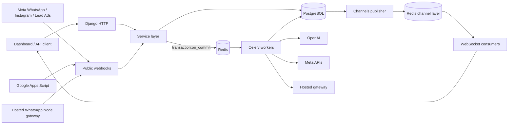
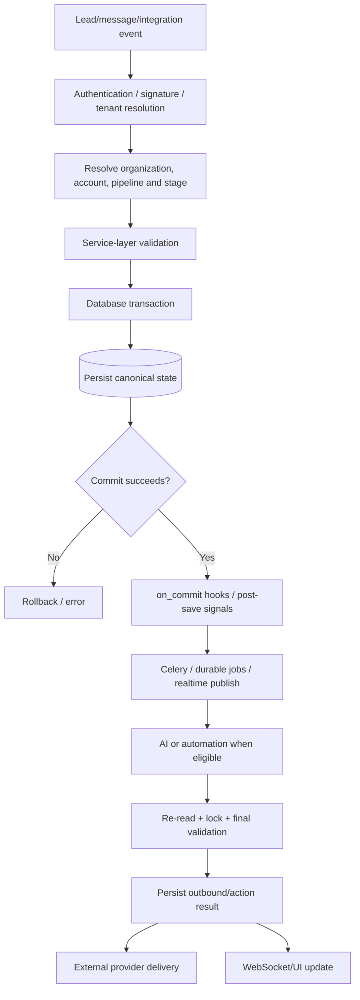
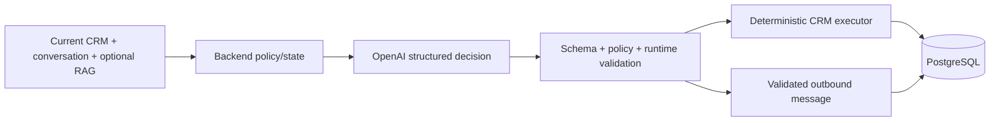
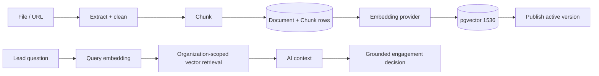

# SHVYA AI System Architecture

This folder is the end-to-end runtime architecture reference for SHVYA AI. It explains how requests enter the application, where data moves, how leads are created and routed, how AI decisions are produced and validated, how RAG knowledge is ingested and retrieved, and how background jobs and realtime updates connect the system.

> **Implementation snapshot:** traced against `staging` at `88a71f8a02c911c5c963c9f0d8235ff60684ab17` on 2026-09-16. Source code and Django migrations remain the executable source of truth. Update these documents when the runtime contract changes.

## Documentation map

| File | Purpose |
| --- | --- |
| [`01-request-response-cycle.md`](./01-request-response-cycle.md) | Complete HTTP, webhook, Celery, provider and WebSocket request/response lifecycle. |
| [`02-lead-creation-pipeline-stage-routing.md`](./02-lead-creation-pipeline-stage-routing.md) | Every known lead creation path, `lead_source`, pipeline selection, stage selection and existing-lead behavior. |
| [`03-ai-engagement-runtime.md`](./03-ai-engagement-runtime.md) | AI permissions, context construction, qualification, conditional RAG, model contract, validation, CRM actions and message finalization. |
| [`04-rag-knowledge-data-flow.md`](./04-rag-knowledge-data-flow.md) | Knowledge ingestion, extraction, chunking, versioning, embeddings, pgvector retrieval and grounding data flow. |
| [`05-async-events-realtime-data-movement.md`](./05-async-events-realtime-data-movement.md) | Redis, Celery queues, Beat, transaction boundaries, Hosted durable jobs, triggers, follow-ups and Channels/WebSockets. |
| [`06-end-to-end-scenarios.md`](./06-end-to-end-scenarios.md) | Sequence diagrams for the most important production scenarios. |
| [`07-source-code-map.md`](./07-source-code-map.md) | Responsibility-to-file map for developers and reviewers. |
| [`08-security-idempotency-failure-model.md`](./08-security-idempotency-failure-model.md) | Tenant isolation, authentication boundaries, idempotency keys, locks, retries and fail-safe behavior. |

The database structure itself is documented separately in [`../../database.md`](../../database.md).

---

## 1. System at a glance

The central architectural rule is that **PostgreSQL owns durable business state**. Redis accelerates runtime coordination, queues and WebSocket fan-out, but the important business entities, messages, jobs, trigger events, follow-up state, AI credit accounting and knowledge chunks are persisted in PostgreSQL.

---

## 2. Core runtime layers

### Edge and request layer

Requests enter through Django URL routing. Dashboard routes use SHVYA CRM sessions, REST endpoints use their configured authentication, and public provider callbacks use webhook-specific verification. `config/asgi.py` routes HTTP to Django and WebSockets through Django Channels.

Important entry points include:

- `/dashboard/...` for CRM and product UI.
- `/api/v1/leads/...` for API-key authenticated lead operations.
- `/api/v1/ai-engagement/...` for AI-specific APIs.
- `/webhooks/whatsapp/` for Meta WhatsApp Cloud API callbacks.
- `/webhooks/instagram/` for Instagram callbacks.
- `/webhooks/meta-leads/` for Meta Lead Ads.
- Hosted WhatsApp callbacks from the separate Node gateway.

### Service layer

Views should parse/validate transport input and delegate business logic. Important domain services live under `services/` and `apps/*/services/`.

Examples:

- `services/crm/lead_service.py` is the canonical lead create/upsert boundary.
- `services/crm/lead_transition.py` owns stage/pipeline transitions.
- `services/channels/whatsapp_service.py` owns Meta API inbound/outbound business logic.
- `services/channels/hosted_whatsapp_service.py` owns Hosted linked-device persistence/routing.
- `apps/ai_engagement/services/engagement.py` owns the guarded AI decision pipeline.
- `apps/ai_engagement/services/crm_executor.py` converts validated AI requests into deterministic CRM mutations.

### Durable state

PostgreSQL stores tenant data, CRM state, channel messages, RAG documents/chunks, AI wallet/ledger, durable Hosted AI jobs, follow-up executions, trigger outbox records and provider delivery history.

### Asynchronous execution

Celery uses Redis as broker/result backend. Customer-facing Meta WhatsApp AI and final Meta send tasks are routed to the `ai_realtime` queue. Hosted AI has the separate `hosted_ai` queue. Other background work uses the default queue unless explicitly routed.

### Realtime UI

Django Channels uses a separate Redis channel-layer database. Message/status publication happens after database commit so an open browser never receives an event for a row that is not yet visible.

---

## 3. Main business data path

A major reliability pattern throughout the code is **validate again immediately before side effects**. AI generation can take seconds. During that time the lead may move stages, AI may be disabled, another inbound message may arrive, or an account may disconnect. The worker therefore does not trust the state captured when the webhook arrived.

---

## 4. Tenant boundary

`Organization` is the tenant root. Business logic should never infer tenant scope from user-controlled identifiers alone. Important runtime checks include:

- lead belongs to organization;
- pipeline belongs to organization;
- stage belongs to selected pipeline;
- WhatsApp account belongs to organization;
- AI context explicitly filters messages by both organization and lead;
- knowledge retrieval filters chunks and documents by organization;
- AI CRM actions resolve target records inside the same organization;
- inactive organizations are rejected by dashboard/session, API-key and WebSocket authentication paths in the current staging snapshot.

---

## 5. Pipeline and stage meaning

A pipeline is an organization-owned CRM workflow. A stage is an ordered column inside that pipeline. `Stage.display_order` determines the first stage when a channel creates a new lead automatically.

The system does **not** globally hard-code one universal first stage. Instead, automatic channel routing typically resolves a pipeline and then selects that pipeline's first active stage. Manual/import/integration flows can use an explicitly configured stage.

The names `New Lead`/`New Leads` have additional product meaning for first-turn welcome behavior and qualification, while `Qualified` has special completion behavior in AI qualification. Those semantic rules are described in the lead and AI documents.

---

## 6. AI design principle

SHVYA does not give an LLM unrestricted control over the CRM. Python owns permissions, qualification state, allowed stage IDs, record scope, idempotency, transport eligibility and database mutations. The model returns a bounded decision object. The backend validates that object, rechecks current state, then executes only allow-listed actions.

This separation is intentional: language understanding/generation belongs to the model; authorization and side effects belong to deterministic application code.

---

## 7. RAG design principle

Knowledge ingestion and knowledge retrieval are separate pipelines.

A newly ingested URL/document version is not supposed to replace the active version until extraction and indexing succeed. This prevents a failed refresh from destroying the currently usable knowledge base.

---

## 8. Important reliability contracts

1. **Write durable state before asynchronous work.** Celery work is normally queued from `transaction.on_commit()` or from a committed post-save signal.
2. **Provider retries must be idempotent.** Meta message IDs, Hosted message IDs, durable job/source-message constraints and AI source-message metadata prevent duplicate processing.
3. **Only one layer owns retries.** The OpenAI SDK automatic retry is disabled; Celery owns provider retry behavior.
4. **Never send based on stale AI context.** Permissions, latest inbound message, account connection and 24-hour send eligibility are rechecked after generation and again in the final transaction.
5. **AI requests actions; backend executes them.** CRM mutations are validated by tenant scope and allow-listed schemas.
6. **Historical Hosted sync is not live engagement.** Hosted history is persisted but does not auto-create leads or queue AI under the live-message rules. Coexistence history has a different import path and can attach/create CRM leads.
7. **Realtime publication follows commit.** Browser updates are secondary projections of durable rows, not the source of truth.

---

## 9. How to use this folder during development

When changing a flow, follow the path in this order:

1. Find the external entry point in `01-request-response-cycle.md`.
2. If it can create/update a lead, verify its behavior in `02-lead-creation-pipeline-stage-routing.md`.
3. If it can invoke AI, verify permissions and finalization in `03-ai-engagement-runtime.md`.
4. If knowledge is involved, trace ingestion/retrieval in `04-rag-knowledge-data-flow.md`.
5. If the operation is delayed or event-driven, inspect `05-async-events-realtime-data-movement.md`.
6. Compare the real scenario with `06-end-to-end-scenarios.md`.
7. Use `07-source-code-map.md` to find the implementation files.
8. Use `08-security-idempotency-failure-model.md` before changing retries, locks, webhooks or authentication.

When the architecture changes, update the relevant files in this folder in the same pull request.